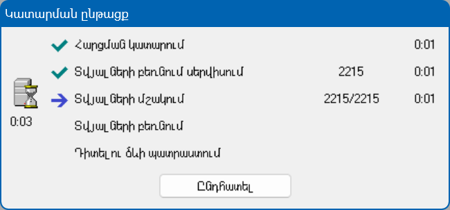

8x միջավայրում ստեղծված է հնարավորություն աշխատացնել երկար աշխատող գործողություններ հերթագրման միջոցով։ 
Հերթագրված գործողությունները աշխատում են ասինխրոն եղանակով կիրառությունների սերվերի վրա։ 
Կատարվող գործողությունների ընթացքի մասին տեղեկությունը և վերջնական արդյունքը պահվում է քեշում, կամ Redis-ում։ 
Հերթագրված գործողությունների համար կլիենտական ծրագիրը կարող է ցուցադրել կատարման ընթացքի պատուհան, իսկ ավարտից հետո արդյունքը։ 

  
*DS-ի կատարման նկար առաջընթացի ցուցիչով և դադարեցման կոճակով*

Ասինխրոն մշակում կիրառությունների սերվերի վրա հարկավոր է օգտագործել, եթե տեղի ունի 3 պայմաններից մեկը՝
1. Գործողության տևողությունը անհայտ է կամ կգերազանցի 90 վարկյանը։
2. Անհրաժեշտ է կատարման առաջընթացի ցուցիչ։
3. Անհրաժեշտ է դադարեցման հնարավորություն։

Ասինխրոն մշակումների օրինակներն են՝ DPR-ի (Data Proccesing Request) կանչ, DS-ի (Data Source) ասինխրոն կատարում, փաստաթղթի ասինխրոն մշակում։ 

Ասինխրոն մշակումը կիրառությունների սերվերի վրա ղեկավարվում REST API-ի 4 POST կանչով։ 
Նկարագրենք այդ կանչերը DPR-ի համար՝
* /api/DPR/enqueue, սկսում է DPR-ի կատարումը, պատասխանի id-ում պարունակում է DPR-ի guid-ին։ 
* /api/DPR/progress, վերադարձնում է DPR-ի կատարման առաջընթացը։ Հանարվոր վիճակներն են՝ հերթագրված, ընթացքում է, դադարեցված է, ավարտված է բարեհաջող, ավարտված է սխալով։
* /api/DPR/stop, դադարեցնում է DPR-ի կատարումը։
* /api/DPR/result, վերադարձնում է DPR-ի կատարման արդյունքը կամ կատարման ժամանակ տեղի ունեցած սխալը։

  
*Ասինխրոն մշակման բլոկ սխեմա*

Կլաստերով տեղադրված կիրառությունների սերվերների դեպքում նախօրոք պետք է կարգավորել, թե որ սերվերներն են կատարելու հերթագրված գործողությունները։ 
Այս դեպքում պարտադիր կարգավորվում է Redis սերվերը գործողությունների ընթացքի մասին տեղեկությունները և վերջնական արդյունքնորը պահպանելու համար։

