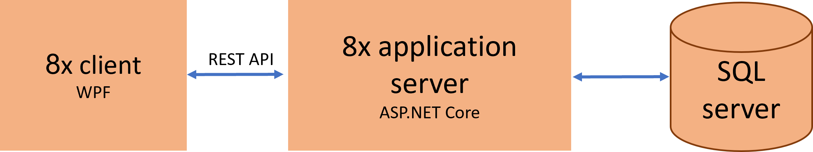
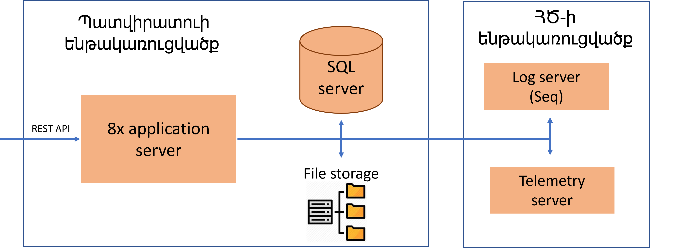
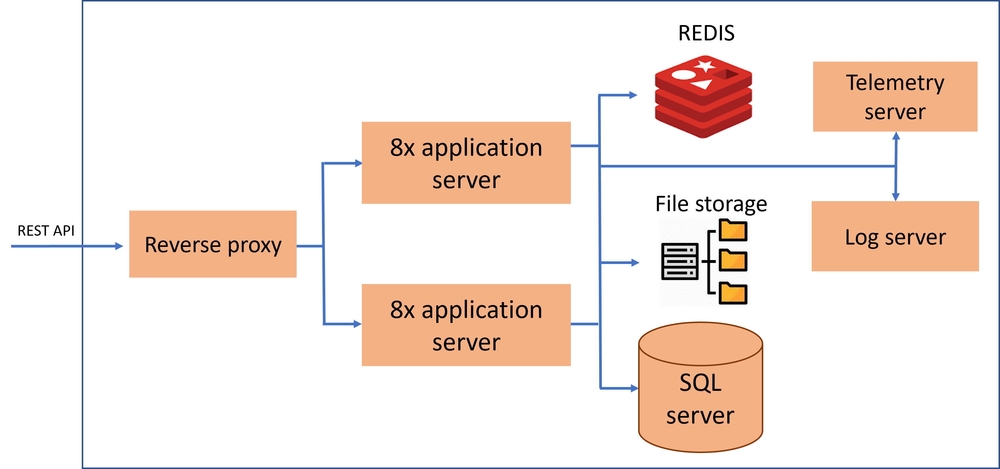

##  8x-ի Ճարտարապետության հիմունքները

8x-ը ծրագրային միջավայր է եռամակարդակ (client, application server, database) բիզնես ավտոմատացման ծրագիր
ստեղծելու համար։ Մասնավորապես ՀԾ-Բանկ, ՀԾ-Ձեռնարկություն, ՀԾ-Աշխատավարձ համակարգերի համար։

8x ծրագրային միջավայրը հիմնված է Microsoft-ի տեխնոլոգյաների վրա՝ 
* 8x Windows կլիենտը (client) իրականացված է որպես  Windows Presentation Foundation (WPF) կիրառություն։
* Կիրառությունների սերվերը (application server) իրականացված որպես է ASP.NET Core Web API։
* Տվյալների բազան (database) օգտագործում է Microsoft SQL Server-ը։

  
*8x ճարտարապետությունը պարզեցված*

8x Windows կլիենտը աշխատում է կիրառությունների սերվերը հետ ստանդարտ REST(http,json) արձանագրությամբ։ Օգտագործելով 8x REST API-ը այլ համակարգեր նույն պես կարող են աշխատել կիրառությունների սերվերի հետ, օրինակ ինտեգման նպատակով։ 4x Windows կլիենտը օգտագործում է 8x REST API-ը 4x-ից դեպի 8x անցման ժամանակ։ 

  
*8x REST API-ի օգտագործման օրինակ*

## Կիրառությունների սերվերի ենթակառուցվածք

Կիրառությունների սերվերը կարելի է տեղադրել պարզ կոնֆիգուրացիաներից դեպի բարդ կլաստերներ։ 
Պարզ դեպքում կարելի է սահմանափակվել մեկ սերվերով, որտեղ կտեղադրվի կիրառությունների սերվերը, տվյաների բազան և այդ սերվերի ֆայլաին համակարգը կօգտագործվի որպես ֆայլային պահուստ։ 

  
*Կիրառությունների սերվերի պարզ տեղադրում*

Պարզ դեպքում պատվիրատուի մոտ լոգերի (log server) և հեռաչափության (telemetry  server) սերվերների տեղադրումից կարելի խուսափել և օգտագործել Հայկական Ծրագրերի կողմից տրամադրվ ենթակառուցվածքը։
Եթե պատվիրատուն իր մոտ արդեն ունի լոգերի և հեռաչափության սերվերներ, կամ անվտանգության քաղականությունը թելադրում է անեն ինչ տեղադրել սեփական ենթակառուցվածքի վրա, ապա լոգերի և հեռաչափության սերվերներ տեղադրվում են իր մոտ։

Մի շարք պատճառներով մեկ օրինակ կիրառությունների սերվերը կարող քիչ լինել, այդ դեպքում կարելի տեղադրել լրացուցիչը։ Այդ պարագայում պարտադիր է տեղադրել Redis սերվեր կլաստերի մեջ ներգրավված կիրառությունների սերվերի համաձայնեցման համար։
 
  
*Երկու կիրառությունների սերվերից կազմված կլաստեր*

