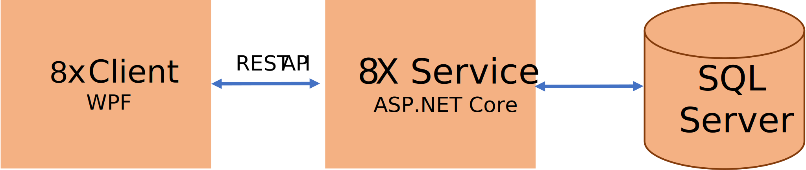

# 

8x-ը ծրագրային միջավայր է եռամակարդակ (client, application server, database) բիզնես ավտոմատացման ծրագիր
ստեղծելու համար։ Մասնավորապես ՀԾ-Բանկ, ՀԾ-Ձեռնարկություն, ՀԾ-Աշխատավարձ համակարգերի համար։

8x ծրագրային միջավայրը հիմնավծ է Microsoft-ի տեխնոլոգյաների վրա՝ 
* Windows կլիենտը (client) իրականացված է որպես  Windows Presentation Foundation (WPF) կիրառւոթյուն։
* Կիրառությունների սերվերը (application server) իրականացված որպես է ASP.NET Core Web API։
* Տվյաների բազան (database) օգտագործում է Microsoft SQL Server-ը։

 
 *8x Ճարտարապետությունը պարզեցված*
