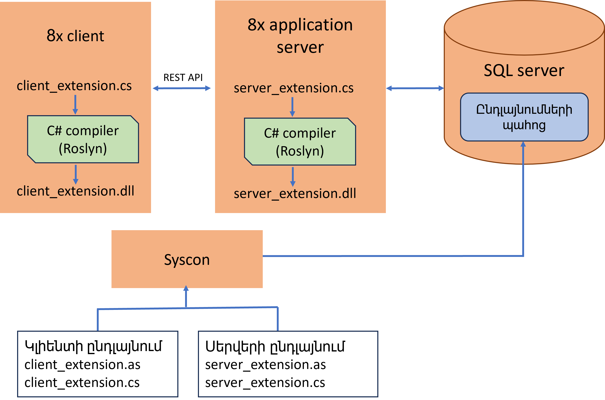

## Բովանդակություն

- [Ի՞նչ է ընդլայնումը](#ի՞նչ-է-ընդլայնումը)
- [Ֆայլերի ներմուծում SysCon գործիքի միջոցով](#ֆայլերի-ներմուծում-syscon-գործիքի-միջոցով)
- [.NET գրադարանների տեղադրման միջոցով](#net-գրադարանների-տեղադրման-միջոցով)

## Ի՞նչ է ընդլայնումը

8X ծրագրային միջավայրը հնարավոր է ընդլայնել ավելացնելով նոր նկարագրություններ և տրամաբանություններ, ինչպես նաև փոխել գործող վարքերը։

Ընդլայնման միջոցով հնարավոր է 
1. Ավելացնել նոր փաստաթղթեր
2. Ավելացնել նոր տվյալների աղբյուր
3. Ավելացնել նոր երկար աշխատող պրոցես
4. Փոխել գործող փաստաղթի վարքը
5. Փոխել գործող տվյալների աղբյուրի վարքը
6. Փոխել հաշվարկվող տպվող ձևի արժեքների բազմությունը
7. Բացի նշված դեպքերից տրված է հնարավորություն նաև ծրագրի յուրահատուկ կետերում ընդլայնման ստորև նշված եղանակով։

Ընդլայնման ենթակա է և՛ կիրառությունների սերվերը, և՛ 8X կլիենտը։ 
Ընդլայնման համար նախատեսված է երկու եղանակ՝
1. Նկարագրությունների ֆայլերի (.as) և C# կոդի ֆայլերի (.cs) ներմուծում SysCon գործիքի միջոցով։
2. Ծրագրի կողքին .NET գրադարանների (.dll) տեղադրման և ծրագրի appsettings.json ֆայլի կարգավորման միջոցով։

## Ֆայլերի ներմուծում SysCon գործիքի միջոցով

Ընլայման առաջին եղանակն է պատրաստել նկարագրությունների (.as) ֆայլ և տրամաբանությունների C# (.cs) ֆայլ և դրանք SysCon գործիքով ներմուծել համակարգ։
Դրանից հետ ծրագիրը (կիրառությունների սերվերը) անհրաժեշտ պահի կբեռնի այդ ֆայլերը, ապա C# դասը կոմպիլյացիա կանի և կաշխատացնի միջի տրամաբանությունը։

Այս եղանակի դեպքում ծրագրերի փոփոխությունները կատարվում է արագ՝ կիրառությունների սերվերը ճանաչում է փոփոխությունները և սկսում օգտագործել ներմուծումից հետո։
Ունի նաև թերություն հնարավոր չէ կազմել մեծ քանակությամբ C# դասերը տարբեր ֆայլերում, որոնք իրար են հղվում։

  
*SysCon-ով ֆայլերի ներմուծում և դինամիկ կոմպիլյացիա*

## .NET գրադարանների տեղադրման միջոցով

Ընդլայնման երկրորդ եղանակն է պատրաստել նկարագրությունների (.as) ֆայլ և ներմուծել SysCon գործիքով, իսկ տրամաբանությունները կոմպիլյացնել և տեղադրել կիրառությունների սերվերի ենթաթղթապանակում։

Այս եղանակի դեպքում ծրագրերի փոփոխությունները կպարտադրեն կիրառությունների սերվերի վերագործարկում։
Այս դեպքում հնարավոր է տեղադրեկ նաև այլ գրադարններ և օգտվել դրանցից։

*dll-ը տեղադրված ծրագրի կողքին*
