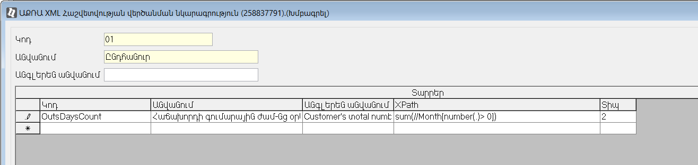
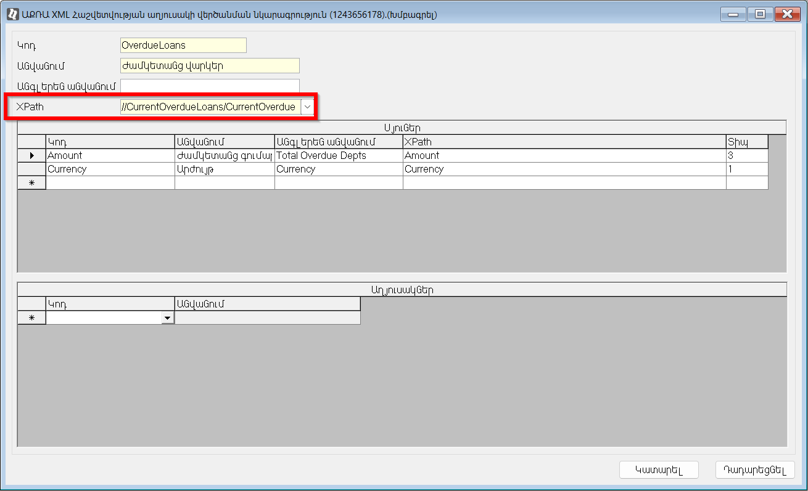

## Բովանդակություն

- [Ներածություն](#ներածություն)
- [Մեթոդներ](#մեթոդներ)
  - [AppForm](#appform)
  - [ClientDoc](#clientdoc)
  - [AcraData](#acradata)
    - [Վերծանման տարրերի օգտագործում ֆունկցիաների հաշվարկում](#վերծանման-տարրերի-օգտագործում-ֆունկցիաների-հաշվարկում)  
    - [Վերծանման մեջ նկարագրված աղյուսակների կիրառում ցուցանիշների հաշվարկման ժամանակ](#վերծանման-մեջ-նկարագրված-աղյուսակների-կիրառում-ցուցանիշների-հաշվարկման-ժամանակ)  
    - [XML տվյալների ստացում առանց վերծանման նկարագրությունների](#xml-տվյալների-ստացում-առանց-վերծանման-նկարագրությունների)
  - [EkengPEKData](#ekengpekdata)
  - [EkengPEKTotalNetInc](#ekengpektotalnetinc)
  - [EkengPEKAvgNetInc](#ekengpekavgnetinc)
  - [AllLoansCount CurrentLoansCount NotMortgagedLoansAmount](#allloanscount-currentloanscount-notmortgagedloansamount)
  - [CurrentLoansAmount](#currentloansamount)

## Ներածություն

Դասը նախատեսված է «Վարկային հոսքագիծ» ենթահամակարգում C# ֆունկցիաների հաշվարկների ժամանակ ընթացիկ տվյալների տրամադրման համար։

Տե՛ս 
- [Վարկային հոսքագծի ենթահամակարգում օգտագործվող C# ֆունկցիաների ստեղծման ձեռնարկ](loan_app.md)
- [IAppCustomCondition ինտերֆեյս](IAppCustomCondition.md)
- [IAppCustomScore ինտերֆեյս](IAppCustomScore.md)

## Մեթոդներ

### AppForm

```c#
public ApForm AppForm()
```

Վերադարձնում է վարկային հայտի փաստաթղթի օբյեկտը։

**Օրինակ**
```c#
// Ստանում ենք վարկային հայտի Գումար և Արժույթ դաշտերի արժեքները։
public async Task<decimal> Evaluate(AppProcessContext context, CancellationToken cancellationToken)
{
    decimal appSum = context.AppForm().SUMMA;
    string currency = context.AppForm().CURRENCY;
    
    // Ստանում ենք "Ցուցանիշներ" աղյուսակի 0030 կոդով ցուցանիշի արժեքը։
    var someScore = context.AppForm().SCORES.Where(r => r.CODE == "0030").First().VALUE;
    //...
}
```

### ClientDoc

```c#
public async Task<Client> ClientDoc()
```

Վերադարձնում է Վարկային հայտում լրացված հաճախորդի քարտի օբյեկտը։

**Օրինակ**
```c#
//Ստանում ենք հայտը ներկայացրած հաճախորդի քարտի "Ընտանիքի անդամների քանակ" դաշտի արժեքը։
public async Task<decimal> Evaluate(AppProcessContext context, CancellationToken cancellationToken)
{
    Client cliCard = await context.ClientDoc();
    int familiMembersCount = cliCard.FMNUM;
    //...
}
```

### AcraData

```c#
async Task<AcraReport> AcraData(string reportType)
```

Վերադարձնում է ACRA հարցման պատասխանը պարունակող օբյեկտ։  
Նշված օբյեկտի միջոցով հասանելի են նաև հաշվարկված, «ԱՔՌԱ XML-ի վերծանման ընտրություն» կարգավորման միջոցով սահմանված ցուցանիշների և աղյուսակների տվյալները։ 
Բացի այդ օբյեկտը պարունակում է ACRA կատարված հարցման վիճակի, իսկ սխալի դեպքում, սխալի հաղորդագրությունը։ 

Հայտի հայտատեսակի և համապատասխան վերծանման նկարագրության միջև կապը նկարագրվում է «ԱՔՌԱ XML-ի վերծանման ընտրություն» կարգավորման միջոցով («Հայտերի ադմինիստրատորի ԱՇՏ» &#8594; «Պարամետրեր և կարգավորումներ»)։  
Վերծանման նկարագրությանը պարունակում է XPath v1.0 լեզվով գրված արտահայտություններ, որոնք թույլ են տալիս ԱՔՌԱ-ից ստացված XML ֆայլից 
* ստանալ / հաշվարկել որոշակի արժեք, 
* ներբեռնել որոշակի հանգույցի ներքո եղած ներդրված էլեմենտները, որոնք այնուհետև իտերացվող օբյեկտի տեսքով հնարավոր է մշակել c# ընդլայնման մեջ։

> [!TIP]
> Ավելի մանրամասն վերծանումների նկարագրությունների վերաբերյալ տես՝ «Վարկային հայտերի» ենթահամակարգի «ԱՔՌԱ ԱՎՀ սերվիս»-ի կարգավորումներ մասը։

Ֆունկցիային, որպես պարամետր փոխանցվում է ԱՔՌԱ վարկային զեկույցի տեսակի կոդը (Այն տարբերբեր ամեն կազմակերպության համար, որպես կանոն 01 - «Ամբողջական զեկույց, 
02 - «Ամբողջական զեկույց + ՖԱՅԿՈ Սքոր», 03 - «ՖԱՅԿՈ Սքոր»)։  
Վարկային զեկույցների տեսակները սահմանվում են «ԱՔՌԱ ԱՎՀ սերվիս» ԱՇՏ &#8594; «Վարկային զեկույցի տեսակներ» տեղեկատուի մեջ։

#### Վերծանման տարրերի օգտագործում ֆունկցիաների հաշվարկում

 

**Օրինակ**
```c# 
/*
Բերված օրինակում հաշվարկվում է հարցման պահին Ժամկետանց օրերի ընդհանուր քանակը։ 
Հաշվարկը իրականցվում է 01 - «Ամբողջական զեկույցի» հիման վրա։ 
Հաշվարկի ընթացքում օգտագործված է հայտին կապակցված վերծանման OutsDaysCount ցուցանիշը։
*/
public class CalculatePaymDelayCount : IAppCustomScore
{
    public async Task<decimal> Evaluate(AppProcessContext context, CancellationToken cancellationToken)
    {
        var acraRep = await context.AcraData("01");

        if (acraRep.Status != ReportDataStatus.OK)
        {
            return 0;
        }
        var OutsDaysCount = acraRep.Data.Items["OutsDaysCount"].Value ?? 0;
        //...
    }
}    
```

#### Վերծանման մեջ նկարագրված աղյուսակների կիրառում ցուցանիշների հաշվարկման ժամանակ 

Օրինակում օգտագործված է ԱՔՌԱ-ից ստացված XML պատասխանի ստորև բերված հատվածը, որը պարունակում է հաճախորդի ժամկետանց գումարները համապատսխան արժութների կոդերով։

```xml
...
<CurrentOverdueLoans>
    <CurrentOverdueLoan>
        <Amount>
        <![CDATA[ 73404 ]]>
        </Amount>
        <Currency>
        <![CDATA[ AMD ]]>
        </Currency>
    </CurrentOverdueLoan>
    <CurrentOverdueLoan>
        <Amount>
        <![CDATA[ 95 ]]>
        </Amount>
        <Currency>
        <![CDATA[ USD ]]>
        </Currency>
    </CurrentOverdueLoan>
</CurrentOverdueLoans>
...
```


**Օրինակ**
```c# 
/*
Հաշվարկը իրականացվել է օգտագործելով XML հաշվետվության վերծանման նկարագրութան մեջ սահմանված CurrentOverdueLoans աղյուսակը։ 
Կատարվել է՝ ExchangeRateService, GeneralService դասերի ինյեկցիա, որոնց միջոցով ստանում ենք արժույթների թվային կոդը և փոխարժեքը դրամային համարժեքով ժամկետանց գումարները հաշվարկելու համար։
*/
public class CalculateOverdueTotal : IAppCustomScore
{
    private ExchangeRateService exchangeRateService;
    private readonly GeneralService generalService;

    public CalculateOverdueTotal(ExchangeRateService exchangeRateService, GeneralService generalService)
    {
        this.exchangeRateService = exchangeRateService;
        this.generalService = generalService;
    }

    public async Task<decimal> Evaluate(AppProcessContext context, CancellationToken cancellationToken)
    {
        var acraRep = await context.AcraData("01");

        if (acraRep.Status != ReportDataStatus.OK)
        {
            return 0;
        }
        var loansByCur = acraRep.Data.SubGrids["OverdueLoans"].Rows;
        decimal total = 0;
        foreach (var row in loansByCur)
        {
            if ((string) row.Columns["Currency"].Value != "AMD")
            {
                string curCode = await generalService.GetCurrencyASCode((string) row.Columns["Currency"].Value);
                var rate = await exchangeRateService.GetExchangeRate(curCode, applicationDate);
                total += (decimal)row.Columns["Amount"].Value * rate.Rate;
            }
            else
            {
                total += (decimal)row.Columns["Amount"].Value;
            }
        }
        return total;
    }
}
```

#### XML տվյալների ստացում առանց վերծանման նկարագրությունների

**Օրինակ**

```c#
/*
Օրինակում հաշվարկվում է հաճախորդի վերջին 6 ամիսների ընթացքում ստացված վարկերի քանակը, որոնց մնացորդը մեծ է 0-ից իսկ պայմանագրի գումարը մեծ է 50000-ից։ 
Ամբողջական xml պատասխանը հասանելի է ReportXml հատկության միջոցով (data.ReportXml)։
*/

public class XPathScoreSample : IAppCustomScore
{
    public async Task<decimal> Evaluate(AppProcessContext context, CancellationToken cancellationToken)
    {
        var data = await context.AcraData("01");

        if (data.Status != ReportDataStatus.OK)
        {
            return 0;
        }

        var doc = new XPathDocument(new StringReader(data.ReportXml)); 
        var nav = doc.CreateNavigator();

        int count = 0;
        var checkDate = context.AppForm().DATE.Value.AddMonths(-6);

        var nodes = nav.Select($"ROWDATA/PARTICIPIENT/Loans/Loan[Balance>0 and CreditStatus='գործող' and Amount>50000]/CreditingDate");
        while (nodes.MoveNext())
        {
            if (DateTime.Parse(nodes.Current.Value) > checkDate)
            {
                count++;
            }
        }

        return count;
    }
}
```

### EkengPEKData

```c#
public async Task<List<PEKTaxInfo>> EkengPEKData()
```

Վերադարձնում է ArmSoft.AS8X.Bank.General.Ekeng.PEKTax.DTO.PEKTaxInfo տիպի օբյեկտների ցուցակ (list)։  
Ցուցակի տարր հանդիսացող օբյեկտները պարունակում են մեկ ամսվա հաճախորդի եկամուտների վերաբերյալ տվյալներ։  Պահանջվող ամիսների քանակը որոշվում է «ԷԿԵՆԳ-ՊԵԿ հարցման եկամուտների ամիսների քանակ» («Հայտերի ադմինիստրատորի ԱՇՏ» &#8594; «Պարամետրեր և կարգավորումներ») կարգավորման միջոցով։ 
Հարցման ժամանակահատվածը ներառում է հայտի ամսաթվին, կարգավորման միջոցով սահմանված ամիսների քանակով, նախորդող ամիսները։

Յուրաքանչյուր օբյեկտ պարունակում է հետևյալ դաշտերը՝ 

| Դաշտի անվանում | Նկարագրություն | Օրինակ |
| -- | -- | -- |
| CivilLawContractPayments | Քաղ-իրավ. պայմ. աշխատավարձ | 0.0000 |
| IncomeDateYYYYMM | Եկամուտի ամիս | "2023-01" |
| IncomeTax | Վճարված եկամտահարկ | 70000.0000 |
| SalaryEquivPayments | Աշխատավարձ և դրան հավասարեցված վճ-ր| 350000.0000 |
| SocialPayments | Վճարված սոց. վճարներ| 17500.0000 |
| SocialPaymentsID | ՀԾՀ | 17500.0000 |
| TaxPayerID | Աշխատակցի ՀՎՀՀ-ն| "00807555" |
| WorkingHours | Աշխ. ժամաքանակ | 158 |

**Օրինակ**
```c#
/*
Օրինակում հաշվարկվում է սահմանված քանակով հայտի ամսաթվին նախորդող ամիսների ընթացքում հաճախորդի կողմից ստացված՝ աշխատավարձին հավասարեցված և քաղիրավական պայմանագրերով վճարված գումարները։
*/
public class CalculateScore : IAppCustomScore
{
    public async Task<decimal> Evaluate(AppProcessContext context, CancellationToken cancellationToken)
    {
        var ekeng = await context.EkengPEKData();
        decimal inc = 0m;
        foreach(var m in ekeng)
        {
            inc += m.CivilLawContractPayments ?? 0;
            inc += m.SalaryEquivPayments ?? 0;
        }
        return inc;
    }
}
```

### EkengPEKTotalNetInc

```c#
public Task<decimal> EkengPEKTotalNetInc()
```

Վերադարձնում է սահմանված ամիսների ընթացքում հաճախորդի զուտ եկամուտը, որը հաշվարկվում է որպես՝ աշխատավարձի և դրան հավասարեցված այլ վճարների և քաղիրավական պայմանագրերով աշխ.վարձատրության ընդհանուր գումարից հանած վճարված եկամտահարկը և սոց վճարները։

Ամիսների քանակը որոշվում է "ԷԿԵՆԳ-ՊԵԿ հարցման եկամուտների ամիսների քանակ" ("Հայտերի ադմինիստրատորի ԱՇՏ" &#8594; "Պարամետրեր և կարգավորումներ") կարգավորման միջոցով։ Հարցման ժամանակահատվածը ներառում է հայտի ամսաթվին, կարգավորման միջոցով սահմանված ամիսների քանակով, նախորդող ամիսները։

**Օրինակ**
```c#
public class CalculateScore : IAppCustomScore
{
    public async Task<decimal> Evaluate(AppProcessContext context, CancellationToken cancellationToken)
    {
        return await context.EkengPEKTotalNetInc();
    }
}
```

### EkengPEKAvgNetInc

```c#
public Task<decimal> EkengPEKAvgNetInc(int avgIncZeroMntNum = 0)
```

Վերադարձնում է միջին զուտ եկամուտը, որը հաշվարկում է հաճախորդի կողմից ստացված՝ աշխատավարձի և դրան հավասարեցված այլ վճարների, քաղիրավական պայմանագրերով աշխ. վարձատրության գումարներից հանած վճ.եկամտահարկ և սոց վճարներ։

Միջինը հաշվարկելիս, `avgIncZeroMntNum` պարամետրի 0 արժեքի դեպքում, ամիսների քանակը որոշվում է «ԷԿԵՆԳ-ՊԵԿ հարցման եկամուտների ամիսների քանակ» («Հայտերի ադմինիստրատորի ԱՇՏ» &#8594; «Պարամետրեր և կարգավորումներ») կարգավորման միջոցով։  
Հարցման ժամանակահատվածը ներառում է հայտի ամսաթվին, կարգավորման միջոցով սահմանված ամիսների քանակով, նախորդող ամիսները։

Այն դեպքում երբ `avgIncZeroMntNum` պարամետրի արժեքը մեծ է 0-ից, ապա ֆունկցիան կվերադարձնի կարգավորման միջոցով սահմանված ամիսների միջինը, եթե հայտի ամսվանը նախորդող, `avgIncZeroMntNum` պարամետրով սահմանված ամիսների ընթացքում, գումարային եկամուտը եղել է 0-ից մեծ։ Հակառակ դեպքում ֆունկցիան կվերադարձնի 0։

**Պարամետրեր**

* `avgIncZeroMntNum`- Սահմանվում է հաճախորդի ոչ 0-ական եկամուտների նվազագույն ամիսների քանակը հայտի ամսվանը նախորդող ամիսների ընթացքում։

**Օրինակ**
```c#
public class CalculateScore : IAppCustomScore
{
    public async Task<decimal> Evaluate(AppProcessContext context, CancellationToken cancellationToken)
    {
        return await context.EkengPEKTotalNetInc();
    }
}
```

### AllLoansCount CurrentLoansCount NotMortgagedLoansAmount

```c#
public Task<decimal> AllLoansCount(string acsType = "");
public Task<decimal> CurrentLoansAmount(string acsType = "", string shablon = "");
public Task<decimal> NotMortgagedLoansAmount(string acsType = "", string shablon = "");
```

**AllLoansCount** վերադարձնում է հաճախորդի բաց և փակված տեղաբաշխված պայմանագրերի քանակը։  
**CurrentLoansAmount**-ը վերադարձնում է հաճախորդի միայն գործող տեղաբաշխված պայմանագրերի քանակը։ 
**NotMortgagedLoansAmount** ֆունկցիան օգտագործվում է հաճախորդի գործող, առանց ապահովվածության, վարկերի գումարը ստանալու համար։ 

**CurrentLoansAmount, NotMortgagedLoansAmount** Ֆունկցիաները հաշվարկելիս հնարավոր է ֆիլտրել պայմանագրերը նաև ըստ ձևանմուշի։

`acsType` պարամետրի լռությամբ արժեքի դեպքում, Ֆունկցիան կվերադարձնի հայտում սահմանված հաճախորդի ստորև թվարկված տեսակի պայմանագրերի քանակները։


Պարամետրի արժեքը սահմանված լինելու դեպքում կվերադարձվի միայն սահմանված տեսակի պայմանագրերի քանակը։

**Պարամետրեր**

* `acsType`- Պայմանագրերի հասանելիության տիպերի ցուցակ, ստորակետներով անջատված, որ տեսակների քանակը անհրաժեշտ է ստանալ։  
  Դատարկ արժեքի դեպքում կվերադարձվի հետևյալ տեսակի պայմանագրերի ընդհանուր քանակը  
  C1   Վարկեր (տեղաբաշխված)           
  C2   Տեղաբաշխված ավանդներ           
  C3   Օվերդրաֆտ (տեղաբաշխված)        
  C4   Ֆինանսական լիզինգ (տեղաբաշխված)  
  C5   Ֆակտորինգ                      
  C6   Ռեպո                           
  C9   Փոխատվություններ               
  CL   Ակրեդիտիվ                      
  CO   Գերածախս                       
  BR   Դեբիտորական պարտք              
  M2   Տրամադրված երաշխավորություն    

* `shablon` - Ձևանմուշների ցուցակ։ Կիրառվում է CurrentLoansAmount և NotMortgagedLoansAmount ֆունկցիաների դեպքում։ Մի քանի ձևանմուշ սահմանելու դեպքում անհրաժեշտ է դրանք տարանջատել ստորակետով։

**Օրինակ**
```c#
//Բերված օրինակում կհաշվարկվի հաճախորդի վարկերի և օվերդրաֆտների ընդհանուր քանակը ներառյալ փակվածները։
public class CalculateScore1 : IAppCustomScore
{
    public async Task<decimal> Evaluate(AppProcessContext context, CancellationToken cancellationToken)
    {
        return await context.AllLoansCount("C1,C3");
    }
}

//Հաշվարկվում է հաճախորդի 0065 ձևանմուշով բացված առանց ապահովվածության վարկերի գումարը։
public class CalculateScore2 : IAppCustomScore
{
    public async Task<decimal> Evaluate(AppProcessContext context, CancellationToken cancellationToken)
    {
        return await context.NotMortgagedLoansAmount("C1", "0065" );
    }
}
```

### CurrentLoansAmount

```c#
public async Task<decimal> CurrentLoansAmount()
```

Վերադարձնում է հայտում սահմանված հաճախորդի գործող տեղաբաշխված պայմանագրերի ընդհանուր մնացորդը հայտի ամսաթվով և հայտի արժութով։

**Պարամետրեր**

* `acsType`- Պայմանագրերի հասանելիության տիպերի ցուցակ, ստորակետներով անջատված, որ տեսակների քանակը անհրաժեշտ է ստանալ։  
  Դատարկ արժեքի դեպքում կվերադարձվի հետևյալ տեսակի պայմանագրերի ընդհանուր քանակը  
  C1   Վարկեր (տեղաբաշխված)           
  C2   Տեղաբաշխված ավանդներ           
  C3   Օվերդրաֆտ (տեղաբաշխված)        
  C4   Ֆինանսական լիզինգ (տեղաբաշխված)  
  C5   Ֆակտորինգ                      
  C6   Ռեպո                           
  C9   Փոխատվություններ               
  CL   Ակրեդիտիվ                      
  CO   Գերածախս                       
  BR   Դեբիտորական պարտք              
  M2   Տրամադրված երաշխավորություն    

**Օրինակ**

```c#
public class AllAgrAmount : IAppCustomScore
{
    public async Task<decimal> Evaluate(AppProcessContext context, CancellationToken cancellationToken)
    {
        return await context.CurrentLoansAmount();
    }
}
```

