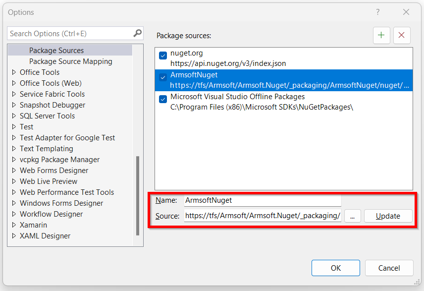
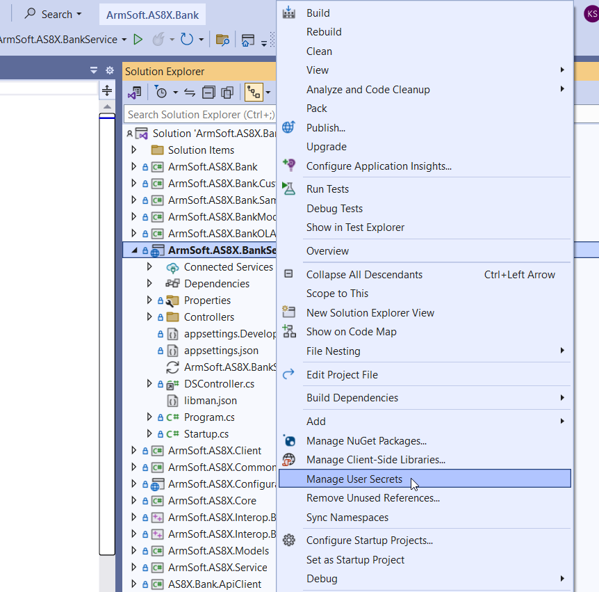

## Բովանդակություն
* [Ներածություն](#ներածություն)
* [Visual Studio ծրագրում կատարվող Կարգավորումները](#visual-studio-ծրագրում-կատարվող-կարգավորումները)
* [Local Service-ի կարգավորում](#Local-Service-ի-կարգավորում)
* [Break Point-ի տեղադրում]
* [Սերվիսի գործարկում]
* [Աշխատանք Debugger-ի հետ]

## 	Ներածություն

Debug-ը թույլ է տալիս գործարկել ծրագրերը վերահսկվող միջավայրում, որի ընթացքում հնարավոր է Կատարել կոդը քայլ առ քայլ վերլուծելով այն, գտնել և շտկել սխալներ: Նախքան Debug-ը գործընթացը անհրաժեշտ է որոշակի կարգավորումներ անել Visual Studio ծրագրում։


## Visual Studio ծրագրում կատարվող կարգավորումները 

Debugger-ի օգտագործման համար անհրաժեշտ է կարգավորել ներքին մատակարարման Nuget սերվերի ճանապարհը։
Սահմանվելով այն ՝ https://tfs/Armsoft/Armsoft.Nuget/_packaging/ArmsoftNuget/nuget/v3/index.json։



Սահմանեք Startup Project -ը Set as Startup Project գործողության միջոցով  Օրինակ՝ ArmSoft.AS8X.BankService

Սերվիսը աշխատացնելու համար անհրաժեշտ է, որպեսզի կարգավորված լինի  բազային միանալու համար անհրաժեշտ տվյալները՝ սերվերի անունը, բազան, sql-ի մուտքանունն ու գաղտնաբառը: Այդ նպատակով գործարկեք Manage User Secrets հրամանը համապատսխան սերվիսի համար Solution Explorer պատուհանում




այնուհետև լրացրեք պահանջվող տվյալները բացված secrets.json ֆայլում json ֆորմատով ստորև բերված օրինակին համապատսխան։

  ```json
{
  "db": {
    "server": "BANK-SERVER\\SQL2017",
    "database": "asbank",
    "login": "user1",
    "password": "passw123"
  }
} 
```

## Local Service ի կարգավորում

Debug անելու համար անհրաժեշտ է կարգավորել ՀԾ-Բանկ համակարգը local սերվիսով աշխատելու համար։ Այդ նպատակով Config.as ֆայլում 
համապատասխան տվյալների բազայի կոնֆիգուրացիայի համար պետք է ավելացնել նրա կրնկնօրինակը փոխելով Service պարամետրի արժեքը հետևյալ կերպ՝ 
```
 Service = https://localhost:1027;
```
Օրինակ՝
```
CONFIG{ NAME="6d_bank6_local";
      SERVER=BANK-SERVER\SQL2017;
      DATABASE=d_bank6;
      BASEFOLDER=D:\BANK\asbank\8xCustomerSpecific;
      BackupFolder=\\qa\backup; SS = YES;
      CONTEXT = ASBANK;
      Service = "https://localhost:1027";
};
```
Local սերվիսով ՀԾ-Բանկ մուտք գործելու համար անհրաժեշտ է նախապես գործարկել այն Visual Studio ծրագրում։


Սերվիսի հաջող գործարկումից հետո բացված browser-ի պատուհանում կարտացոլվի Swagger-ի էջը իսկ Visual Studio ծրագրում կհայտնվի Debug-ի գործիքների վահանակը։ 


