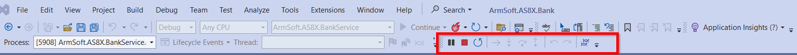
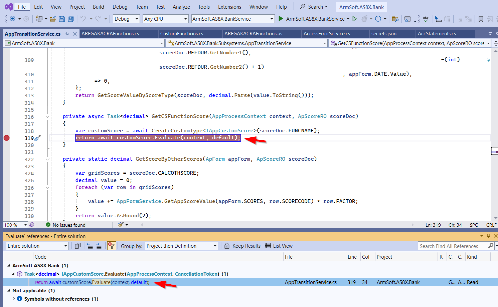

## Բովանդակություն
* [Ներածություն](#ներածություն)
* [Visual Studio ծրագրում կատարվող Կարգավորումները](#visual-studio-ծրագրում-կատարվող-կարգավորումները)
* [Local Service-ի կարգավորում և գործարկում](#Local-Service-ի-կարգավորում-և-գործարկում)
* [Break Point-ի տեղադրում ընդլայնումների ֆայլերում](#Break-Point-ի-տեղադրում-ընդլայնումների-ֆայլերում)
* [Աշխատանք Debugger-ի հետ](#Աշխատանք-Debugger-ի-հետ)

## 	Ներածություն

Debug-ը թույլ է տալիս գործարկել ծրագրերը վերահսկվող միջավայրում, որի ընթացքում հնարավոր է Կատարել կոդը քայլ առ քայլ վերլուծելով այն, գտնել և շտկել սխալներ: Նախքան Debug-ը գործընթացը անհրաժեշտ է որոշակի կարգավորումներ անել Visual Studio ծրագրում։


## Visual Studio ծրագրում կատարվող կարգավորումները 

Debugger-ի օգտագործման համար անհրաժեշտ է կարգավորել ներքին մատակարարման Nuget սերվերի ճանապարհը։
Սահմանվելով այն ՝ https://tfs/Armsoft/Armsoft.Nuget/_packaging/ArmsoftNuget/nuget/v3/index.json։


Սահմանեք Startup Project -ը Set as Startup Project գործողության միջոցով  Օրինակ՝ ArmSoft.AS8X.BankService

Սերվիսը աշխատացնելու համար անհրաժեշտ է, որպեսզի կարգավորված լինի  բազային միանալու համար անհրաժեշտ տվյալները՝ սերվերի անունը, բազան, sql-ի մուտքանունն ու գաղտնաբառը: Այդ նպատակով գործարկեք Manage User Secrets հրամանը համապատսխան սերվիսի համար Solution Explorer պատուհանում


այնուհետև լրացրեք պահանջվող տվյալները բացված secrets.json ֆայլում json ֆորմատով ստորև բերված օրինակին համապատսխան։

  ```json
{
  "db": {
    "server": "BANK-SERVER\\SQL2017",
    "database": "asbank",
    "login": "user1",
    "password": "passw123"
  }
} 
```

## Local Service ի կարգավորում և գործարկում

Debug անելու համար անհրաժեշտ է կարգավորել ՀԾ-Բանկ համակարգը local սերվիսով աշխատելու համար։ Այդ նպատակով Config.as ֆայլում 
համապատասխան տվյալների բազայի կոնֆիգուրացիայի համար պետք է ավելացնել նրա կրնկնօրինակը փոխելով Service պարամետրի արժեքը հետևյալ կերպ՝ 
```
 Service = https://localhost:1027;
```
Օրինակ՝
```
CONFIG{ NAME="6d_bank6_local";
      SERVER=BANK-SERVER\SQL2017;
      DATABASE=d_bank6;
      BASEFOLDER=D:\BANK\asbank\8xCustomerSpecific;
      BackupFolder=\\qa\backup; SS = YES;
      CONTEXT = ASBANK;
      Service = "https://localhost:1027";
};
```
Local սերվիսով ՀԾ-Բանկ մուտք գործելու համար անհրաժեշտ է նախապես գործարկել այն Visual Studio ծրագրում։ Սխալների բացակայության մեջ համոզվելու համար անհրաժեշտ է Build անել պրոյեկտը։


Սերվիսի հաջող գործարկումից հետո բացված browser-ի պատուհանում կարտացոլվի Swagger-ի էջը իսկ Visual Studio ծրագրում կհայտնվի Debug-ի գործիքների վահանակը։ 



## Break Point-ի տեղադրում ընդլայնումների ֆայլերում

Օգտագործողների կողմից ստեղծված ընդլայնումների ֆայլերը Debug անելիս սովորական եղանակով break point -ի տեղադրումը հնարավոր չէ ելնելով իրագործման առանձնահատկություններից։ Ծրագրի ընթացքը կանգեցնելու համար առկա են հետևյալ երկու տարբերակները։ 

1. Break point-ի տեղադրում ընդլայնման ֆայլում հաշվարկի մեթոդը (Calculate, Evaluate) կանչող (տվյալ ֆայլից դուրս գտնվող) հայտարարության (statement) տողի վրա: Նշված հայտարարության տողը գտնելու համար Նշեք մեթոդի անվանումը և սեղմեք Shift + F12 (Find All References)։ Բացված Evaluate References պատուհանում ընտրեք տվյալ մեթոդը կանչող հայտարարությունը։ Արդյունքում կկատարվի անցում համապատասխան ֆայլի պահանջող տողի վրա, որտեղ և տեղադրեք Break Point-ը։ 



2. System.Diagnostics.Debugger.Break(); տողի տեղադրում ընդլայնման ֆայլի այն տողում որտեղ ցանկանում ենք կանգնեցնել ծրագրի կատարումը։
   


  Ընդլայնման ֆայլը խմբագրելուց հետո, նախքան սերվիսի գործարկումը ներմուծեք այն SysCon ծրագրի միջոցով:

## Աշխատանք Debugger-ի հետ

Debugger-ի հետ աշխատանքի վերաբերյալ տես հետևյալ հղումով՝ [Learn to debug C# code using Visual Studio](https://learn.microsoft.com/en-us/visualstudio/get-started/csharp/tutorial-debugger?view=vs-2022&toc=%2Fvisualstudio%2Fdebugger%2Ftoc.json)


