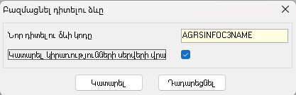
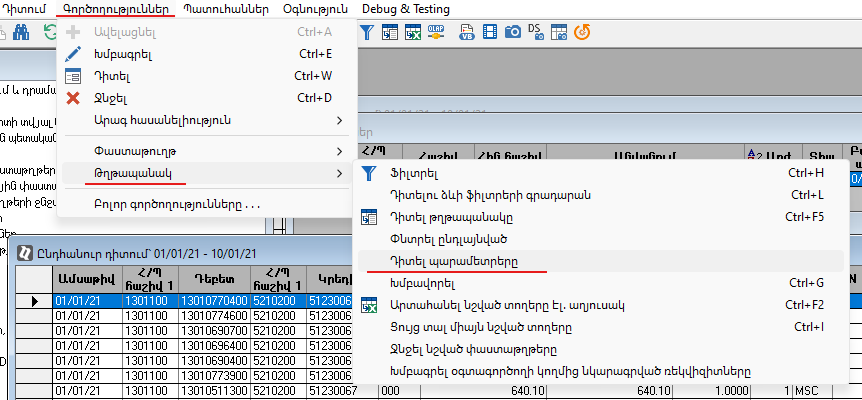

## Բովանդակություն
* [Ներածություն](#ներածություն)
* [Դիտելու ձևի ստեղծում](#դիտելու-ձևի-ստեղծում)
* [Սյուների ընդլայնում](#սյուների-ընդլայնում)
* [Պարամետրերի ընդլայնում](#պարամետրերի-ընդլայնում)
  * [Դիալոգում նոր պարամետրի ավելացում](#դիալոգում-նոր-պարամետրի-ավելացում)

## Ներածություն

Դիտելու ձևում լրացուցիչ սյուներ ավելացնելու, տողերի պարունակությունը փոփոխելու համար 
- նկարագրվում է [տվյալների աղբյուրի ընդլայնում](ds_extender_guide.md),
- ստեղծվում է դիտելու ձևի պատճենը և դրա համար կարգավորվում է ընդլայնումը։

Նոր պարամետրեր ավելացնելու համար
- նկարագրվում է [տվյալների աղբյուրի ընդլայնում նոր պարամետրորով](ds_extender_param_guide.md),
- ստեղծվում է դիտելու ձևի պատճենը և դրա համար կարգավորվում է ընդլայնումը,
- ավելացվում է նոր պարամետր դիտելու ձևի համար բացվող դիալոգի պատուհանում։

## Դիտելու ձևի ստեղծում

Դիտելու ձևի ընդլայնման համար Համակարգային նկարագրությունների «Դիտելու ձևեր» թղթապանակում ցանկալի դիտելու ձևը բազմացնելուց դիալոգային պատուհանում ակտիվացնել «Կատարել կիրառությունների սերվերի վրա» նշիչը։

Նոր ստեղծված դիտելու ձևը խմբագրել և ընտրել ստեղծված «Տվյալների աղբյուրի ընդլայնիչը»։

## Սյուների ընդլայնում

Ընդլայնիչում ավելացված նոր սյուները դիտելու ձևում ավելացնելու համար սյուներ էջում «Հասանելի սյուների» միջոցով հարկավոր է ավելացնել անհրաժեշտ սյուները և տալ հիշել։

## Պարամետրերի ընդլայնում

Հարկավոր է ստեղծել [տվյալների աղբյուրի ընդլայնիչ նոր պարամետրերով](ds_extender_param_guide.md)։  
Նոր ստեղծված դիտելու ձևում «Տվյալների աղբյուրի ընդլայնիչը» լրացնելուց հետո, նոր ավելացված պարամետրերը կարելի է տեսնել «Պարամետրերի սկզբնական արժեքներ» էջի աղյուսակում։

Ստորև օրինակում, որպես նոր պարամետր ավելացվում է հաճախորդի կոդը։

### Դիալոգում նոր պարամետրի ավելացում

Համակարգային նկարագրությունների «Դիալոգների ընդլայնումներ» թղթապանակում ավելացնել նոր դիալոգի ընդլայնում։

Ավելացնել նոր դաշտ, որտեղ "Դաշտի կոդը" և "Համակարգային տիպը" պետք է համընկնեն տվյալների աղբյուրի ընդլայնիչում `AddParam` ֆունկցիայով հայտարարված պարամետրերի անվան և տիպի հետ։

Դիալոգի անունը պետք է լինի նույնի ինչ գրանցված է համարգի մեջ տվյալ թղթապանակի համար։ 
Այն հնարավոր է տեսնել թղթապանակը կանչելով և բացելով թղթապանակի պարամետրերը հաշվետվությունը։ 
Օրինակում բերված է «Ընդհանուր դիտում» թղթապանակի համար դիալոգի անունը` AllOpers:

