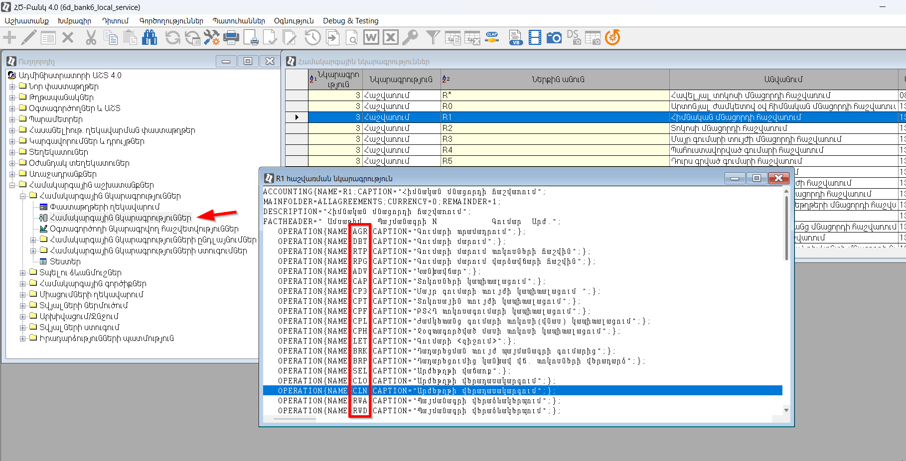

## Բովանդակություն
* [Ներածություն](#ներածություն)
* [Մեթոդներ](#մեթոդներ)
   * [AcName, AcEName](#acname-acename)
   * [AgrSchedule](#agrschedule)
   * [AsCCur](#asccur)
   * [CalculateAtmInd](#calculateatmind)
   * [CalculateOlapFormula](#calculateolapformula)
   * [CliName, CliEName](#cliname-cliename)
   * [CurrencyFormat](#currencyformat)
   * [CurrencyISOCode](#currencyisocode)
   * [CurrencyName](#currencyname)
   * [CURRENT_DATE](#current_date)
   * [DealRate](#dealrate)
   * [ExistsContractByCliISN, ExistsContractByCliCode](#existscontractbycliisn-existscontractbyclicode)
   * [FolderElProp](#folderelprop)
   * [FolderElPropSpec](#folderelpropspec)
   * [FormatDDMMYY, FormatDDMMYYYY, FormatYYYYMMDD](#formatddmmyy-formatddmmyyyy-formatyyyymmdd)
   * [FormatToPrint](#formattoprint)
   * [GetAccCodeByAgrISN](#getacccodebyagrisn)
   * [GetAccountISN](#getaccountisn)
   * [GetAgrFactValue](#getagrfactvalue)
   * [GetAgrRem](#getagrrem)
   * [GetAgrTurn](#getagrturn)
   * [GetAgrTypeByISN](#getagrtypebyisn)
   * [GetAllDayAgrJ](#getalldayagrj)
   * [GetAllDayJCount](#getalldayjcount)
   * [GetBranchParam](#getbranchparam)
   * [GetCliCodeByAcc](#getclicodebyacc)
   * [GetCliContractNamesByISN, GetCliContractNamesByCode](#getclicontractnamesbyisn-getclicontractnamesbycode)
   * [GetClientAMDAcc](#getclientamdacc)
   * [GetClientFullName](#getclientfullname)
   * [GetClientISN](#getclientisn)
   * [GetClientISNByAcc](#getclientisnbyacc)
   * [GetClientRezJurVolortByAccount](#getclientrezjurvolortbyaccount)
   * [GetCollateralISNsByAgrNum](#getcollateralisnsbyagrnum)
   * [GetContractISN](#getcontractisn)
   * [GetDayAgrJ](#getdayagrj)
   * [GetDayPerJ](#getdayperj)
   * [GetExchangeRate](#getexchangerate)
   * [GetFutAgrDbt](#getfutagrdbt)
   * [GetFutPerDbt](#getfutperdbt)
   * [GetFutServFeeDbt](#getfutservfeedbt)
   * [GetLinkedMortSum, GetLinkedGuarSum](#getlinkedmortsum-getlinkedguarsum)
   * [GetPCardData](#getpcarddata)
   * [GetPCardDoc](#getpcarddoc)
   * [GetPerFutur](#getperfutur)
   * [GetAgrSumJ, GetPerSumJ](#getagrsumj-getpersumj)
   * [GetPerSumPayDate, GetAgrSumPayDate](#getpersumpaydate-getagrsumpaydate)
   * [GetRating](#getrating)
   * [GetRatingCode](#getratingcode)
   * [GetRemHI2](#getremhi2)
   * [GetRemSS](#getremss)
   * [GetSSFactValue](#getssfactvalue)
   * [GetSUIDAndDate](#getsuidanddate)
   * [InList](#inlist)
   * [IsIncExpAcc](#isincexpacc)
   * [IsKasAcc](#iskasacc)
   * [LoadAccountDesc](#loadaccountdesc)
   * [LoadAccountDoc](#loadaccountdoc)
   * [LoadClientDesc](#loadclientdesc)
   * [LoadClientDoc](#loadclientdoc)
   * [LoadClientDocRO](#loadclientdocro)
   * [LoadContractDescByCode](#loadcontractdescbycode)
   * [LoadContractDescByISN](#loadcontractdescbyisn)
   * [LoadContractDoc](#loadcontractdoc)
   * [LoadDoc](#loaddoc)
   * [LoadDocFromFolder](#loaddocfromfolder)
   * [LoadNBAccountDesc](#loadnbaccountdesc)
   * [LoadShortAccountDesc](#loadshortaccountdesc)
   * [MaxOverdueDaysCount](#maxoverduedayscount)
   * [MONTH_BEGIN](#month_begin)
   * [MONTH_END](#month_end)
   * [PREVIOUS_MONTH_BEGIN](#previous_month_begin)
   * [PREVIOUS_MONTH_END](#previous_month_end)
   * [PREVIOUS_QUARTE_BEGIN](#previous_quarte_begin)
   * [PREVIOUS_QUARTE_END](#previous_quarte_end)
   * [QUARTE_BEGIN](#quarte_begin)
   * [QUARTE_END](#quarte_end)
   * [SERVER_DATE](#server_date)
   * [SSLastOpDate](#sslastopdate)
   * [SumInWordsAsync](#suminwordsasync)
   * [TreeElProp](#treeelprop)
   * [TreeElPropComment, TreeElPropEComment](#treeelpropcomment-treeelpropecomment)
   * [TryAddAtomicAsync, TryAddAtomic](#tryaddatomicasync-tryaddatomic)
   * [Udf](#udf)
   * [UserElProp](#userelprop)
   * [WEEK_BEGIN](#week_begin)
   * [WEEK_END](#week_end)
   * [WKDATE](#wkdate)
   * [YEAR_BEGIN](#year_begin)
   * [YEAR_END](#year_end)
  
* [Պայմանագրերի հաշվառումների կոդեր](#պայմանագրերի-հաշվառումների-կոդեր)
* [Հաշվառումների գործողությունների կոդեր](#հաշվառումների-գործողությունների-կոդեր)
  

## Ներածություն

UserProxyService-ը օգտագործվում է ընդլայնումներ ստեղծելիս։  
Այն հիմնականում պարունակում է մեթոդներ, որոնք համարժեքն են նախկունում Օգտագործողի կողմից նկարագրվող հաշվետվություններում հասանելի մեթոդների։

Հասանելի են հետևյալ խմբերի մեթոդներ՝
1. Տվյալների պահոցից ստանալ՝ հաճախորդի քարտերի, հաշիվների, պլաստիկ քարտերի, ներգրավված/տեղաբաշխված միջոցների պայմանագրերի ինչպես նաև այլ փաստաթղթերի վերաբերյալ տվյալներ։
2. Սահմանված ամսաթվերով ստանալ հաշիվների, պայմանագրերի հաշվառումների մնացորդները։
3. Ֆորմատավորել ամսաթվեր, գումարներ։
4. Հաշվարկել OLAP-ի ատոմար ցուցանիշների կամ օգտագործողի կողմից նկարագրված ֆունկցիաներ։
 
Ընդլայնումներում UserProxyService-ն օգտագործելու համար անհրաժեշտ է կատարել նշված սերվիսի [ինյեկցիան](../project/injection.md)։ 
Օրինակ՝  
``` c#
[TemplateSubstitutionExtender]
public class AccStatements : ITemplateSubstitutionExtender
{
    private readonly UserProxyService proxyService;

    public AccStatements(UserProxyService proxyService)
    {
        this.proxyService = proxyService;
    }

    //...
}
```

UserProxyService-ը պարունակում է ասինխորն աշխատող մեթոդներ (վերադարձնում են `Task<T>`) և սովորական մեթոդներ։ 
Ասինխորն աշխատող մեթոդները հիմնականում հարկավոր է կանչել օգտագործվելով await բանալի բառը։  


```c#
// Ասինխորն կանչի օրինակ՝ 
Document agrDoc = await proxyService.LoadDoc(docISN);  

// Սովորական մեթոդի կանչի օրինակ՝
DateTime curDate = proxyService.WKDATE(); 
```

Որոշ մեթոդներ սահմանված են static, և դրանք կանչվում են անմիջապես դասի վրայից առանց ինյեկցիայի։

```c#
decimal sum = UserProxyService.AsCCur("15.86") 
```

## Մեթոդներ

### AcName, AcEName

```c#
public Task<string> AcName(string code)
public Task<string> AcEName(string code)
```

Վերադարձնում է հաշվի հայերեն/անգլերեն անվանումը։

**Պարամետրեր**

* `code` - Հաշվի համար։

**Օրինակ**

```c#
// Ստանում ենք 004438799 հաշվի անվանումը։ 
string accName = await proxyService.AcName("004438799"); 
```

### AgrSchedule

```c#
public Task<List<AgrScheduleRow>> AgrSchedule(int isn, DateTime requestDate, 
   ScheduleValueType valueType, ScheduleBasis schKind = ScheduleBasis.Any)
```

Վերադարձնում է գրաֆիկով (Univer) տեսակի պայմանագրերի գրաֆիկի տողերը համար։  
Վերադարձնում է AgrScheduleRow տիպի օբյեկտների ցուցակ, որտեղ յուրաքանչյուր էլեմենտը պարունակում է հետևյալ հատկությունները՝

* `Date` 
* `Summa`

**Պարամետրեր**

- `isn` - Փաստաթղթի ISN։
- `requestDate` -Ամսաթիվ, որի դրությամբ պահանջվում է ստանալ ընթացիկ գրաֆիկը 
- `valueType` - Հնարավոր արժեքներն են՝
  ``` c#
  public enum ScheduleValueType : short
  {
      Agr = 1, // մայր գումարի գրաֆիկ
      Base = 11, // հիմնական ամսաթվերի գրաֆիկ 
      Per = 2, // տոկոսների գրաֆիկ
      PerProl = 22, // երկարաձգված տոկոսների գրաֆիկ
      ServFee = 7, // վարձավճարի գրաֆիկ
      ServFeeProl = 27, // երկարաձգված վարձավճարի գրաֆիկ
      Lim = 6, // սահմանաչափի գրաֆիկ
      Dis = 8 // զեղչատոկոսի գրաֆիկ  
  }
  ```
- `schKind` - Ոչ պարտադիր։ Հնարավոր արժեքներն են՝
  ```c#
  public enum ScheduleBasis : short
  {
      Any = -2, // Կամայական: Լռությամբ արժեք։ 
      AnySchRevision = -1,   // Կամայական վերանայում  0, 9, 10, 11, 12, 13, 14, 15
      RevisionProl = 0, // Վերանայում (Համարելով երկարաձգված)
      RevisionNotProl = 9, // Վերանայում (Չհամարելով երկարաձգված)
      RevisionProlNotLR = 10, // Վերանայում (Չհամարելով երկարաձգված միայն ՎՌ-ում)
      RevDisbNotProl = 13, // Վերանայումով տրամադրում (Համարելով երկարաձգված)
      RevDisbProl = 14, // Վերանայումով տրամադրում (Չհամարելով երկարաձգված)
      RevDisbProlNotLR = 15, // Վերանայումով տրամադրում (Չհամարելով երկարաձգված միայն ՎՌ-ում)
      InterestRate = 1, // Տոկոսադրույքի փոփոխություն
      Repayment = 2,   // Մարում
      Disbursement = 3, // Տրամադրում
      InterestAdjustment = 4, // Տոկոսագումարի ճշգրտում
      SecurityOut = 5,   // Արժեթղթի ելք
      SecurityIn = 6,   // Արժեթղթի մուտք
      InterestAccum = 7, // Տոկոսների հաշվարկում
      LimitSchRevision = 11, // Սահմանաչափի գրաֆիկի վերանայում
      WorkingDayChange = 12, // Ոչ աշխատանքային օրերի փոփոխում
      IntAccumStartDate = 16, // Տոկոսների հաշվարկման սկզբի ամսաթիվ
      EndOfLease = 17, // Վարձակալության ավարտ
      EmergIntProlong = 22 // Տոկոսների արտակարգ երկարաձգում
  }   
  ```

**Օրինակ**

``` c#
// Օրինակում հաշվարկվում է 1433755346 ISN-ով պայմանագրի, 21/01/20-ի դրությամբ գործող գրաֆիկում առկա տոկոսագումարների հանրագումարը։

List<ScheduleRow> schedule = await proxyService.AgrSchedule(1433755346, DateTime.Parse("2020-01-21"), ScheduleValueType.Per);

decimal perSum = 0;
foreach (ScheduleRow row in schedule)
{
    perSum += row.Sum;
}
```

### AsCCur

```c#
public static decimal AsCCur(string stringValue)
```

Վերափոխում է տողով (string) փոխանցված թիվը տասնորդական թվի (decimal)։ 
Դատարկ տող, կամ ոչ թվային սիմվոլներ պարունակող տող փոխանցելու դեպքում կրերադարձվի 0։ 

**Պարամետրեր**

* `stringValue` - Թիվ պարունակող տող։

**Օրինակ**

```c#
// Ֆունկցիային փոխանցված տողը փոխակերպում ենք տասնորդական թվային տիպի։ 
decimal sum = UserProxyService.AsCCur("102111.26");
decimal sum2 = UserProxyService.AsCCur("adada");   // -> 0
```

### CalculateAtmInd

```c#
public decimal CalculateAtmInd(string codFormList, DateTime dateFirst, DateTime dateLast, 
    string acsBranch = "", string skv = "", string calcCurCode = "", int precision = 2)
```

Հաշվարկում է փոխանցված OLAP ատոմար ցուցանիշների գումարը։ 

**Պարամետրեր**

* `codFormList` - Ատոմար ցուցանիշների կոդեր ստորակետով տարանջատված։
  Հնարավոր է փոխանցել ինչպես մեկ այնպես էլ մի քանի ատոմար ցուցանիշի կոդ։
  Մի քանի կոդ փոխանցելու դեպքում նրանք պետք է առանձնացված լինեն ստորակետով և նրանց արանքը չպիտի տեղադրված լինի բացատ։
  Պարամետրի օրինակներ՝ `"XXA"`, `"XXA,XXB"`։
* `dateFirst` - Ժամանակաշրջանի սկիզբ, այն դեպքում երբ ցուցանիշը հաշվարկում է որոշակի ժամանակահատվածի համար (օրինակ՝ հաշիվների միջին մնացորդ)։
  Մնացորդ վերադարձնելու դեպքում այն հանդիսանում է մնացորդի ամսաթիվը։
* `dateLast` - Ժամանակաշրջանի վերջ։ 
  Օգտագործվում է ժամանակահատվածի համար ցուցանիշների հաշվարկի դեպքում։ 
  Մնացորդ վերադարձնելու դեպքում այն կանտեսվի։
* `acsBranch` - Գրասենյակ, որով կֆիլտրվեն հարցվող տվյալներ։
* `skv` - Արժույթի տեսակ կամ արժույթի կոդ։ 
  Հնարավոր արժեքներն են՝
  - `""` կամ `"0"` փոխանցելու դեպքում - Ամբողջ մնացորդը դրամով։
  - `"1"` - Միայն ազատ փոխարկելի արժույթով մնացորդ։
  - `"2"` - Միայն սահմանափակ փոխարկելի արժույթով մնացորդ։
  - `"3"` - Ազատ և սահմանափակ փոխարկելի արժույթներով մնացորդ։
  - Արժույթի կոդ - հաշվարկը կկատարվի ըստ այդ արժույթի։
* `calcCurCode` - Դատարկ արժեքրի դեպքում ցուցանիշի հաշվարկը կկատարվի ՀՀ դրամով։
  Այլ արժույթի կոդ փոխանցելու դեպքում ցուցանիշը կվերահաշվարկվի այդ արժույթով տվյալ օրվա ՀՀ ԿԲ հաշվարկային փոխարժեքով։ 
* `precision` - `1` - կլորացնել հազար դրամի ճշտությամբ, `2` - չկլորացնել։

> [!TIP]
> Ժամանակահատվածի սկզբի, վերջի, ինչպես նաև `acsBranch`, `skv`, `calcCurCode`, `precision` 
պարամետրերի արժեքները ավտոմատ կփոխանցվեն ատոմար ցուցանիշում լրացված բանաձևերի համապատասխան պարամետրերին 
եթե նրանք առկա են։ 

**Օրինակ**

```c#
// Հաշվարկվում է pak մնացորդային ատոմար ցուցանիշի արժեքը B10 գրասենյակի համար 31/10/24 ամսաթվով 001 արժույթի համար։
decimal sum = proxyService.CalculateAtmInd("pak", DateTime.Parse("2024-10-31"), acsBranch: "B10", skv:"001");
```

### CalculateOlapFormula

```c#
public decimal CalculateOlapFormula(string codFormList, string branch, DateTime dateFirst, 
    DateTime dateLast, string skv = "", string calcCurCode = "", int precision = 2)
```

Հաշվարկում է փոխանցված կոդերով OLAP բանաձևերի գումարը։

**Պարամետրեր**

* `codFormList` - OLAP ցուցանիշների կոդեր ստորակետով տարանջատված։ 
  Հնարավոր է փոխանցել՝ ինչպես մեկ, այնպես էլ մի քանի ցուցանիշների կոդեր։ 
  Մի քանի կոդ փոխանցելու դեպքում նրանք պետք է առանձնացված լինեն ստորակետով և նրանց արանքը չպիտի տեղադրված լինի բացատ։  
  Պարամետրի օրինակներ՝ `"_BIA"`, `"_HKAPITAL,_LKAPITAL"`։
* `branch` - OLAP գրասենյակի կոդը։ Օրինակ՝ 16600, 99997, 99999,  
* `dateFirst` - Ժամանակաշրջանի սկիզբ։
* `dateLast` - Ժամանակաշրջանի վերջ
* `skv` - Արժույթի տեսակ կամ արժույթի կոդ։ 
  Հնարավոր արժեքներն են՝
  - `""` կամ `"0"` փոխանցելու դեպքում - Ամբողջ մնացորդը դրամով։
  - `"1"` - Միայն ազատ փոխարկելի արժույթով մնացորդ։
  - `"2"` - Միայն սահմանափակ փոխարկելի արժույթով մնացորդ։
  - `"3"` - Ազատ և սահմանափակ փոխարկելի արժույթներով մնացորդ։
  - Արժույթի կոդ - հաշվարկը կկատարվի ըստ այդ արժույթի։
* `calcCurCode` - Դատարկ արժեքրի դեպքում ցուցանիշի հաշվարկը կկատարվի ՀՀ դրամով։ 
  Այլ արժույթի կոդ փոխանցելու դեպքում ցուցանիշը կվերահաշվարկվի այդ արժույթով տվյալ օրվա ՀՀ ԿԲ հաշվարկային փոխարժեքով։ 
* `precision` - `1` - կլորացնել հազար դրամի ճշտությամբ, `2` - չկլորացնել։

> [!TIP]
> Ժամանակահատվածի սկզբի, վերջի, ինչպես նաև `branch`, `skv`, `calcCurCode`, `precision` պարամետրերի արժեքները ավտոմատ կփոխանցվեն OLAP ցուցանիշում լրացված բանաձևերի համապատասխան պարամետրերին, եթե նրանք առկա են։ 

**Օրինակ**

```c#
decimal sum = proxyService.CalculateOlapFormula("_BIA", "99997", DateTime.Parse("2024-10-31"), DateTime.Parse("2024-10-31"));
```

### CliName, CliEName

```c#
public Task<string> CliName(string code)
public Task<string> CliEName(string code)
```
Վերադարձնում է հաճախորդի հայերեն/անգլերեն անվանումը։

**Պարամետրեր**

* `code` - Հաճախորդի կոդ։

**Օրինակ**

```c#
// Ստանում ենք 00006473 կոդով հաճախորդի հայերեն անվանումը։
string clName = await proxyService.CliName("00006473");
```

### CurrencyFormat

```c#
public string CurrencyFormat(decimal value, short length = 20, short precision = 2)
```

Վերադարձնում է ֆորմատավորված գումարի տող։ 
Սահմանված երկարությունից նիշերի քանակը ավելի փոքր լինելու դեպքում պակասող նիշերը ձախից կհամալրվեն բացատներով։

**Պարամետրեր**

* `value` - Տասնորդական թիվ, որի համար ձևավորվում է ֆորմատավորված տող։
* `length` - Տողի երկարությունը։ 
* `precision` - Ստորակետից հետո նիշերի քանակը։

**Օրինակ**

```c#
decimal amount = 1500.266m;
string st = proxyService.CurrencyFormat(amount, precision:1);
// st փոփոխականի արժեքը կլինի՝ "             1,500.3"
```

### CurrencyISOCode

```c#
public Task<string> CurrencyISOCode(string codCurrency)
```

Վերադարձնում է արժույթի ISO կոդը ըստ ՀԾ-Բանկի Արժույթներ տեղեկատուում գրանցված կոդի։

**Պարամետրեր**

* `codCurrency` - Արժույթի կոդ։ Օրինակ՝ 001։

**Օրինակ**
```c#
// curISO - փոփոխականը կստանա "USD" արժեքը։
string curISO = await proxyService.CurrencyISOCode("001");
```

### CurrencyName

```c#
public Task<(string amName, string enName)> CurrencyName(string codCurrency)
```

Վերադարձնում է արժույթի հայերեն և անգլերեն անվանումները Արժույթներ տեղեկատուից։

**Պարամետրեր**

* `codCurrency` - Արժույթի կոդ։ Օրինակ՝ 001։

**Օրինակ**

```c#
// Ստանում ենք 001 արժույթի հայերեն և անգլերեն անվանումները՝
// curAMD - ԱՄՆ Դոլար
// curUSD - US Dollar 
(string curAMD, string curUSD) = await proxyService.CurrencyName("001");
```

### CURRENT_DATE

```c#
public DateTime CURRENT_DATE()
```

Վերադարձնում է ՀԾ-Բանկ համակարգի դրույթներում սահմանված «ընթացիկ օրը»։

**Օրինակ**

```c#
DateTime dt = proxyService.CURRENT_DATE();
```

### DealRate

```c#
public decimal DealRate(string curCode1, string curCode2, string pusa, string cash, 
        DateTime calcdate, string sMaxCreationDate = "")
```

Վերադարձնում է տրված արժույթների համար սահմանված կանխիկ/անկանխիկ, առքի/վաճառքի դիլինգային փոխարժեքը նշված օրվա դրությամբ։ 

Փոխարժեքի սահմանված չլինելու դեպքում վերադարձնում է զրո։

**Պարամետրեր**

* `curCode1` - Արժույթ 1։
* `curCode2` - Արժույթ 2։
* `pusa` -  Առք/վաճառք։ Հնարավոր արժեքներն են՝ "1" - առք, "2" - վաճառք։
* `cash` -  Կանխիկ/անկանխիկ։ Հնարավոր արժեքներն են՝ "0" - կանխիկ, "1" - անկանխիկ։
* `calcdate` - Փոխարժեքի ամսաթիվ։ 
* `sMaxCreationDate` - Օգտագործվում է այն դեպքում, երբ նույն օրվա ընթացքում սահմանվել են մի քանի փոխարժեքներ և անհրաժեշտ է ստանալ նշված ժամին գործողը։ 
  Արժեքը փոխանցվում է հետևյալ ձևաչափով՝ "yyyy-MM-dd hh:mm"։

**Օրինակ**

```c#
// Ստանում ենք ԱՄՆ դոլարի առքի և վաճառքի, կանխիկի և անկանխիկի համար սահմանված ՀՀ դրամով փոխարժեքը,
// որոնք գործել են 05/09/24-ի 15։00 դրությամբ։

// ԱՄՆ դոլարի կանխիկ առքի փոխարժեքը ՀՀ դրամի նկատմամբ 05/09/24-ի դրությամբ
decimal CashBuyRate = proxyService.DealRate("001", "000", "1", "0", DateTime.Parse("2024-09-05"));

// ԱՄՆ դոլարի անկանխիկ վաճառքի փոխարժեքը ՀՀ դրամի նկատմամբ 05/09/24-ի 15։00-ի դրությամբ
decimal NonCashSellRate = proxyService.DealRate("001", "000", "2", "1", DateTime.Parse("2024-09-05"), "2024-09-05 15:00");
```

### ExistsContractByCliISN, ExistsContractByCliCode

```c#
public bool ExistsContractByCliISN(int cliISN, string contractKey, bool checkClosed = false)
public Task<bool> ExistsContractByCliCode(string cliCode, string contractKey, bool checkClosed = false)
```

Ֆունկցիաները ստուգում են հաճախորդի ISN-ով կամ հաճախորդի կոդով հաճախորդին կից նշված տեսակի պայմանագրերի առկայությունը։

**Պարամետրեր**

* `cliISN` - Հաճախորդի ISN։
* `cliCode` - Հաճախորդի կոդ։
* `contractKey` - Ենթահամակարգի կոդ` BR, C1, C2, D1, D2, N1...
* `checkClosed` - Դիտարկել նաև փակված պայմանագրերը։

> [!TIP]
> ՀԾ-Բանկ համակարգում ենթահամակարգերի կոդերը հնարավոր է դիտել SubSys ծառում։ 
> Այն հասանելի է «Ադմինիստրատորի ԱՇՏ 4.0» &#8594; «Համակարգային աշխատանքներ» &#8594; «Համակարգային նկարագրություններ» տեղեկատուի մեջ։ 
> Ծառը դիտելու համար անհրաժեշտ է կոնտեքստային մենյուի մեջ գործարկել «Բացել ծառը» հրամանը։

**Օրինակ**

```c#
// 898692403 ins-ով հաճախորդի գծով բացված գործող ստացված երաշխավորության պայմանագրերի առկայությունը
bool agrExist = proxyService.ExistsContractByCliISN(898692403, "N2");

// "00101953" կոդով հաճախորդի գծով բացված գործող ստացված տեղաբաշված վարկային պայմանագրերի առկայությունը
bool agrExist2 = await proxyService.ExistsContractByCliCode("00101953", "C1");     
```

### FolderElProp

```c#
public Task<FolderElement> FolderElProp(string folderId, string key, bool noLock = true)
```

Վերադարձնում է [FolderElement](../server_api/types/FolderElement.md) տիպի օբյեկտ ըստ թղթապանակի անվան և բանալիի։ 
Թղթապանակները գրանցվում են հիմնական բազայի FOLDERS աղյուսակում։

**Պարամետրեր**

* `folderId` - Թղթապանակի ներքին անուն։ Համապատասխանում է FOLDERS աղյուսակի fFOLDERID դաշտին։
* `key` - Տարրի բանալին թղթապանակում։ Համապատասխանում է FOLDERS աղյուսակի fKEY դաշտին։
* `noLock` - Թղթապանակի տարրը վերադարձնող Sql հարցման [NOLOCK](https://learn.microsoft.com/en-us/sql/t-sql/queries/hints-transact-sql-table?view=sql-server-ver16#readuncommitted) (READUNCOMMITTED) ռեժիմով կատարման հայտանիշ։  
  false արժեքի դեպքում, հաշվարկի ժամանակ, տվյալների փոփոխման տրանզակցիայի առկայության դեպքում, տվյալների ստացումը կկատարվի տրանզակցիայի ավարտից հետո։ 
  true արժեքի դեպքում տվյալները կվերադարձվեն անմիջապես, մինչև տրանզակցիայի ավարտը, այսպիսով հաշվարկը կկատարվի ավելի արագ։

**Օրինակ**

```c#
// Ստանում ենք վարկային պայմանագրի ընթացիկ գրաֆիկի ISN-ը պայմանագրի թղթապանակից։
// Agr.243335599-ն հանդիսանում է 243335599 ISN-ով պայմանագրի թղթապանակը, 
// C1TSDtUn-ն հանդիսանում է թղթապանակում ընթացիկ գրաֆիկի բանալին։
int schedISN = (await proxyService.FolderElProp("Agr.243335599", "C1TSDtUn")).ISN;
```

### FolderElPropSpec

```c#
public Task<string> FolderElPropSpec(string folderId, string key, bool noLock = true)
```

Վերադարձնում է FOLDERS աղյուսակի fSPEC դաշտի արժեքը ըստ թղթապանակի անվան և տարրի բանալու։

**Պարամետրեր**

* `folderId` - Թղթապանակի ներքին անուն։ Համապատասխանում է FOLDERS աղյուսակի fFOLDERID դաշտին։
* `key` - Տարրի բանալին թղթապանակում։ Համապատասխանում է FOLDERS աղյուսակի fKEY դաշտին։
* `noLock` - Թղթապանակի տարրը վերադարձնող Sql հարցման [NOLOCK](https://learn.microsoft.com/en-us/sql/t-sql/queries/hints-transact-sql-table?view=sql-server-ver16#readuncommitted) (READUNCOMMITTED) ռեժիմով կատարման հայտանիշ։  
  false արժեքի դեպքում, հաշվարկի ժամանակ, տվյալների փոփոխման տրանզակցիայի առկայության դեպքում, տվյալների ստացումը կկատարվի տրանզակցիայի ավարտից հետո։ 
  true արժեքի դեպքում տվյալները կվերադարձվեն անմիջապես, մինչև տրանզակցիայի ավարտը, այսպիսով հաշվարկը կկատարվի ավելի արագ։

**Օրինակ**
```c#
// Ստանում ենք C.304663812 թղթապանակի (304663812 ISN-ով հաճախորդի թղթապանակ) 1065495882
// բանալիով տողի fSPEC դաշտի արժեքը՝
// "004480000    Արժ.- 000  Տիպ- 01  Հ/Հաշիվ- 3022000   Անվանում-Պողոսյան Պողոս" 

string accDetails = await proxyService.FolderElPropSpec("C.304663812", "1065495882");
```

## FormatDDMMYY, FormatDDMMYYYY, FormatYYYYMMDD

```C#
public string FormatDDMMYY(DateTime? date);
public string FormatDDMMYYYY(DateTime? date);
public string FormatYYYYMMDD(DateTime? date);
```

Ձևափոխում են տրված ամսաթիվը տեքստի։ 

FormatDDMMYY-ը կօգտագործի `dd/MM/yy` ձևաչափ։ `null` արժեքի դեպքում կվերադարձվի `" / / "` տողը։  
FormatDDMMYYYY-ը կօգտագործի `dd/MM/yyyy` ձևաչափ։ `null` արժեքի դեպքում կվերադարձվի `" / /   "` տողը։  
FormatYYYYMMDD-ը կօգտագործի `yyyyMMdd` ձևաչափ։ `null` արժեքի դեպքում կվերադարձվի `"00000000"` տողը։  

**Պարամետրեր**

* `date` - Ամսաթիվ։

**Օրինակ**

```C#
DateTime dt = new DateTime(2024, 11, 25);

string dt1 = proxyService.FormatDDMMYY(dt);     // -> "25/11/24"
string dt2 = proxyService.FormatDDMMYYYY(dt);   // -> "25/11/2024"
string dt3 = proxyService.FormatYYYYMMDD(dt);   // -> "20241125"

string dt4 = proxyService.FormatDDMMYY(null);   // -> "  /  /  "
string dt5 = proxyService.FormatDDMMYYYY(null); // -> "  /  /    "
string dt6 = proxyService.FormatYYYYMMDD(null); // -> "        "
```

### FormatToPrint

```c#
public string FormatToPrint(decimal value)
```

Ձևափոխում են տրված տասնորդական թիվը տեքստի։ 

**Պարամետրեր**

* `value` - Թիվ։

**Օրինակ**

```c#
decimal amount = 2301500.266m;
string st = proxyService.FormatToPrint(amount); // -> "2,301,500.266"
```

### GetAccCodeByAgrISN

```c#
public Task<string> GetAccCodeByAgrISN(int agrISN, string accName, string agrType = "", 
        string agrRisk = "", bool accFormat = true)
```
Վերադարձնում է պայմանագրի հաշվապահական հավելվածի համապատասխան դաշտում լրացված հաշվեհամարը, որի ներքին անվանումը փոխանցվում է accName պարամետրի միջոցով։

**Պարամետրեր**

* `agrISN` - Պայմանագրի ISN։
* `accName` - Հաշվապահական հավելվածի համապատասխան դաշտի ներքին անունը կամ պահուստավորման աղյուսակում հաշվի սյան ներքին անունը։
* `agrType` - Պայմանագրի ենթահամակարգի տեսակ` C, D, M, N, B, Q։ 
  Պարամետրի լրացված լինելու դեպքում հաշվարկը կկատարվի ավելի արագ։
* `agrRisk` - Պայմանագրի ռիսկի դասիչը, որի համապատասխան պահուստավորման հաշիվը հարկավոր է վերադարձնել։ 
  Օգտագործվում է միայն պահուստավորման հետ կապված հաշիվների ստացման համար (Հաշվապահական հավելվածի «Պահուստավորման հաշիվներ» աղյուսակ)։ 
* `accFormat` - true արժեքի դեպքում ետհաշվեկշռային հաշիվները կվերադարձվեն 20, իսկ հաշվեկշռային հաշիվները 11 երկարությամբ պակասող նիշերը աջից կհամալրվեմ բացակներով։ 
  false արժեքի դեպքում հաշվեհամարները կվերադարձվեն առանց բացատների։

> [!TIP]
> ՀԾ-Բանկ համակարգում ենթահամակարգերի տեսակը հնարավոր է դիտել SubSys ծառում։ 
> Այն հասանելի է «Ադմինիստրատորի ԱՇՏ 4.0» &#8594; «Համակարգային աշխատանքներ» &#8594; «Համակարգային նկարագրություններ» տեղեկատուի մեջ։ 
> Ծառը դիտելու համար անհրաժեշտ է կոնտեքստային մենյուի մեջ գործարկել «Բացել ծառը» հրամանը։

**Օրինակ**

```c#
// Ստանում ենք 253711148 ISN-ով տեղաբաշված վարկի պայմանագրի տոկոսների հաշվարկման հաշիվը։
string acc = await proxyService.GetAccCodeByAgrISN(253711148, "ACCPERCNT", "C");
```

### GetAccountISN

```c#
public Task<int> GetAccountISN(string acc)
```

Վերադարձնում է հաշվի ISN-ը ըստ հաշվի համարի։ 

**Պարամետրեր**

* `acc` - Հաշվի համար։

**Օրինակ**

```c#
// Ստանում ենք 10110050601 հաշվի ISN-ը։
int isn = await proxyService.GetAccountISN("10110050601");
```

### GetAgrFactValue

```c#
public Task<DateTime?> GetAgrFactValueDate(int isn, NoRem accType, string accOp, 
        DateTime requestDate, MinMax minMax, bool onlyOpenChildren)

public Task<DateTime?> GetAgrFactValueDate(int isn, NoRem accType, string accOp, 
        DateTime requestDate, MinMax minMax, bool onlyOpenChildren, string agrTypeName)

public Task<InterestRate> GetAgrFactValuePercent(int isn, NoRem accType, string accOp, 
        DateTime requestDate, MinMaxLast minMaxLast, bool onlyOpenChildren)

public Task<InterestRate> GetAgrFactValuePercent(int isn, NoRem accType, string accOp, 
        DateTime requestDate, MinMaxLast minMaxLast, bool onlyOpenChildren, string agrTypeName)

public Task<decimal?> GetAgrFactValueDecimal(int isn, NoRem accType, string accOp, 
        DateTime requestDate, MinMax minMax, bool onlyOpenChildren)

public Task<decimal?> GetAgrFactValueDecimal(int isn, NoRem accType, string accOp, 
        DateTime requestDate, MinMax minMax, bool onlyOpenChildren, string agrTypeName)

public Task<string> GetAgrFactValueString(int isn, NoRem accType, string accOp, 
        DateTime requestDate, MinMax minMax, bool onlyOpenChildren)

public Task<string> GetAgrFactValueString(int isn, NoRem accType, string accOp, 
        DateTime requestDate, MinMax minMax, bool onlyOpenChildren, string agrTypeName)
```

Ֆունկցիաները վերադարձնում են պայմանագրի [ոչ մնացորդային հաշվառումների](#ոչ-մնացորդային-հաշվառումներ) արժեքները տրված ամսաթվով։ 

Ի տարբերություն [GetSSFactValue](#getssfactvalue) ֆունկցիաների խմբի այս ֆունկցիաները գործում են նաև բարդ պայմանագրերի համար։ 
Վերադարձվող արժեքը կարող է լինել ենթապայմանագրի գծով առավելագույն, նվազագույն կամ վերջին նշակաված արժեքը։ 

**Պարամետրեր**

* `isn` -  Պայմանագրի ISN։
* `accType` - Հաշվառման կոդ։ 
  Արժեքները փոխանցվում են NoRem դասի համապատասխան հատկության միջոցով։ 
  Նշված դասի հատկությունների անվանումները համապատասխանում են [պայմանագրերի հաշվառման կոդերին](#ոչ-մնացորդային-հաշվառումներ)։
* `accOp` - [Գործողության որոնվող կոդ](#հաշվառումների-գործողությունների-կոդեր)։ 
* `requestDate` - Արժեքի որոնման ամսաթիվ։
* `MinMax`, `MinMaxLast` - Նվազագույն, առավելագույն կամ վերջին նշանակված արժեքը ըստ ենթապայմանագրերի։
* `onlyOpenChildren` - Դիտարկել միայն հարցման ամսաթվով գործող ենթապայմանագրերը։
* `agrTypeName` - Փոխանցվում է պայմանագրի (`isn`) փաստաթղթի ներքին անունը՝ տեսակը։ 
  Փոխանցելու դեպքում ֆունկցիայի կատարման ժամանակը կկրճատվի։


**Օրինակ**

```c#
// ստանում ենք 307245031 ISN-ով բարդ պայմանագրի ենթապայմանագրերի գծով նշանակված վերջին տոկոսադրույքը
// 29/12/24 ամսաթվի դրությամբ։ 
deciaml perc = (await proxyService.GetAgrFactValuePercent(307245031, NoRem.N0, 
    "PAG", DateTime.Parse("2024-12-29"), MinMaxLast.Last, true, "C1Compl")).Rate;
```

### GetAgrRem

```c#
public Task<decimal> GetAgrRem(int isn, Rem accType, DateTime requestDate, 
        string agrTypeName = null, string sourceCur = "", string targetCur = "")
```

Վերադարձնում է պայմանագրի հաշվառման մնացորդը։ 
Բարդ պայմանագրի դեպքում վերադարձնում է ըստ բոլոր ենթապայմանագրերի։

**Պարամետրեր**

* `isn` -  Պայմանագրի ISN։
* `accType` - Հաշվառման կոդ։ 
  Արժեքները փոխանցվում են Rem դասի համապատասխան հատկության միջոցով։ 
  Նշված դասի հատկությունների անվանումները համապատասխանում են [պայմանագրերի հաշվառման կոդերին](#մնացորդային-հաշվառումներ)։
* `requestDate` - Մնացորդի ամսաթիվ։
* `agrTypeName` - Փոխանցվում է պայմանագրի (`isn`) փաստաթղթի ներքին անունը՝ տեսակը։ 
  Փոխանցելու դեպքում ֆունկցիայի կատարման ժամանակը կկրճատվի։
* `sourceCur` - Պայմանագրի մնացորդի արժույթի կոդը։  
  Օրինակ՝ "000", "001"։  
  Այս պարամետրը հարկավոր է փոխանցել `targetCur` պարամետրի հետ միասին։ 
* `targetCur` - Վերահաշվարկի արժույթի թվային կոդը։  
  Օրինակ՝ "000", "001"։  
  Այս պարամետրը հարկավոր է փոխանցել `sourceCur` պարամետրի հետ միասին։ 
  Փոխանցված լինելու դեպքում մնացորդը կվերահաշվարկվի ըստ տվյալ արժույթի համար `requestDate` ամսաթվով ՀՀ ԿԲ հաշվարկային փոխարժեքի։  
  Փոխանցված չլինելու դեպքում գումարը կվերադարձվի հաշվառման արժույթով։

**Օրինակ**

```c#
// կհաշվարկվի 653013562 ISN-ով, ԱՄՆ դոլարով պայմանագրի մնացորդը վերահաշվարկված ԵՎՐՈ-ով
// 13/08/24-ի դրությամբ։
decimal agrRem = await proxyService.GetAgrRem(653013562, Rem.R1, 
    DateTime.Parse("2024-08-13"), "C1Univer", "001", "049");
```

### GetAgrTurn

```c#
public Task<decimal> GetAgrTurn(int isn, DateTime startDate, DateTime endDate, 
        Rem accType, string accOp, string dbCr, string opCur = "", string convertCur = "")
```

Վերադարձնում է պայմանագրի շրջանառությունը ըստ սահմանված գործողության տեսակի և ժամանակահատվածի։ 
Բարդ պայմանագրի դեպքում վերադարձնում է ըստ բոլոր ենթապայմանագրերի։

**Պարամետրեր**

* `isn` -  Պայմանագրի ISN։
* `startDate` - Սկզբի ամսաթիվ։
* `endDate` - Վերջի ամսաթիվ։
* `accType` - Հաշվառման կոդ։
  Արժեքները փոխանցվում են Rem դասի համապատասխան հատկության միջոցով։ 
  Նշված դասի հատկությունների անվանումները համապատասխանում են [պայմանագրերի հաշվառման կոդերին](#մնացորդային-հաշվառումներ)։
* `accOp` - [Գործողության որոնվող կոդ](#հաշվառումների-գործողությունների-կոդեր)։ 
* `dbCr` - Փոխանցել `"D"` հաշվառման մնացորդի ավելացնող գործողությունների որոնման համար։ `"C"`՝ նվազման։
* `opCur` - Գործողության կատարման արժույթի թվային կոդ։  
  Օրինակ՝ "001", "000"։  
  Այս պարամետրը հարկավոր է փոխանցել `convertCur` պարամետրի հետ միասին։  
  Փոխանցված չլինելու դեպքում գումարը կվերադարձվի գործողության արժույթով։
* `convertCur` - Վերահաշվարկի արժույթի թվային կոդը։  
  Այս պարամետրը հարկավոր է փոխանցել `opCur` պարամետրի հետ միասին։  
  Փոխանցված լինելու դեպքում մնացորդը կվերահաշվարկվի ըստ տվյալ արժույթի ՀՀ ԿԲ հաշվարկային փոխարժեքի։  
  Փոխանցված չլինելու դեպքում գումարը կվերադարձվի գործողության արժույթով։


**Օրինակ**

```c#
// հաշվարկվում է 812735354 ISN-ով, դրամային պայմանագրի գծով, 
// սահմանված ժամանակահատվածում կատարված տրամադրումների ընդհանուր գումարը վերահաշվարկված ԱՄՆ դոլարի։
decimal agrRem = await proxyService.GetAgrTurn(812735354, 
    DateTime.Parse("2009-07-10"), DateTime.Parse("2009-07-25"), Rem.R1,"AGR","D", "000", "001");
```

### GetAgrTypeByISN

```c#
public string GetAgrTypeByISN(int docISN)
```

Վերադարձնում է պայմանագրի ենթահամակարգի տեսակը։
Օրինակ՝ C, D, N:

**Պարամետրեր**

* `docISN` - Պայմանագրի ISN:

**Օրինակ**

```c#
// 607802582 ISN-ով տեղաբաշխված վարկի համար կվերադարձնի "C"։
string agrType = proxyService.GetAgrTypeByISN(607802582);
```

### GetAllDayAgrJ

```c#
public Task<short> GetAllDayAgrJ(int agrIsn, DateTime getDate)
```

Վերադարձնում է պայմանագրի ընդհանուր ժամկետանց օրերի քանակը։

**Պարամետրեր**

* `agrIsn` - Պայմանագրի ISN:
* `getDate` - Հարցման ամսաթիվը:

**Օրինակ**

```c#
// Հաշվարկվում է 905721123 պայմանագրի ընդհանուր ժամկետանց օրերի քանակը ընթացիկ ամսաթվի դրությամբ։
short agrJ = await proxyService.GetAllDayAgrJ(905721123, proxyService.CURRENT_DATE());
```

### GetAllDayJCount

```c#
public Task<short> GetAllDayJCount(int agrIsn, DateTime repDate)
```

Վերադարձնում է պայմանագրի անընդմեջ ժամկետանց օրերի քանակը։

**Պարամետրեր**

* `agrIsn` - Պայմանագրի ISN:
* `getDate` - Հարցման ամսաթիվը:

**Օրինակ**

```c#
// Հաշվարկվում է 905721123 ISN-ով պայմանագրի գծով անընդմեջ ժամկետանց օրերի քանակը ընթացիկ ամսաթվի դրությամբ։
short agrJc = await proxyService.GetAllDayJCount(905721123, proxyService.CURRENT_DATE()); 
```

### GetBranchParam

```c#
public Task<string> GetBranchParam(string paramCode, string branchCode = "")
```

Վերադարձնում է գրասենյակ փաստաթղթի տվյալները:

Գրասենյակի կոդը փոխանցված չլինելու դեպքում կվերադարձվի առաջին պարամետրով փոխանցված նույնանուն համակարգային պարամետրերի արժեքը։

**Պարամետրեր**

* `paramCode` - Գրասենյակ փաստաթղթի դաշտի ներքին անուն կամ նույնանուն համակարգային պարամետրի կոդ։
  Հնարավոր արժեքներն են՝
  - COMPANYNAME - Անվանում
  - ECOMPANYNAME - Անգլերեն անվանում
  - GENKASSA - Ընդհանուր դրամարկղ
  - CODBANK - ՀՀ ԿԲ կոդ
  - OFFLINE - OFF-LINE մասնաճյուղ
  - MANAGERPOST - Ղեկավարի պաշտոնը 
  - EMANAGERPOST - Ղեկավարի պաշտոնը (անգլերեն)
  - MANAGERNAME - Ղեկավարի անունը
  - EMANAGERNAME - Ղեկավարի անունը (անգլերեն)
  - MANAGERPASS - Ղեկավարի անձնագրի համարը
  - MANAGERDOV - Ղեկավարի լիազորագրի համարը
  - CHIEFACCTNTPOST - Գլխավոր հաշվապահի պաշտոնը
  - ECHIEFACCTNTPOST - Գլխավոր հաշվապահի պաշտոնը(անգլերեն)
  - CHIEFACCTNT - Գլխավոր հաշվապահ
  - ECHIEFACCTNT - Գլխավոր հաշվապահ(անգլերեն)
  - COMPANYADDR - Հասցե
  - ECOMPANYADDR - Հասցե (անգլերեն)
  - COMPANYTEL - Հեռախոս
  - COMPANYCITY - Քաղաք
  - ECOMPANYCITY - Քաղաք(անգլերեն)
  - POSTIND - Ինդեքս
* `branchCode` - Գրասենյակի կոդ՝ համապատասխանում է Գրասենյակներ ծառի հանգույցներին։

**Օրինակ**

```c#
// Ստանում ենք B01 կոդով գրասենյակի գլխավոր հաշվապահի անունը։ 
string accountantName = await proxyService.GetBranchParam("CHIEFACCTNT", "B01"); 
```

### GetCliCodeByAcc

```c#
public Task<string> GetCliCodeByAcc(string account)
```

Վերադարձնում է Հաճախորդի կոդը ըստ հաշվի համարի։ 

**Պարամետրեր**

* `account` - Հաշվի համար։

**Օրինակ**

```c#
// Հաշվարկվում է 10200060200 հաշվի հաշվետիրոջ կոդը։
string cliCode = await proxyService.GetCliCodeByAcc("10200060200");
```

### GetCliContractNamesByISN, GetCliContractNamesByCode

```c#
public Task<string> GetCliContractNamesByISN(int cliISN, bool showClosed = false)
public Task<string> GetCliContractNamesByCode(string cliCode, bool showClosed = false)
```

Վերադարձնում են հաճախորդի թղթապանակում առկա փաստաթղթերի ներքին անունների (տեսակների) ցուցակը։

Վերադարձվող արժեքը ստորակետով տարաջատված տեքստ է։
Օրինակ՝ "Acc, C1Univer, Cli, N1Other, NBAcc, REMINDER"։

**Պարամետրեր**

* `cliISN` - Հաճախորդի ISN:
* `cliCode` - Հաճախորդի կոդ։
* `showClosed` - Ցույց տալ նաև փակվածները։ 

**Օրինակ**

```c#
// Վերադարձվող տողի օրինակ ՝ "Acc, C1Univer, Cli, N1Other, NBAcc, REMINDER"
string docTypes1 = await proxyService.GetCliContractNamesByISN(339923058);
string docTypes2 = await proxyService.GetCliContractNamesByCode("00006518");
```

### GetClientAMDAcc

```c#
public Task<string> GetClientAMDAcc(string cliCode)
```

Վերադարձնում է հաճախորդի քարտում լրացված հիմնական դրամային հաշիվը («Պայմաններ» էջ, «Հիմնական դրամային հաշիվ (գանձ. պայմ% մար-տրմդր)»)։

**Պարամետրեր**

* `cliCode` - Հաճախորդի կոդ։

**Օրինակ**

```c#
string acc = await proxyService.GetClientAMDAcc("00006252");
```

### GetClientFullName

```c#
public Task<string> GetClientFullName(string firstName, string lastName, 
        string ptronymic, bool arm)
```

Վերադարձնում է հաճախորդի անուն, ազգանուն, հայրանունը համակարգում սահմանված հերթականությամբ։

Հերթականությունը որոշվում է CLINAMEORDER - «Հաճախորդի անվան հերթականություն» պարամետրով, եթե ձևավորվում է հայերեն ամբողջական անունը և CLINAMEORDERENG - «Հաճախորդի անգլ. անվան հերթականություն» պարամետրերով, եթե ձևավորվում է անգլերեն ամբողջական անուն։

**Պարամետրեր**

* `firstName` - Հաճախորդի անուն կամ անգլերեն անուն։
* `lastName` - Հաճախորդի ազգանուն կամ անգլերեն ազգանուն։
* `ptronymic` - Հաճախորդի հայրանուն կամ անգլերեն հայրանուն։
* `arm` - **true** - անվանումը հայերեն է, **false** - անվանումը անգլերեն է։

**Օրինակ**

```c#
string fullName = await proxyService.GetClientFullName("Պողոս", "Պողոսյան", "Պողոսի", true);
```

### GetClientISN

```c#
public Task<int> GetClientISN(string cliCode)
```

Վերադարձնում է հաճախորդի ISN-ը ըստ հաճախորդի կոդի։

**Պարամետրեր**

* `cliCode` - Հաճախորդի կոդը։

**Օրինակ**

```c#
int isn = await proxyService.GetClientISN("00006525");
```

### GetClientISNByAcc

```c#
public Task<int> GetClientISNByAcc(string acc)
```

Վերադարձնում է հաճախորդի ISN-ը ըստ հաճախորդի որևէ հաշվեհամարի։  
Հաշվեհամարի բացակայության կամ ոչ հաճախորդային հաշվի դեպքում կվերադարձվի -1։

**Պարամետրեր**

* `acc` - Հաշվի համար։

**Օրինակ**

```c#
int isn = await proxyService.GetClientISNByAcc("10000081200");
```

### GetClientRezJurVolortByAccount

```c#
public Task<(string residence, string jurState, string volort)> 
    GetClientRezJurVolortByAccount(string accCode)
```

Վերադարձնում է հաճախորդի ռեզիդենտություն, իրավաբանական կարգավիճակ և ոլորտ դաշտերի արժեքները ըստ հաճախորդի հաշվեհամարի։  
Հաշվեհամարի բացակայության կամ ոչ հաճախորդային հաշվի դեպքում կվերադարձվի դատակ արժեքներ։

**Պարամետրեր**

* `acc` - Հաշիվի համար։

**Օրինակ**
```c#
(string res, string jstat, string volort) = await proxyService.GetClientRezJurVolortByAccount("00315580100");
```

### GetCollateralISNsByAgrNum

``` c#
public Task<List<int>> GetCollateralISNsByAgrNum(string agreemCode, string agreemType)
```

Վերադարձնում է տվյալ պայմանագրին կապակցված գրավների ISN-ները (ավանդային գրավի դեպքում վերադարձնում Է N3DepMor պայմանագիրը, ոչ թե ավանդային գրավի ենթապայմանագրերը):

**Պարամետրեր**

* `agreemCode` - Պայմանագրի համար։
* `agreemType` - Պայմանագրի ենթահամակարգի տեսակը՝ "C", "M" (տրամադրված երաշխավորությունների դեպքում)։

**Օրինակ**

```c#
// Ստանում ենք TV-8900 վարկային պայմանագրին կապակցված գրավի և երաշխավորությունների պայմանագրերի ISN-ները:
List<int> cISNs = await proxyService.GetCollateralISNsByAgrNum("TV-8900", "C");
```

### GetContractISN

```c#
public Task<int> GetContractISN(string agrType, string agrCode)
```

Վերադարձնում է պայմանագրի ISN-ը ըստ պայմանագրի համարի։

**Պարամետրեր**

* `agrType` - Պայմանագրի ենթահամակարգի տեսակ` C, D, M, N, B, Q։ 
* `agrCode` - Պայմանագրի համար։

> [!TIP]
> ՀԾ-Բանկ համակարգում ենթահամակարգերի տեսակը հնարավոր է դիտել SubSys ծառում։ 
> Այն հասանելի է «Ադմինիստրատորի ԱՇՏ 4.0» &#8594; «Համակարգային աշխատանքներ» &#8594; «Համակարգային նկարագրություններ» տեղեկատուի մեջ։ 
> Ծառը դիտելու համար անհրաժեշտ է կոնտեքստային մենյուի մեջ գործարկել «Բացել ծառը» հրամանը։

**Օրինակ**

```c#
// Ստանում ենք AS80-001 համարով վարկային պայմանագրի ISN-ը։
int agIsn = await proxyService.GetContractISN("C", "AS80-001");
```

### GetDayAgrJ

```c#
public Task<short> GetDayAgrJ(int agrIsn, string agrType, DateTime getDate)
```

Վերադարձնում է պայմանագրի մայր-գումարի ժամկետանց օրերի քանակը։

**Պարամետրեր**

* `agrIsn` - Պայմանագրի ISN:
* `agrType` - Պայմանագրի տիպ։ 
  Օրինակ՝ C1Univer, C5Univer, C1Simpl: 
  Դատարկ տող փոխանցելու դեպքում փաստաթղթի տեսակի կորոշվի ավտոմատ։
* `getDate` - Հարցման ամսաթիվ։

**Օրինակ**  

```c#
// Հաշվարկվում է 905721123 ISN-ով պայմանագրի գծով մայր-գումարի ժամկետանց օրերի քանակը ընթացիկ ամսաթվի դրությամբ։
short overdDays = await proxyService.GetDayAgrJ(815929352, "", DateTime.Parse("2024-10-15")); 
```

### GetDayPerJ

```c#
public Task<short> GetDayPerJ(int agrIsn, DateTime getDate)
```

Վերադարձնում է պայմանագրի տոկոսների ժամկետանց օրերի քանակը։

**Պարամետրեր**

* `agrIsn` - Պայմանագրի ISN:
* `getDate` - Հարցման ամսաթիվ։

**Օրինակ**

```c#
// Հաշվարկվում է 836420323 ISN-ով պայմանագրի գծով տոկոսների ժամկետանց օրերի քանակը 15/10/24 ամսաթվի դրությամբ։
short overdPerDays = await proxyService.GetDayPerJ(836420323, DateTime.Parse("2024-10-15"));
```

### GetExchangeRate

```c#
public Task<decimal> GetExchangeRate(string codCurrency, DateTime date, DateTime? maxCreationDate = null)
```

Վերադարձնում է ՀՀ ԿԲ հաշվարկային փոխարժեքը ըստ արժույթի և ամսաթվի։

**Պարամետրեր**

* `codCurrency` - Արժույթի կոդ։
* `date` - Փոխարժեքի ամսաթիվ։
* `maxCreationDate` - Օգտագործվում է այն դեպքում, երբ նույն օրվա ընթացքում սահմանվել են մի քանի փոխարժեքներ և անհրաժեշտ է ստանալ նշված ժամին գործողը։ 

**Օրինակ**

```c#
// Վերադարձվում է 06/09/24 -ի 15։12 դրությամբ գործող ԱՄՆ դոլարի հաշվարկային փոխարժեքը։
decimal cur = await proxyService.GetExchangeRate(
    "001", DateTime.Parse("2024-09-06"), DateTime.Parse("2024-09-06 15:12"));
```

### GetFutAgrDbt

```c#
public Task<decimal> GetFutAgrDbt(int agrIsn, DateTime startDate, DateTime endDate)
```

Վերադարձնում է նշված ժամանակահատվածում մայր-գումարի վճարվելիք ընդհանուր գումարը։  
Կիրառելի է գրաֆիկով (Univer) տեսակի պայմանագրերի համար։  
Հաշվարկի համար օգտագործվում է `startDate`-ի դրությամբ առկա մարումների գրաֆիկը։
Հաշվարկի մեջ չի դիտարկվում `startDate` ամսաթվով մարումները։

**Պարամետրեր**

* `agrIsn` - Պայմանագրի ISN:
* `startDate` - Սկզբի ամսաթիվ։
* `endDate` - Վերջի ամսաթիվ։

**Օրինակ**

```c#
// Հաշվարկվում է 1533697979 ISN-ով պայմանագրի գծով 17/01/25 -ից մինչև 17/02/25 ժամանակահատվածը վճարվելիք մայր-գումարի ընդհանուր թիվը։ 
decimal paym = await proxyService.GetFutAgrDbt(
    1533697979, DateTime.Parse("2025-01-17"), DateTime.Parse("2025-02-17"));
```

### GetFutPerDbt

```c#
public Task<decimal> GetFutPerDbt(int agrISN, DateTime dateStart, DateTime dateEnd)
```

Վերադարձնում է նշված ժամանակահատվածում մարման ենթակա տոկոսագումարը հաշվի առնելով տոկոսագումարի կանխավճարը։  
Կիրառելի է գրաֆիկով (Univer) տեսակի պայմանագրերի համար։  
Հաշվարկի համար օգտագործվում է `startDate`-ի դրությամբ առկա մարումների գրաֆիկը։
Հաշվարկի մեջ չի դիտարկվում `startDate` ամսաթվով մարումները։

**Պարամետրեր**

* `agrISN` - Պայմանագրի ISN։
* `dateStart` - Սկզբի ամսաթիվ։
* `dateEnd` - Վերջի ամսաթիվ։

**Օրինակ**

```c#
// Հաշվարկվում է 605404534 ISN -ով պայմանագրի ապագա վճարվելիք տոկոսագումարը 05/01/25 - 03/04/25 ժամանակահատվածի համար։
decimal fDbt = await proxyService.GetFutPerDbt(
    605404534, DateTime.Parse("2025-01-05"), DateTime.Parse("2025-04-03"));
```

### GetFutServFeeDbt

```c#
 public Task<decimal> GetFutServFeeDbt(int agrISN, DateTime begDate, DateTime endDate)
```

Վերադարձնում է նշված ժամանակահատվածում մարման ենթակա վարձավճարը հաշվի առնելով վարձավճարի կանխավճարը։  
Կիրառելի է գրաֆիկով (Univer) տեսակի պայմանագրերի համար։  
Հաշվարկի համար օգտագործվում է `startDate`-ի դրությամբ առկա մարումների գրաֆիկը։
Հաշվարկի մեջ չի դիտարկվում `startDate` ամսաթվով մարումները։

**Պարամետրեր**

* `agrISN` - Պայմանագրի ISN։
* `dateStart` - Սկզբի ամսաթիվ։
* `dateEnd` - Վերջի ամսաթիվ։

**Օրինակ**
```c#
// Հաշվարկվում է 287232600 ISN-ով պայմանագրի գծով 25/03/25-17/04/25 ժամանակահատվածում վճարվելիք վարձավճարի գումարը։
decimal dbt = await proxyService.GetFutServFeeDbt(287232600, DateTime.Parse("2025-03-25"), DateTime.Parse("2025-04-17"));
```

### GetLinkedMortSum, GetLinkedGuarSum

```c#
public Task<decimal> GetLinkedMortSum(int agrISN, DateTime date, string agrType, string returnCurr)
public Task<decimal> GetLinkedGuarSum(int agrISN, DateTime date, string agrType, string returnCurr)
```

Վերադարձնում է պայմանագրին կապակցված գրավների/երաշխավորությունների ընդհանուր գումարը նշված ամսաթվով։

**Պարամետրեր**

* `agrISN` - Պայմանագրի ISN։
* `date` - Հարցման ամսաթիվ։
* `agrType` - Առաջին պարամետրով սահմանված ISN-ով պայմանագրի Ենթահամակարգի կոդը։ 
  Օրինակ` "C1", "C3": 
  Պարամետրի արժեքը փոխանցվում է արագագործության համար։
* `returnCurr` - Արժույթի թվային կոդը, որով պետք է արտացոլված լինի վերադարձվող գումարը։  
  Ապահովվածությունների գումարնեը կվերահաշվարկվի ըստ տվյալ արժույթի համար `date` ամսաթվով ՀՀ ԿԲ հաշվարկային փոխարժեքի։

**Օրինակ**

```c#
// Օրինակում հաշվակվում են 253711148 ISN-ով պայմանագրին կապակցված գրավի և երաշխավությունների
// ընդհանուր գումարները։ 
decimal am1 = await proxyService.GetLinkedMortSum(253711148, DateTime.Parse("2024-09-16"), "C1", "000");

// Երաշխավորության դեպքում գումարը կարտացոլվի ԱՄՆ դոլարով։ 
decimal am2 = await proxyService.GetLinkedGuarSum(253711148, DateTime.Parse("2024-09-16"), "C1", "001");
```

### GetPCardData

```c#
public Task<Dictionary<string, object>> GetPCardData(string fieldList,
                                                    string cardNum = "",
                                                    string cardAcc = "",
                                                    long isn = 0,
                                                    bool includeClosed = true,
                                                    bool throwException = true)
```

Վերադարձնում է պլաստիկ քարտի տվյալներն CARDS աղյուսակից։  

Փնտրումը հնարավոր է իրականացնել կա՛մ քարտի համարով կա՛մ քարտային հաշվի համարով կա՛մ ISN-ով։ 
Հարկավոր է մեթոդին փոխանցել այս պարամետրերից միայն մեկը։

Վերադարձվող Dictionary-ում բանալին հանդիսանում է CARDS աղյուսակի սյունակի անունը, իսկ արժքը համապատասխան արժեքը։ 

**Պարամետրեր**

* `fieldList` - CARDS աղյուսակի դաշտերի անվանումները ստորակետով տարանջատված, որոնք անհրաժեշտ է վերադարձնել։
* `cardNum` - Քարտի համար։
* `cardAcc` - Քարտային հաշվի համար:
* `isn` - Քարտի ISN:
* `includeClosed` - Փնտրել նաև փակվածների մեջ։
* `throwException` - Նշված պայմաններով քարտ չգտնելու դեպքում առաջացնել սխալ։

**Օրինակ**

```c#
//Ստանում ենք 80662376 ISN ով վճարային քարտի արժույթը և հաճախորդի կոդը պարունակող dictionary: 
Dictionary<string, object> pcard = await proxyService.GetPCardData("fCUR, fCLICODE", isn: 80662376);

proxyService.TryAddAtomic("param1", () => (string)pcard["fCUR"], templateSubstitutionArgs);
proxyService.TryAddAtomic("param2", () => (string)pcard["fCLICODE"], templateSubstitutionArgs);
```

### GetPCardDoc

```c#
public Task<Card> GetPCardDoc(string cardNum = "", string cardAcc = "", bool throwException = true)
```

Վերադարձնում է պլաստիկ քարտի փաստաթուղթը։

Փնտրումը հնարավոր է իրականացնել կա՛մ քարտի համարով կա՛մ քարտային հաշվի համարով։ 
Հարկավոր է մեթոդին փոխանցել այս պարամետրերից միայն մեկը։

**Պարամետրեր**

* `cardNum` - Քարտի համար։
* `cardAcc` - Քարտային հաշվի համար։
* `throwException` - Նշված պայմաններով քարտ չգտնելու դեպքում առաջացնել սխալ։

**Օրինակ**

```c#
// Ստանում ենք 9051231000001578 համարով քարտի հաշվեհամարը։
var cardDoc = await proxyService.GetPCardDoc("9051231000001578");
string cardAcc = cardDoc.ACC;
```

### GetPerFutur

```c#
public Task<decimal> GetPerFutur(int agrIsn, DateTime requestDate, string curDefault)
```

Վերադարձնում է փոխանցված ամսաթվից մինչև պայմանագրի ավարտը ընկած մարման օրերին մարման ենթակա տոկոսագումարը։ 
Կիրառելի է գրաֆիկով (Univer) տեսակի պայմանագրերի համար։  

**Պարամետրեր**

* `agrIsn` - Պայմանագրի ISN:
* `requestDate` - Հարցման ամսաթիվ։ 
  Կդիտարկվեն միայն տվյալ ամսաթվին և նրան հաջորդող մարման օրերին վճարվելիք տոկոսագումարները։
* `curDefault` - Արժույթի կոդը։ Օրինակ՝ 001։

**Օրինակ**

```c#
// Հաշվարկվում է 18/11/24-ին և նրան հաջորդող մարման օրերին վճարվելիք ընդհանուր տոկոսագումարը։
decimal fPer = await proxyService.GetPerFutur(1533697979, DateTime.Parse("2024-11-18"), "000")
```

### GetAgrSumJ, GetPerSumJ

```c#
public Task<(decimal OverduePerSum, decimal NotOverduePerSum)> GetPerSumJ(
  int agrIsn, DateTime requestDate)

public Task<(decimal OverduePerSum, decimal NotOverduePerSum)> GetAgrSumJ(
  int agrIsn, DateTime requestDate)
```

GetPerSumJ ֆունկցիան վերադարձնում է պայմանագրի ժամկետանց և ժամկետային տոկոսագումարը:
GetAgrSumJ ֆունկցիան վերադարձնում է պայմանագրի մայր-գումարի ժամկետանց և ժամկետային մասերը։

**Պարամետրեր**

* `agrIsn` - Պայմանագրի ISN:
* `requestDate` - Հարցման ամսաթիվ։ 

**Օրինակ**

```c#
// 20/02/25-ի դրությամբ պայմանագրի ժամկետանց և ժամկետային տոկոսագումարը 
// ժամկետանց տոկոսի / մայր-գումարի մնացորդը, իսկ sum-ը ժամկետային։

(decimal ovPer, decimal notOvPer) = await proxyService.GetPerSumJ(1533697979, DateTime.Parse("2025-02-20"));

// 20/02/25-ի դրությամբ պայմանագրի ժամկետանց և ժամկետային մայր-գումարը 
(decimal ovSum, decimal NotOvSum) = await proxyService.GetAgrSumJ(1533697979, DateTime.Parse("2025-02-20"));
```

### GetPerSumPayDate, GetAgrSumPayDate

```c#
public Task<DateTime?> GetAgrSumPayDate(bool previous, int agrIsn, DateTime requestDate)
public Task<DateTime?> GetPerSumPayDate(bool previous, int agrIsn, DateTime requestDate)
```

Ֆունկցիաները վերադարձնում են սահմանված ամսաթվին նախորդող կամ հաջորդող պայմանագրի մայր գումարի կամ տոկոսի մարման ամսաթվերը, եթե նրանք առկա են։ 
Կիրառելի է գրաֆիկով (Univer) տեսակի պայմանագրերի համար։  

**Պարամետրեր**

* `previous` - `true` արժեքի դեպքում կվերադարձվի `requestDate` պարամետրով սահմանված ամսաթվին նախորդող, իսկ `false` արժեքի դեպքում հաջորդող մարման ամսաթիվը։
* `agrIsn` - Պայմանագրի ISN։
* `requestDate` - Հարցման ամսաթիվ։

**Օրինակ**

```c#
// 1081528567 ISN-ով պայմանագրի 12/03/24-ին հաջորդող վարկի մայր գումարի մարման ամսաթիվը
DateTime? dt1 = await proxyService.GetAgrSumPayDate(false, 1081528567, DateTime.Parse("2024-03-12"));

// 1081528567 ISN-ով պայմանագրի 12/03/24-ին հաջորդող վարկի տոկոսագումարի մարման ամսաթիվը
DateTime? dt2 = await proxyService.GetPerSumPayDate(false, 1081528567, DateTime.Parse("2024-03-12"));
```

### GetRating

```c#
public Task<string> GetRating(string clientCode, DateTime dateIn, string operation)
```

Վերադարձնում է հաճախորդի համապատասխան վարկանիշը (մուտքագրվում է Վարկանշման ԱՇՏ-ում) սահմանված ամսաթվով։

**Պարամետրեր**

* `clientCode` - Հաճախորդի կոդ։
* `dateIn` - Հարցման ամսաթիվ։
* `operation` - Վարկանիշի կոդ։ 
  Հնարավոր արժեքները թվարկված են ստորև աղյուսակում։

| Կոդ | Վարկանիշ |
| - | - |
| MDS | Կարճաժամկետ Մուդիզ|
| MDL | Երկարաժամկետ Մուդիզ |
| SPS | Կարճաժամկետ Ստանդարտ և Փուրզ |
| SPL | Երկարաժամկետ Ստանդարտ և Փուրզ |
| FTS | Կարճաժամկետ Ֆիթչ |
| FTL | Երկարաժամկետ Ֆիթչ |
| CBR | Կենտրոնական Բանկի |
| INR | Բանկի Ներքին |
   
**Օրինակ**

```c#
// 00007776 կոդով հաճախորդի Կարճաժամկետ Մուդիզ վարկանիշի արժեքը 19/09/24 ամսաթվի դրությամբ։ 
// Վերադարձված արժեքը՝ Պ-1։
 
string mdsr = await proxyService.GetRating("00007776", DateTime.Parse("2024-09-19"), "MDS");
```

### GetRatingCode

```c#
public Task<string> GetRatingCode(string clientCode, DateTime dateIn, string operation)
```

Վերադարձնում է տվյալ հաճախորդին համապատասխանող վարկանիշի, «Վարկանիշային սիմվոլներ» փաստաթղթի «Դաշտի արժեքը»։


**Պարամետրեր**

* `clientCode` - Հաճախորդի կոդը։
* `dateIn` - Հարցման ամսաթիվը։
* `operation` - Վարկանիշի կոդը։ Հնարավոր արժեքները թվարկված են [GetRating](#GetRating) ֆունկցիայի նկարագրության մեջ։

**Օրինակ**

```c#
// 00007776 կոդով հաճախորդի Կարճաժամկետ Մուդիզ վարկանիշի արժեքը 19/09/24 ամսաթվի դրությամբ 
// և վերադարձվում է համապատասխան "Վարկանիշային սիմվոլներ" փաստաթղթի "Համար" դաշտի արժեքը։ 
// Վերադարձված արժեքը՝ 020։
 
string mdsr = await proxyService.GetRating("00007776", DateTime.Parse("2024-09-19"), "MDS");
```

### GetRemHI2

```c#
public Task<(decimal CRem, decimal NCRem)> GetRemHI2(string accounting, 
    int isn = -1, int isnGl = -1, DateTime? remDate = null)
```

Օգտագործվում է, միաժամանակ երկու օբյեկտի հետ կապակցված հաշվառումների մնացորդները ստանալու համար։ 

Օրինակ՝ HA - "Ռեպո համ-ով ձեռք բերված արժ.հակ.ռեպոյով վաճառված մաս" հաշվառումը զուգահեռ կապված է արժեթղթի և ռեպո պայմանագրերի հետ։ 

Բոլոր նմանատիպ հաշվառումների շրջանառությունը գրանցվում է HI2 աղյուսակում (իսկ սկզբնական և վերջնական հասանելի մնացորդները HIREST2 աղյուսակում)։ 

Այս ֆունկցիայով որոշակի հաշվառման մնացորդի ստացման հնարավորությունը կարելի է ստուգել տվյալ հաշվառման առկայությամբ HI2 կամ HIREST2 աղյուսակներում (fTYPE դաշտ)։ 

Մնացորդի հաշվարկը կատարվում է HI2-ում գրանցված շրջանառության և HIREST2-ի սկզբնական և վերջնական
մնացորդների հիման վրա։ 

Ֆունկցիան վերադարձնում է կորտեժ երկու արժեքով՝ մնացորդ արժույթով (հաշվարկվում է HIREST2 աղյուսակի fCURREM և HI2 աղյուսակի fCURSUM դաշտերի միջոցով) և մնացորդ ՀՀ դրամով (fSUM / fREM դաշտեր)։ 

HI2 / HIREST2 աղյուսակներում  fCURSUM, fSUM / fCURREM, fREM  դաշտերի լրացումը կատարվում է հաշվի առնելով իրագործման առանձնահատկությունները, որի պատճառով հնարավոր են դեպքեր, երբ դաշտերից մեկն է լրացված։

Ֆունկցիան կանչելիս անհրաժեշտ է փոխանցել առնվազն `isn` կամ `isnGl` պարամետրերից մեկը։

**Պարամետրեր**

* `accounting` - Հաշվառման կոդը։
* `isn` - Համապատասխանում է HI2 աղյուսակի fOBJECT դաշտի արժեքին: 
* `isnGl ` - Համապատասխանում է HI2 աղյուսակի fGLACC դաշտի արժեքին:
* `remDate` - Մնացորդի ամսաթիվ։ Նշված չլինելու դեպքում կվերադարձվի վերջին գրանցված մնացորդը։

**Օրինակ**

```c#
// հաշվարկվում է 13047440 ISN-ով հաճախորդի քարտի գծով 100095 ISN-ով
// արժույթով (տվյալ դեպքում ՀՀ դրամ) կանխիկի հաշվառման ("10") մնացորդը 06/12/2018-ի դրությամբ։

(decimal CRem, decimal NCRem) = await proxyService.GetRemHI2(
    "10", 13047440, 100095, DateTime.Parse("2018-12-06"));
```

### GetRemSS

```c#
public Task<decimal> GetRemSS(int isn, Rem accType, DateTime requestDate)
```

Վերադարձնում է պայմանագրի մնացորդը։ 
Չի նախատեսված բարդ պայմանագրերի համար։ 
Բարդ պայմանագրերի ենթապայմանագրերի հաշվառումների մնացորդների ստացման համար նախատեսված է [GetAgrRem](#GetAgrRem) ֆունկցիան։

**Պարամետրեր**

* `isn` -  Պայմանագրի ISN։
* `accType` - Հաշվառման կոդ։ 
  Արժեքները փոխանցվում են Rem դասի համապատասխան հատկության միջոցով։ 
  Նշված դասի հատկությունների անվանումները համապատասխանում են [պայմանագրերի հաշվառման կոդերին](#մնացորդային-հաշվառումներ)։
* `requestDate` - Մնացորդի ամսաթիվ։

**Օրինակ**

```c#
// Հաշվարկում ենք 587157500 ISN-ով պայմանագրի մայր-գումարի մնացորդը ընթացիկ օրվա դրությամբ։
decimal agrem = await proxyService.GetRemSS(587157500, Rem.R1, proxyService.CURRENT_DATE());
```

### GetSSFactValue

```c#
public Task<string> GetSSFactValueString(int isn, NoRem accType, string accOp, DateTime requestDate)

public Task<int?> GetSSFactValueInt(int isn, NoRem accType, string accOp, DateTime requestDate)

public Task<decimal?> GetSSFactValueDecimal(int isn, NoRem accType, string accOp, DateTime requestDate)

public Task<InterestRate> GetSSFactValuePercent(int isn, NoRem accType, string accOp, DateTime requestDate)
```

Ֆունկցիաները վերադարձնում են պայմանագրի [ոչ մնացորդային հաշվառումների](#ոչ-մնացորդային-հաշվառումներ) արժեքները տրված ամսաթվով։ 

Տե՛ս նաև [GetAgrFactValue](#getagrfactvalue) ֆունկցիաների խումբը բարդ պայմանագրերի 

**Պարամետրեր**

* `isn` -  Պայմանագրի ISN։
* `accType` - Հաշվառման կոդ։
  Արժեքները փոխանցվում են NoRem դասի համապատասխան հատկության միջոցով։
  Նշված դասի հատկությունների անվանումները համապատասխանում են [պայմանագրերի հաշվառման կոդերին](#ոչ-մնացորդային-հաշվառումներ)։
* `accOp` - [Գործողության որոնվող կոդ](#հաշվառումների-գործողությունների-կոդեր)։
* `requestDate` - Մնացորդի ամսաթիվը։

**Օրինակ**

```c#
// ստանում ենք 812735354 ISN -ով պայմանագրի տոկոսադրույքը 15/08/24 ամսաթվի դրությամբ։ 
deciaml perc = (await proxyService.GetSSFactValuePercent(812735354, NoRem.N0, 
    "PAG", DateTime.Parse("2024-08-15"))).Rate;
```

### GetSUIDAndDate

```c#
public Task<(bool exists, short suid, string dateTime)> GetSUIDAndDate(
        int isn, int state, bool sort = true)
```

Վերադարձնում է փաստաթղթի պատմության մեջ նշված վիճակով առաջին կամ վերջին տողի գրանցման ժամանակը և կատարողի կոդը։ 
Առաջին կամ վերջին իրադարձության ընտրությունը կախված է `sort` պարամետրի արժեքից։

Ֆունկցիան վերադարձնում է կորտեժ երեք արժեքներով՝  
`exists` - Կախված սահմանված վիճակի առկայությունից փաստաթղթի պատմության մեջ, կստանա true կամ false արժեքը։  
`suid` - Գործողությունը կատարած օգտագործողի կոդը։  
`dateTime` -  Գործողության կատարման օրը և ժամը։  

**Պարամետրեր**

* `isn` - Փաստաթղթի ISN։
* `state` - Փաստաթղթի վիճակի համարը։
* `sort` - **true** - Փնտրել ամենահին տողը, **false** - ամենանոր տողը։

**Օրինակ**

```c#
// Ստանում ենք 812735354 ISN-ով փաստաթղթի 7 վիճակում գրանցված լինելու 
// առկայությունը (exist), նշված վիճակով վերջին գրանցող օգտագործղողի կոդը (suid)
// և ժամանակը (dateTime)
(bool exist, int suid, string dateTime) = await proxyService.GetSUIDAndDate(
        812735354, 7, false);
```

### InList

```c#
public static bool InList(string sValue, params string[] lValues)
public static bool InList(string sValue, IEnumerable<string> lValues)
```

Ստուգում է տեքստի առկայությունը տեքստերի ցուցակում։

**Պարամետրեր**

* `sValue` - Փնտրվող տեքստ։
* `lValues` - տեքստերի ցուցակ։

**Օրինակ**

```c#
bool abcExist1 = UserProxyService.InList("abc", "ab", "cd", "abc");
bool abcExist2 = UserProxyService.InList("abc", ["ab", "cd", "abc"]);
```

### IsIncExpAcc

```c#
public Task<bool> IsIncExpAcc(string account)
```

Ստուգում է հաշվի եկամտի կամ ծախսի հաշիվ լինելը։ 

**Պարամետրեր**

* `account` - Հաշվի համար։

**Օրինակ**

```c#
bool isIncAcc = await proxyService.IsIncExpAcc("64190050300");
```

### IsKasAcc

```c#
public Task<bool> IsKasAcc(string account)
```

Ստուգում է հաշվի դրամարկղային հաշիվ լինելը։ 

**Պարամետրեր**

* `account` - Հաշվի համար։

**Օրինակ**

```c#
bool isCashAcc = await proxyService.IsKasAcc("10000081000");
```

### LoadAccountDesc

```c#
public Task<AccountDesc> LoadAccountDescByIsn(int isn, bool throwException = false)
public Task<AccountDesc> LoadAccountDescByCode(string code, bool throwException = false)
```

Վերադարձնում են հաշվի հիմնական դաշտերը պարունակող օբյեկտ ըստ հաշվի ISN-ի կամ հաշվի համարի։

**Պարամետրեր**

* `isn` - Հաշվի ISN 
* `code` - Հաշվի համար։
* `throwException` - Առաջացնել սխալ հաշվի բացակայության դեպքում։ 

**Օրինակ**

```c#
// Ստանում ենք 211268325 ISN-ով հաշվի անվանումը։
AccountDesc accDesc = await proxyService.LoadAccountDescByIsn(211268325);
string accName = accDesc.Caption;

// Ստանում ենք 004471800 հաշվի անվանումը։
AccountDesc accDesc2 = await proxyService.LoadAccountDescByCode("004471800");
string accName2 = accDesc2.Caption;
```

### LoadAccountDoc

```c#
public Task<Account> LoadAccountDoc(string accCode)
```

Վերադարձնում է հաշվի փաստաթուղթը ըստ հաշվեհամարի։

**Պարամետրեր**

* `code` - Հաշվի համար։

**Օրինակ**

```c#
// Ստանում ենք հաշվի նշումը
Account accDoc = await proxyService.LoadAccountDoc("004471800");
string accNote = accDoc.ACCNOTE;
```

### LoadClientDesc

```c#
public Task<ClientDesc> LoadClientDescByISN(int isn)
public Task<ClientDesc> LoadClientDescByCode(string code)
```

Վերադարձնում է հաճախորդի հիմնական դաշտերը պարունակող օբյեկտ ըստ հաճախորդի կոդի կամ ISN-ի։ 

**Պարամետրեր**

* `isn` - Հաճախորդ փաստաթղթի ISN։
* `code` - Հաճախորդի կոդ։

**Օրինակ**

```c#
// Ստանում ենք 00006473 կոդով հաճախորդի հեռախոսահամարը։
ClientDesc clientDesc1 = await proxyService.LoadClientDescByCode("00006473");
string tel = clientDesc1.Tel;

// Ստանում ենք 304663812 ISN-ով հաճախորդի հասցեն։
ClientDesc clientDesc2 = await proxyService.LoadClientDescByISN(304663812);
string address = clientDesc2.Address;
```

### LoadClientDoc

```c#
public Task<Client> LoadClientDoc(string clientCode)
```

Վերադարձնում է հաճախորդի փաստաթուղթը։

**Պարամետրեր**

* `clientCode` - Հաճախորդի կոդ։

**Օրինակ**

```c#
// Բեռնում ենք 00000418 կոդով հաճախորդի քարտը, այնուհետև ստանում ենք անձնագրի համարը։

Client cli = await proxyService.LoadClientDoc("00000418");
string passport = cli.PASCODE;
```

### LoadClientDocRO
 
```c#
public Task<ClientRO> LoadClientDocRObyISN(int isn)
public Task<ClientRO> LoadClientDocROByCode(string cliCode)
```

Վերադարձնում են հաճախորդի ոչ խմբագրելի փաստաթուղթը (RODocument) հաճախորդի ISN-ով կամ կոդով։ 
Ստացված օբյեկտում դաշտերը գրահաս չեն։ 

**Պարամետրեր**

* `isn` - Հաճախորդի ISN։
* `code` - Հաճախորդի կոդ։

**Օրինակ**

```c#
// Հաշվարկվում է 00006525 կոդով հաճախորդի ՀՎՀՀ -ն
var cli1 = await proxyService.LoadClientDocROByCode("00006525");
string taxCode = cli1.TAXCOD;

// Հաշվարկվում է 103028 ISN-ով հաճախորդի ՀՎՀՀ -ն
var cli2 = await proxyService.LoadClientDocRObyISN(103028);
string taxCode = cli2.TAXCOD;
```

### LoadContractDesc

```c#
public Task<ContractDesc> LoadContractDescByISN(int isn)
public Task<ContractDesc> LoadContractDescByCode(string agrType, string code)
```

Վերադարձնում է պայմանագրի հիմնական դաշտերը պարունակող օբյեկտ ըստ պայմանագրի համարի կամ ISN-ի։

**Պարամետրեր**

* `isn` - Պայմանագրի ISN։
* `agrType` - Պայմանագրի ենթահամակարգի տեսակ` C, D, M, N, B, Q։ 
* `code` - Պայմանագրի համար։

> [!TIP]
> ՀԾ-Բանկ համակարգում ենթահամակարգերի տեսակ հնարավոր է դիտել SubSys ծառում։ 
> Այն հասանելի է «Ադմինիստրատորի ԱՇՏ 4.0» &#8594; «Համակարգային աշխատանքներ» &#8594; «Համակարգային նկարագրություններ» տեղեկատուի մեջ։ 
> Ծառը դիտելու համար անհրաժեշտ է կոնտեքստային մենյուի մեջ գործարկել «Բացել ծառը» հրամանը։

**Օրինակ**

```c#
// Ստանում ենք 587157500 ISN-ով պայմանագրի Նշում դաշտի արժեքը։
var cDesc1 = await proxyService.LoadContractDescByISN(587157500);
string agrCode = cDesc1.Note;

// Ստանում ենք TV2446 համարով վարկային պայմանագրի Նշում 2 դաշտի արժեքը։
ContractDesc cDesc = await proxyService.LoadContractDescByCode("C", "TV2446");
string note = cDesc.Note2;
```

### LoadContractDoc

```c#
public Task<Document> LoadContractDoc(string agrType, string agrCode)
```

Վերադարձնում է պայմանագրի փաստաթուղթը ըստ պայմանագրի համարի:

**Պարամետրեր**

* `agrType` - Պայմանագրի ենթահամակարգի տեսակ` C, D, M, N, B, Q։ 
* `agrCode` - Պայմանագրի համար։

> [!TIP]
> ՀԾ-Բանկ համակարգում ենթահամակարգերի տեսակ հնարավոր է դիտել SubSys ծառում։ 
> Այն հասանելի է «Ադմինիստրատորի ԱՇՏ 4.0» &#8594; «Համակարգային աշխատանքներ» &#8594; «Համակարգային նկարագրություններ» տեղեկատուի մեջ։ 
> Ծառը դիտելու համար անհրաժեշտ է կոնտեքստային մենյուի մեջ գործարկել «Բացել ծառը» հրամանը։

**Օրինակ**

```c#
// Բեռնում ենք TV2446 համարով վարկային պայմանագրի փաստաթուղթը, այնուհետև ստանում ենք պայմանագրի գումարը։

var agr = await proxyService.LoadContractDoc("C1", "TV2446");
decimal agrAmount = (decimal)agr["SUMMA"];
```

### LoadDoc

```c#
public Task<Document> LoadDoc(int isn, 
                              GridLoadMode gridLoadMode = GridLoadMode.Full,
                              bool loadParents = false,
                              bool throwExceptionIfDeleted = true, 
                              bool lookInArc = true,
                              bool loadImagesAndMemos = false)
```

Վերադարձնում է տրված ISN-ով փաստաթուղթը։

Վերադարձնում է Փաստաթղթի օբյեկտը, եթե հայտնաբերվել է։  
Եթե չի հայտնաբերվել առաջացնում է սխալ կամ վերադարձնում է **null** կախված `throwExceptionIfDeleted` պարամետրից։

**Պարամետրեր**

* `isn` - Փաստաթղթի ISN։
* `gridLoadMode` -  [Աղյուսակների բեռնման հայտանիշ](../server_api/types/GridLoadMode.md)։
* `loadParents` - Ծնող փաստաթղթերի ISN-ների ցուցակի բեռնման հայտանիշ։ 
* `throwExceptionIfDeleted` - Պահանջվող փաստաթղթի հեռացված լինելու դեպքում սխալի առջացման հայտանիշ։ 
* `lookInArc` - Արխիվացված փաստաթղթի բեռնման հայտանիշ։ 
  **true** արժեքի դեպքում փաստաթղթի բեռնումը փորձում է կատարել նաև արխիվային տվյալների պահոցից, եթե այնտեղ նույնպես փաստաթութը առկա չէ, առաջանում է սխալ։ 
* `loadImagesAndMemos` - Նկարների ու մեծ մուտքագրման դաշտերի բեռնման հայտանիշ։ 

#### Վերադարձվող տիպի բերում ստացվող փաստաթղթի տիպի

```c#
// LoadDoc ֆունկցիայի վերադարձրած արժեքը հնարավոր է բերել վերադարձվող փաստաթղթի տիպի (Տարբերակ 2)։
// Այս տարբերակով տվյալ տիպի հատկություններին կարող ենք դիմել անմիջապես կետից հետո գրելով
// հատկության անվանումը (cli2.ADDRESS)։ 
// Առաջին տարբերակի դեպքում հատկության անվանումը փոխանցվում է որպես տող (clientDocument2["ADDRESS"])։
// Նշվածը կարող է հարմար լինել երբ հատկության անվանումը անհրաժեշտ է փոխանցել փոփոխականի միջոցով,
// որը դեպքերից կախված կարող է տարբեր արժեք ունենալ։ 

// Տարբերակ 1
Document cli1 = await proxyService.LoadDoc(304663812);
var cli1Address = cli1["ADDRESS"];

// Տարբերակ 2
Client cli2 = (Client)await proxyService.LoadDoc(304663812); // cli2 փոփոխականը բերվում է Client տիպի
var cli2Address = cli2.ADDRESS;
```

#### Աշխատանք փաստաթղթի աղյուսակների հետ

```c#
// respAndPassCode1 և respAndPassCode2 փոփոխականներին կվերագրվի տող, որը պարունակում է
// 304663812 ISN-ով հաճախորդի քարտի «Պատասխանատուների ցուցակ» գրիդի առաջին տողում լրացված արժեքները
// (պատասխանատուի անվանում, անձնագրի կոդ)։ Օրինակ՝ «Պողոս Պողոսյան - AA1023065»։ 
// Ներկայացված է երկու տարբերակ։ Երկրորդ տարբերակում վերադարձվող օբյեկտը բերվում է Client տիպի։ 
// Առաջին տարբերակում տիպի փոփոխություն չի կատարվում։

// Տարբերակ 1
Document cli1 = await proxyService.LoadDoc(304663812, GridLoadMode.Full);
string respAndPassCode1 = cli1.Grid("RESP").RowCount > 0 ?
       $"{(string)cli1.Grid("RESP")[0]["RESPNAME"]} - {(string)cli1.Grid("RESP")[0]["RESPPASCODE"]}" : "";

  // Տարբերակ 2
Client cli2 = (Client)await proxyService.LoadDoc(304663812, GridLoadMode.Full);
string respAndPassCode2 = cli2.RESP.RowCount > 0 ?
       $"{cli2.RESP[0].RESPNAME} - {cli2.RESP[0].RESPPASCODE}" : "";
```

#### Աշխատանք նկարների հետ

```c#
// Բեռնվում է 102711 ISN-ով հաճախորդի քարտը կից նկարների հետ։ 
// Այնուհետև տպվող ձևի լրացման արժեքներում ավելացվում է cliPhoto անունով պարամետր, 
// որը լրացնում է հաճախորդի քարտի «Ֆոտոնկար» դաշտում լրացված նկարով։ 
// Նկարի չափը սահմանված է միլիմետրորով։

public async Task Calculate(TemplateSubstitutionExtenderArgs args)
{
  Client clientDocument = (Client)await proxyService.LoadDoc(102711, loadImagesAndMemos: true);
  var imageBytes = clientDocument.PICTURE1;
  args.Substitution.ImageSubstitutions.Add("cliPhoto", file: imageBytes, width: 130, height: 150);
  // ...
}
```

#### Աշխատանք երկար տեքստային տեսակի դաշտերի (մեմոների) հետ

```c#
// Ստանում ենք 102711 ISN-ով հաճախորդի քարտի "Տեքստ" էջի նույնանուն դաշտում լրացված տեքստը։

Client clientDocument = (Client)await proxyService.LoadDoc(102711, loadImagesAndMemos: true);
string memo = clientDocument.GetMemo("INFO");
```

#### Ծնող-փաստաթղթերի բեռնում

```c#
// Բեռնում ենք 147890229 ISN-ով վարկային պայմանագիրը, այնուհետև ստանում ենք
// ծնող-փաստաթղթի (Բարդ պայմանագիր) ISN-ը։ 

// loadParents պարամետրի false արժեքի դեպքում, ֆունկցիայի վերադարձրած օբյեկտից ծնող փաստաթղթերը
// ստանալու փորձ կատարելիս նրանք նույնպես ավտոմատ կբեռնվեն։ Ծնող-փաստաթղթի առկայությունը հնարավոր է
// պարզել ՀԾ-Բանկ համակարգում տվյալ փաստաթղթի վրա Shift + F3 սեղմելիս, կամ տվյալ փաստաթղթի ISN-ով
// փնտրելով DOCP աղյուսակում։

int parIsn = 0;
Document agrDoc = await proxyService.LoadDoc(147890229, loadParents: true);
if (agrDoc.GetParents().Result.Count > 0 )
{
  parIsn = agrDoc.GetParents().Result[0];
}
```

### LoadDocFromFolder

```c#
public Task<Document> LoadDocFromFolder(string folder, string key,
                                        GridLoadMode gridLoadMode = GridLoadMode.Full,
                                        bool loadParents = false,
                                        bool loadImagesAndMemos = false)
```

Բեռնում է փաստաթուղթը ըստ թղթապանակի և բանալու։ 
Չհաջողվելու դեպքում վերադարձնում է **null**։ 
Արխիվացված փաստաթղթերը չեն դիտարկվում։ 

> [!TIP]
> Համակարգում առկա թղթապանակները ինչպես նաև այնտեղ գրանցված փաստաթղթերը հնարավոր է տեսնել [FOLDERS](https://armsoft.github.io/as4x-docs/HTM/ProgrGuide/Database/Folders.html) աղյուսակում։ 
> Աղյուսակի հիմնական սյունենրն են՝ fFOLDERID - Ֆոլդերի ներքին անվանումը, fKEY - փաստաթղթի բանալին Ֆոլդերում, fISN - փաստաթղթի ISN-ը։ 


**Պարամետրեր**

* `folder` - Թղթապանակի ներքին անուն։
* `key` -  Թղթապանակի տարրի բանալի։
* `gridLoadMode` -  [Աղյուսակների բեռնման հայտանիշ](../server_api/types/GridLoadMode.md)։
* `loadParents` -  Ծնող փաստաթղթերի ISN-ների ցուցակի բեռնման հայտանիշ։
* `loadImagesAndMemos` - Նկարների ու մեծ մուտքագրման դաշտերի բեռնման հայտանիշ։

Տե՛ս նաև՝ 
* [Աշխատանք փաստաթղթի աղյուսակների հետ](#Աշխատանք-փաստաթղթի-աղյուսակների-հետ) 
* [Աշխատանք նկարների հետ](#Աշխատանք-նկարների-հետ)
* [Աշխատանք մեմո տեսակի դաշտերի հետ](#Աշխատանք-մեմո-տեսակի-դաշտերի-հետ)
* [Ծնող-փաստաթղթերի բեռնում](#Ծնող-փաստաթղթերի-բեռնում)

**Օրինակ**

```c#
// Ստանում ենք 147890229 ISN-ով պայմանագրի ընթացիկ գրաֆիկը տվյալ պայմանագրի թղթապանակից,
// այնուհետև գրաֆիկի ստեղծման ամսաթիվը։

Document sched = await proxyService.LoadDocFromFolder("Agr.147890229", "C1TSDtUn");
DateTime schedDate = sched["DATE"];
```

### LoadNBAccountDesc

```c#
public Task<NBAccountDesc> LoadNBAccountDesc(int isn, bool throwException = false)
public Task<NBAccountDesc> LoadNBAccountDescByCode(string code, bool throwException = false)
```

Վերադարձնում է ետհաշվեկշռային հաշվի հիմնական դաշտերը պարունակող օբյեկտ ըստ հաշվի ISN-ի կամ հաշվի համարի։

**Պարամետրեր**

* `isn` - Ետհաշվեկշռային հաշվի ISN։
* `isn / code` - Ետհաշվեկշռային հաշվի համար։ 
  Ետհաշվեկշռային հաշվի համարը պետք փոխանցել հետևյալ ձևաչափով՝ "հաշվային_պլանի_հաշիվ/անալիտիկ_հաշիվ"։ 
  Օրինակ՝ "8000001/803813"
* `throwException` - Առաջացնել սխալ հաշվի բացակայության դեպքում։ 

**Օրինակ**

```c#
// Ստանում ենք 253011321 ISN-ով ետհաշվեկշռային հաշվի բացման ամսաթիվը
NBAccountDesc nbacc1 = await proxyService.LoadNBAccountDesc(253011321);
DateTime dateOpened1 = nbacc1.DateOpen;

// Ստանում ենք 8000000/4771201 ետհաշվեկշռային հաշվի բացման ամսաթիվը
NBAccountDesc nbacc2 = await proxyService.LoadNBAccountDescByCode("8000000/4771201");
DateTime dateOpened2 = nbacc2.DateOpen;
```

### LoadShortAccountDesc

```c#
public Task<AccountDescShort> LoadShortAccountDescByIsn(int isn, bool throwException = false)
public Task<AccountDescShort> LoadShortAccountDescByCode(string code, bool throwException = false)
```

Վերադարձնում են հաշվի սահմանափակ դաշտերը (ISN, «Հաշվի համար», «Արժույթ», «Գրասենյակ», «Բաժին»,
«Հասանելիության տիպ») պարունակող օբյեկտ ըստ հաշվի ISN-ի կամ հաշվի համարի։

**Պարամետրեր**

* `isn` - Հաշվի ISN 
* `code` - Հաշվի համար։
* `throwException` - Առաջացնել սխալ հաշվի բացակայության դեպքում։ 

**Օրինակ**

```c#
// Ստանում ենք 211268325 ISN-ով հաշվի արժույթը։
AccountDescShort accDesc = await proxyService.LoadShortAccountDescByIsn(211268325);
string accCur = accDesc.Cur;

// Ստանում ենք 004471800 հաշվի արժույթը։
AccountDescShort accDesc2 = await proxyService.LoadShortAccountDescByCode("004471800");
string accCur2 = accDesc2.Cur;
```

### MaxOverdueDaysCount

```c#
public Task<short> MaxOverdueDaysCount(int agrIsn, DateTime dateB, DateTime dateE)
```

Վերադարձնում է ժամանակահատվածում պայմանագրի մայր-գումարի և տոկոսների առավելագույն ժամկետանց օրերի քանակը։ 

**Պարամետրեր**

* `agrIsn` - Պայմանագրի ISN:
* `dateB` - Ժամանակահատվածի սկիզբ։
* `dateE` - Ժամանակահատվածի վերջ։

**Օրինակ**

```c#
// Հաշվարկվում է 30/08/24-ից 15/01/25 ժամանակահատվածում 822631021 ISN-ով պայմանագրի գծով 
// եղած վարկի կամ տոկոսի առավելագույն ժամկետանց օրերի քանակը։
short maxOverd = await proxyService.MaxOverdueDaysCount(822631021, DateTime.Parse("2024-08-30"), DateTime.Parse("2025-01-15"));
```

### MONTH_BEGIN

```c#
public DateTime MONTH_BEGIN(object parDate = null)
```

Վերադարձնում է փոխանցած ամսաթվի կամ [ընթացիկ](#wkdate) ամսաթվի ամսվա առաջին օրը։

**Պարամետրեր**

* `parDate` - Ամսաթիվ, որի դրությամբ պետք է հաշվարկել ամսվա սկիզբը։
  Եթե փոխանցված չէ, ապա կդիտարկվի [ընթացիկ](#wkdate) ամսաթիվը։ 

**Օրինակ**

```c#
// dt կլինի 01/08/2024
DateTime dt = proxyService.MONTH_BEGIN(DateTime.Parse("2024-08-17"));
```

### MONTH_END 

```c#
public DateTime MONTH_END(object parDate = null)
```

Վերադարձնում է փոխանցած ամսաթվի կամ [ընթացիկ](#wkdate) ամսաթվի ամսվա առաջին օրը։

**Պարամետրեր**

* `parDate` - Ամսաթիվ, որի դրությամբ պետք է հաշվարկել ամսվա վերջը։
  Եթե փոխանցված չէ, ապա կդիտարկվի [ընթացիկ](#wkdate) ամսաթիվը։ 

**Օրինակ**

```c#
// dt կլինի 31/08/2024
DateTime dt = proxyService.MONTH_END(DateTime.Parse("2024-08-17"));
```

### PREVIOUS_MONTH_BEGIN

```c#
public DateTime PREVIOUS_MONTH_BEGIN(object parDate = null)
```

Վերադարձնում է փոխանցած ամսաթվի կամ [ընթացիկ](#wkdate) ամսաթվի նախորդող ամսվա առաջին օրը։

**Պարամետրեր**

* `parDate` - Ամսաթիվ, որի դրությամբ պետք է հաշվարկել նախորդ ամսվա սկիզվը։
  Եթե փոխանցված չէ, ապա կդիտարկվի [ընթացիկ](#wkdate) ամսաթիվը։ 

**Օրինակ**

```c#
// dt կլինի 01/07/2024
DateTime dt = proxyService.PREVIOUS_MONTH_BEGIN(DateTime.Parse("2024-08-17"));
```

### PREVIOUS_MONTH_END

```c#
public DateTime PREVIOUS_MONTH_END(object parDate = null)
```

Վերադարձնում է փոխանցած ամսաթվի կամ [ընթացիկ](#wkdate) ամսաթվի նախորդող ամսվա վերջին օրը։

**Պարամետրեր**

* `parDate` - Ամսաթիվ, որի դրությամբ պետք է հաշվարկել նախորդ ամսվա վերջը։
  Եթե փոխանցված չէ, ապա կդիտարկվի [ընթացիկ](#wkdate) ամսաթիվը։ 

**Օրինակ**

```c#
// dt կլինի 31/07/2024
DateTime dt = proxyService.PREVIOUS_MONTH_END(DateTime.Parse("2024-08-17"));
```

### PREVIOUS_QUARTE_BEGIN

```c#
public DateTime PREVIOUS_QUARTE_BEGIN(object parDate = null)
```

Վերադարձնում է փոխանցած ամսաթվի կամ [ընթացիկ](#wkdate) ամսաթվին նախորդող եռամսյակի սկզբի օրը։

**Պարամետրեր**

* `parDate` - Ամսաթիվ, որի դրությամբ պետք է հաշվարկել նախորդող եռամսյակի սկիզբը։
  Եթե փոխանցված չէ, ապա կդիտարկվի [ընթացիկ](#wkdate) ամսաթիվը։ 

**Օրինակ**

```c#
// dt կլինի 01/04/2024
DateTime dt = proxyService.PREVIOUS_QUARTE_BEGIN(DateTime.Parse("2024-08-17"));
```

### PREVIOUS_QUARTE_END

```c#
public DateTime PREVIOUS_QUARTE_END(object parDate = null)
```

Վերադարձնում է փոխանցած ամսաթվի կամ [ընթացիկ](#wkdate) ամսաթվին նախորդող եռամսյակի վերջին օրը։

**Պարամետրեր**

* `parDate` - Ամսաթիվ, որի դրությամբ պետք է հաշվարկել նախորդող եռամսյակի վերջը։
  Եթե փոխանցված չէ, ապա կդիտարկվի [ընթացիկ](#wkdate) ամսաթիվը։ 

**Օրինակ**

```c#
// dt կլինի 30/06/2024
DateTime dt = proxyService.PREVIOUS_QUARTE_END(DateTime.Parse("2024-08-17"));
```

### QUARTE_BEGIN

```c#
public DateTime QUARTE_BEGIN(object parDate = null)
```

Վերադարձնում է փոխանցած ամսաթվի կամ [ընթացիկ](#wkdate) ամսաթվի եռամսյակի սկզբի օրը։

**Պարամետրեր**

* `parDate` - Ամսաթիվ, որի դրությամբ պետք է հաշվարկել եռամսյակի սկիզբը։
  Եթե փոխանցված չէ, ապա կդիտարկվի [ընթացիկ](#wkdate) ամսաթիվը։

**Օրինակ**

```c#
// dt կլինի 01/08/2024
DateTime dt = proxyService.QUARTE_BEGIN(DateTime.Parse("2024-08-17"));
```

### QUARTE_END

```c#
public DateTime QUARTE_END(object parDate = null)
```

Վերադարձնում է փոխանցած ամսաթվի կամ [ընթացիկ](#wkdate) ամսաթվի եռամսյակի վերջին օրը։

**Պարամետրեր**

* `parDate` - Ամսաթիվ, որի դրությամբ պետք է հաշվարկել եռամսյակի վերջը։
  Եթե փոխանցված չէ, ապա կդիտարկվի [ընթացիկ](#wkdate) ամսաթիվը։

**Օրինակ**

```c#
// dt կլինի 30/09/2024
DateTime dt = proxyService.QUARTE_END(DateTime.Parse("2024-08-17"));
```

### SERVER_DATE

```c#
public Task<DateTime> SERVER_DATE()
```

Վերադարձնում է տվյալների բազաների սերվերի ամսաթիվը/ժամը։

**Օրինակ**

```c#
DateTime dt = await proxyService.SERVER_DATE();
```

### SSLastOpDate

```c#
public Task<(DateTime? Date, string Time)> SSLastOpDate(int isn, NoRem accType, 
    DateTime requestDate, string accOp = "", int baseISN = -1)

public Task<DateTime?> SSLastOpDate(int isn, Rem accType, 
    DateTime requestDate, string accOp = "", int baseISN = -1)

public Task<DateTime?> SSLastOpDate(int isn, Turn accType, 
    DateTime requestDate, string accOp = "", int baseISN = -1)
```

ֆունկցիան ունի կանչի երեք տարբերակ, որոնք  վերադարձնում են սահմանված գործողության վերջին կատարման ամսաթիվը (ոչ մնացորդային հաշվառումների գործողությունների դեպքում նաև որոշ դեպքերում ժամանակը)։ 

Վերևում բերված կանչի տարբերակները նախատեսված են ստանալու
1. [Ոչ մնացորդային հաշվառումների](#ոչ-մնացորդային-հաշվառումներ) գծով կատարված վերջին գործողության ամսաթիվն ու ժամը։
2. [Մնացորդային հաշվառումների](#մնացորդային-հաշվառումներ) գծով կատարված վերջին գործողության ամսաթիվը։
3. Շրջանառության (HIT աղյուսակում գրանցվող) հաշվառումների գծով կատարված վերջին գործողության ամսաթիվը։ 
  նշված հաշվառումները հիմնականում վերաբերում են տոկոսների, տույժերի հաշվեգրումներին և սկսվում են N-ով (բացառությամբ N0)։ 
  Օրինակ՝ N2, N3: 
  Տոկոսների տույժերի մնացորդային հաշվառումներից տարբերվում են նրանով որ այս դեպքում նրանց գրանցումը կատարվում է հաշվարկման ամսաթվով այլ ոչ թե ձևակերպման։ 
  Օրինակ՝ կիրակի օրվա տոկոսի կուտակումը, որը ձևակերպվել է երկուշաբթի օրով R2 մնացորդային հաշվառման դեպքում կգրանցվի երկուշաբթի օրով, այն դեպքում երբ N2 հաշվառման դեպքում կիրակի օրվա ամսաթվով։

**Պարամետրեր**

* `isn` - Փաստաթղթի ISN։ 
* `accType` - Հաշվառման կոդ, որը համապատասխանում է հետևյալ enum-ների արժեքներից մեկին՝  
  ArmSoft.AS8X.Bank.Subsystems.Enums.Accountings.NoRem,  
  ArmSoft.AS8X.Bank.Subsystems.Enums.Accountings.Rem,  
  ArmSoft.AS8X.Bank.Subsystems.Enums.Accountings.Turn։  
* `requestDate` - Ամսաթիվ, որին նախորդող մոտակա (կամ նույն օրվա) գործողության ամսաթիվն պետք է գտնել։ 
* `accOp` - [Հաշվառման գործողության կոդը](#հաշվառումների-գործողությունների-կոդեր)։
  Նշված չլինելու դեպքում կվերադարձվի տվյալ հաշվառման գծով վերջին կատարված ցանկացած գործողության ամսաթիվը։
* `baseISN` - Հնարավոր է սահմանել գործողության փաստաթղթի ISN-ը, որը պետք է անտեսել ֆունկցիայի աշխատանքի ժամանակ։

**Օրինակ**

```c#
// Հաշվարկվում է 28/01/2024-ին նախորդող տոկոսների հաշվարկման վերջին ամսաթիվը 
DateTime? opDate = await proxyService.SSLastOpDate(812735354, Turn.N2, DateTime.Parse("2024-01-28"), "N2");

// Հաշվարկվում է 28/01/2024-ին նախորդող տոկոսների ձևակերպման վերջին ամսաթիվը 
DateTime? opDate2 = await proxyService.SSLastOpDate(812735354, Rem.R2, DateTime.Parse("2024-01-28"), "PER");

// Հաշվարկվում է 28/01/2024-ին նախորդող տոկոսադրույքի վերանայման ամսաթիվը։ 
// Տվյալ դեպքում անտեսում ենք ֆունկցիայի կողմից վերադարձվող գործողության ժամը, 
// որը հասանելի է միայն հետևյալ գործողությունների դեպքում 
// (LIM - Սահմանաչափ, DUA - Պայմանագրի ժամկետ, PNE - Բանկի արդյունավետ տոկոսադրույք)։
DateTime? opDate3 = (await proxyService.SSLastOpDate(812735354, NoRem.N0, DateTime.Parse("2024-01-28"), "PAG")).Date;
```

### SumInWordsAsync

```c#
public Task<string> SumInWordsAsync(decimal value, string integerCurrency = "", 
                        string precisionCurrency = "", bool toUpperFirstChar = true, 
                        bool isArmenian = true, bool isUnicode = false)
```

Վերադարձնում է գումարը բառերով հայերեն կամ անգլերեն լեզվով։

**Պարամետրեր**

* `value` - Թիվ, որի համար անհրաժեշտ է ստանալ բառերեվ արտահայտությունը։
* `integerCurrency` - Արժույթի անվանումը պահանջվող լեզվով։  
* `precisionCurrency` - Մանրադրամի անվանումը պահանջվող լեզվով։ 
* `toUpperFirstChar` - Առաջին բառը սկսել մեծատառով։ 
* `isArmenian` - Տեքստը վերադարձնել հայերեն, թե անգլերեն։ 
* `isUnicode` - Վերադարձնել Unicode կոդավորմամբ։

**Օրինակ**

```c#
// Օրինակում վերադարձվում է գումարը բառերով անգլերեն ANSI կոդավորմամբ։
string sumInW = await proxyService.SumInWordsAsync(15.66m, "Dram", "Luma", isArmenian: false, isUnicode: false);
```

### TreeElProp

```c#
public Task<TreeElement> TreeElProp(string treeId, string key, bool useCache = true)
```

Բեռնում է [ծառի տարրը](../server_api/types/TreeElement.md) տվյալների պահոցից կամ քեշից, եթե ծառը քեշավոևվող է։

**Պարամետրեր**

* `treeId` - Ծառի ներքին անուն։
* `key` - Ծառի հանգույցի կոդ։
* `useCache` - Քեշում առկայության դեպքում քեշից բեռնման հայտանիշ։

**Օրինակ**

```c#
// Ստանում ենք մարզերի տեղեկատուի 001 կոդով հանգույցի անվանումը օգտագործելով քեշավորված տվյալները։  
string DistrName = (await proxyService.TreeElProp("LRDistr", "001")).Comment;
```

### TreeElPropComment, TreeElPropEComment

```c#
public Task<string> TreeElPropComment(string treeId, string key, bool useCache = true)
```

Բեռնում է [ծառի տարրի](../server_api/types/TreeElement.md) հայերեն/անգլերեն անվանումը։

**Պարամետրեր**

* `treeId` - Ծառի ներքին անուն։
* `key` - Ծառի հանգույցի կոդ։
* `useCache` - Քեշում առկայության դեպքում քեշից բեռնման հայտանիշ։

**Օրինակ**

```c#
// Ստանում ենք "Մարզեր" ծառ-տեղեկատուի 002 հանգույցի հայերեն և անգլերեն անվանումները։

string marz = await proxyService.TreeElPropComment("LRDistr", "002");
string marzEng = await proxyService.TreeElPropEComment("LRDistr", "002");
```

### TryAddAtomic

```c#
public void TryAddAtomic(string key, Func<string> operation, 
    TemplateSubstitutionExtenderArgs args)

public Task TryAddAtomicAsync(string key, Func<Task<string>> operation, 
    TemplateSubstitutionExtenderArgs args)
```

Ֆունկցիաները օգտագործվում են [տպվող ձևերի ընդլայնումներում](../extensions/definitions/template_substitution.md) պարամետրերի ավելացման համար։  
Նախատեսված են այն դեպքերի համար, երբ հարկավոր է արժեքի հաշվարկի ընթացքում առաջացած սխալները անտեսվեն։  
Ֆունկցիաները որպես երկրորդ պարամետր ստանում են արժեքը հաշվող ֆունկցիա (սովորական, static, լոկալ, լամբդա արտահայտություն)։

**TryAddAtomic** ֆունկցիան օգտագործվում է այն դեպքում, երբ հաշվարկող ֆունկցիան string։

**TryAddAtomicAsync** ֆունկցիան օգտագործվում է այն դեպքում, երբ հաշվարկող ֆունկցիան զուգահեռացվող է՝ վերադարձնում է Task<string>։ 

**Պարամետրեր**

* `key` - Տպվող պարամետրի կոդ։
* `operation` - Արժեքը հաշվող ֆունկցիա։
* `templateSubstitutionArgs` - [Calculate](../extensions/definitions/template_substitution.md#calculate) ֆունկցիայի մուտքային պարամետր։

**Օրինակ**

```c#
[TemplateSubstitutionExtender]
public class Test : ITemplateSubstitutionExtender
{
    private readonly UserProxyService proxyService;

    public Test(UserProxyService proxyService)
    {
        this.proxyService = proxyService;
    }

    public async Task Calculate(TemplateSubstitutionExtenderArgs args)
    {
        await proxyService.TryAddAtomicAsync("bnakavayr", () => Bnakavayr("00000418"), args);
    }

    public async Task<string> Bnakavayr(string clicode)
    {
        var cl = await proxyService.LoadClientDoc(clicode);
        return (string)cl["COMMUNITY"];
    }
}
```

### Udf

```c#
public decimal Udf(string codeForm, params object[] @params)
```

Հաշվարկում է օգտագործողի կողմից նկարագրված OLAP բանաձևը։ 
Մեթոդը հնարավոր է օգտագործել միայն այն դեպքում, երբ բանաձևը վերադարձնում է decimal տիպի թիվ։

**Պարամետրեր**

* `codeForm` - բանաձևի կոդ։
* `@params` - Օգտագործողի կողմից նկարագրվող բանաձևի բոլոր պարամետրերի արժեքները։

**Օրինակ**

```c#
// Հաշվարկվում է AvRem բանաձևը, որը վերադարձնում է 01 տիպի 006 Նշում 
// ունեցող հաշիվների միջին մնացորդը 01/07/24-31/07/24 ժամանակահատվածի համար։
decimal agrs = proxyService.Udf("AvRem", DateTime.Parse("2024-07-01"), DateTime.Parse("2024-07-31"), "01", "006"); 
```

### UserElProp

```c#
public Task<UserDescription> UserElProp(short suid)
```

Վերադարձնում է համակարգի [օգտագործողի նկարագրությունը](../server_api/types/UserDescription.md) ըստ օգտագործողի։

**Պարամետրեր**

* `suid` - Օգտագործողի կոդ։

**Օրինակ**

```c#
//Բերված օրինակում ստանում ենք 139 կոդով օգտագործողի լրիվ անվանունը և նկարագրությունը։
var user = await proxyService.UserElProp(139);
string desc = user.Description;
string fullName = user.FullName;
```

## WEEK_BEGIN

```c#
public DateTime WEEK_BEGIN(object parDate = null)
```

Վերադարձնում է փոխանցած ամսաթվի կամ [ընթացիկ](#wkdate) ամսաթվի շաբաթվա առաջին օրը։

**Պարամետրեր**

* `parDate` - Ամսաթիվ, որի դրությամբ պետք է հաշվարկել շաբաթվա սկիզբը։
  Եթե փոխանցված չէ, ապա կդիտարկվի [ընթացիկ](#wkdate) ամսաթիվը։

**Օրինակ**

```c#
// dt կլինի 02/12/2024
DateTime dt = proxyService.WEEK_BEGIN(DateTime.Parse("2024-12-05"));
```

### WEEK_END

```c#
public DateTime WEEK_END(object parDate = null)
```

Վերադարձնում է փոխանցած ամսաթվի կամ [ընթացիկ](#wkdate) ամսաթվի շաբաթվա վերջին օրը։

**Պարամետրեր**

* `parDate` - Ամսաթիվ, որի դրությամբ պետք է հաշվարկել շաբաթվա վերջը։
  Եթե փոխանցված չէ, ապա կդիտարկվի [ընթացիկ](#wkdate) ամսաթիվը։

**Օրինակ**

```c#
// dt կլինի 08/12/2024
DateTime dt = proxyService.WEEK_END(DateTime.Parse("2024-12-05"));
```

### WKDATE

```c#
public DateTime WKDATE()
```

Վերադարձնում է ՀԾ-Բանկ համակարգի դրույթներում սահմանված «ընթացիկ օրը»։

**Օրինակ**
```c#
DateTime dt = proxyService.WKDATE();
```

### YEAR_BEGIN

```c#
public DateTime YEAR_BEGIN(object parDate = null)
```

Վերադարձնում է փոխանցած ամսաթվի կամ [ընթացիկ](#wkdate) ամսաթվի տարվա սկզբի օրը։

**Պարամետրեր**

* `parDate` - Ամսաթիվ, որի դրությամբ պետք է հաշվարկել տարվա սկիզբը։
  Եթե փոխանցված չէ, ապա կդիտարկվի [ընթացիկ](#wkdate) ամսաթիվը։

**Օրինակ**

```c#
// dt կլինի 01/01/2024
DateTime dt = proxyService.YEAR_BEGIN(DateTime.Parse("2024-08-17"));
```

## YEAR_END

```c#
public DateTime YEAR_END(object parDate = null)
```

Վերադարձնում է փոխանցած ամսաթվի կամ [ընթացիկ](#wkdate) ամսաթվի տարվա վերջին օրը։

**Պարամետրեր**

* `parDate` - Ամսաթիվ, որի դրությամբ պետք է հաշվարկել տարվա վերջը։
  Եթե փոխանցված չէ, ապա կդիտարկվի [ընթացիկ](#wkdate) ամսաթիվը։

**Օրինակ**

```c#
// dt կլինի 31/12/2024
DateTime dt =  proxyService.YEAR_END(DateTime.Parse("2024-08-17"));
```

## Պայմանագրերի հաշվառումների կոդեր
### Մնացորդային հաշվառումներ

| Կոդ | Անվանում |
| -- | -- |
| R0 | Արտոնյալ ժամկետով (հին) օվերդրաֆտի ժամկետային գումար |
| R1 | Հիմնական գումար |
| R2 | Տոկոս |
| R3 | Մայր գումարի տույժ |
| R4 | Պահուստավորված գումար |
| R5 | Դուրս գրված հիմնական գումար |
| R6 | Դուրս գրված տոկոս |
| R7 | Դուրս գրված մայր գումարի տույժ |
| R8 | Զեղչատոկոս/Հավելավճար |
| R9 | Ռեպո համաձայնագրով ձեռք բերված արժեթղթերի գումար |
| RA | Արտոնյալ ժամկետով (հին) օվերդրաֆտի ժամկետանց գումար |
| RB | Դուրս գրված զեղչատոկոս/հավելավճար |
| RC | Վերադասակարգումից առաջացած դիսկոնտ |
| RD | Կոմիսիոն գումար |
| RE | Վերջնահաշվարկ |
| RF | ԲՏՀԴ տոկոս |
| RG | Գրավադրված արժեթուղթ |
| RH | Չօգտագործված մասի տոկոս |
| RI | Եկամուտներ/Ծախսեր |
| RJ | Դուրս գրված տոկոսային տույժ |
| RK | Դուրս գրված ԲՏՀԴ տոկոս |
| RL | Ժամկետանց գումարի տոկոս |
| RM | Արժեթղթի վերագնահատում |
| RN | Գնման գին |
| RO | Չօգտագործված մասի պահուստավորված գումար |
| RQ | Ռեպո համաձայնագրով ձեռք բերված արժեթղթերի վերագնահատում |
| RR | Ռեպո համաձայնագրով ձեռք բերված արժեթղթերի վաճառված մասի վերագնահատում |
| RS | Ռեպո համաձայնագրով ձեռք բերված արժեթղթերի վաճառված գումար |
| RT | Տոկոսի տույժ |
| RW | Դուրս գրված ժամկետանց գումարի տոկոս |
| RE | Փոխարժեքային տարբերությունից գանձում |
| RF | Վարձավճար |
| RF | Վարձավճարի պահուստավորված գումար |
| RH | Դուրս գրված չօգտագործված մասի տոկոս |
| RP | Գանձում |
| RԱ | Սվոպով գնված/վաճառված արժույթի գումար |
| RԲ | Ապահովագրավճար |
| RԳ | Դուրս գրված վարձավճար |
| RԴ | Ժամկետանց տոկոս |
| RԶ | Գրավի շուկայական արժեք |
| RԷ | Արդյունավետ տոկոս |
| RԸ | Դուրսգրված արդյունավետ տոկոս |
| RԹ | Ժամկետանց չօգտագործված մասի տոկոս |
| RԺ | ժամկետանց հիմնական գումար |
| RԻ | Ժամկետանց վճարվելիք տոկոս |
| RԼ | Օվերդրաֆտի մնացորդի անկանխիկ մաս |
| RԽ | Տրամադրման գծով ծախսեր |
| RԾ | Դատական ծախսեր |
| BԾ | Դատական ծախսեր |
| RՀ | Կանխիկի հաշվառում |
| RՁ | Հիմնական միջոցի գնահատում |
| MՁ | Լիզինգի առարկայի քանակ |
| RՂ | Դուրս գրված չօգտագործված մասի ժամկետանց տոկոսի տույժ |
| RՃ | Չօգտագործված մաս |
| RՄ | Զեղչատոկոս/Հավելավճարի մաշեցում |
| RՅ | Արժեթղթի վերագնահատում (ԱԴՄ) |
| RՇ | Չօգտագործված մասի ժամկետանց տոկոսի տույժ |
| RՌ | Լրացուցիչ պահուստավորված գումար |
| RՎ | Ածանցյալ գործիքի վերագնահատում |
| RՏ | Վճարվելիք տոկոս |
| RՖ | Չօգտագործված մասի լրացուցիչ պահուստավորված գումար |
| LP | Հաճախորդից կանխավճար |
| LT | Հաճախորդից կանխավճարի տոկոսի |
| LA | Հիմնական միջոցի մնացորդ |
| L9 | Հիմնական միջոցի տոկոս |
| L1 | Լիզինգի գծով փոխանցումներ (AMD) |
| L2 | Կանխավճարի տոկոս (AMD) |
| L3 | Լիզինգի գծով փոխանցումներ (USD) |
| L4 | Կանխավճարի տոկոս (USD) |
| L5 | Լիզինգի գծով փոխանցումներ (EUR) |
| L6 | Կանխավճարի տոկոս (EUR) |
| L7 | Լիզինգի գծով փոխանցումներ (RUB) |
| L8 | Կանխավճարի տոկոս (RUB) |
| LI | Լիզինգի փոխանցումներից հիմնական միջոցի ձևավորում |
| BN | Պարտատոմսերի քանակ |
| BC | Պարտատոմսեր |
| HL | Ռեպո համաձայնագրով ձեռք բերված արժեթղթի վաճառված մասի գին |
| HN | Ռեպո համաձայնագրով ձեռք բերված արժեթուղթ |
| HP | Ռեպո համաձայնագրով ձեռք բերված արժեթղթի գին |
| HQ | Ռեպո համաձայնագրով ձեռք բերված արժեթղթի վերագնահատում |
| HR | Ռեպո համաձայնագրով ձեռք բերված արժեթղթի վաճառված մասի վերագնահատում |
| HS | Ռեպո համաձայնագրով ձեռք բերված արժեթղթի վաճառված մաս |
| M2 | Գրավի քանակ |
| NN | Վճարված գումար(տոկոս) |
| XX | Դուրս գրված տոկոսի/տույժի տեղափոխում |
| ZZ | Հաշվառում չկա |

### Ոչ մնացորդային հաշվառումներ

| Կոդ | Անվանում |
| - | - |
| A0 | Հաշիվների խմբագրում |
| C0 | Հաճախորդի ռիսկի դասիչ |
| C1 | Հաճախորդի շահառուներ |
| C2 | Շահառուի հաճախորդներ |
| CA | Վարկային հայտի հաշվառումներ |
| N0 | Պայմաններ և վիճակներ |
| NA | Հայտի ծանուցումների ամսաթվեր |
| NB | Պարտատոմսի տեղաբաշխման ավարտ |
| NP | Եկամտաբերության կորեր |
| OA | Լրացուցիչ հաշվառումներ |

## Հաշվառումների գործողությունների կոդեր

ՀԾ-Բանկ համակարգում հաշվառումների գործողությունների կոդերը հնարավոր է դիտել «Համակարգային նկարագրություններ» տեղեկատուի միջոցով։ 
Այն հասանելի է «Ադմինիստրատորի ԱՇՏ 4.0» &#8594; «Համակարգային աշխատանքներ» &#8594; «Համակարգային նկարագրություններ» տեղեկատուի մեջ։ 
Համապատասխան հաշվառումը գտնելու համար մուտքագրեք հաշվառման կոդը տեղեկատուի երկխոսության պատուհանի «Նկարագրության ներքին անուն» դաշտում իսկ «նկարագրության տիպ» դաշտում ընտրեք «հաշվառում» արժեքը։
Գործողությունների կոդերը դիտելու համար գործարկեք համապատասխան հաշվառման տողի կոնտեքստային մենյուի «Դիտել» հրամանը։


