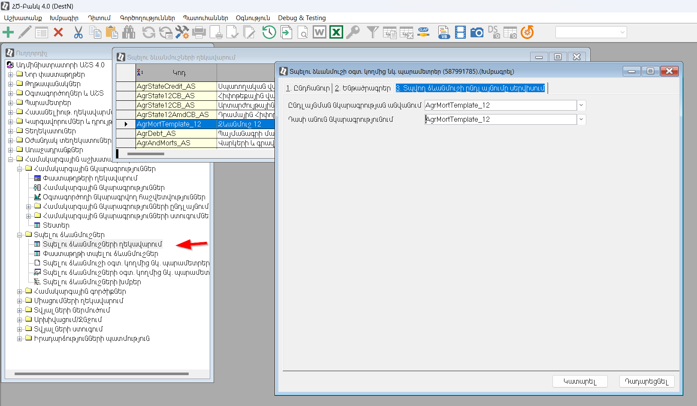

# Տպելու ձևերի ընդլայնման ձեռնարկ


## 1.	Ներածություն

Տպելու ձևանմուշների ընդլայնումը իրականացվում է ծրագրավորման միջոցով օգտագորելով C# լեզուն: Տպելու ձևանմուշի ընդլայնման համար անհրաժեշտ է ստեղծել երկու ֆայլ՝
1.	պարամետրերի հաշվարկի ծրագրերը պարունակող C# ֆայլը,
2.	as ընդլայնումով ֆայլը, որը օգտագործվում է SYSCON ծրագրի կողմից 1-ին կետում նկարագրված ֆայլը ներմուծելիս համար։

Ստեղծված ֆայլերը ներմուծվում են համակարգ օգտագործելով SYSCON ծրագիրը։
Ընդլայնվող տպելու ձևանմուշում օգտագործման ենթակա բոլոր լրացուցիչ պարամետրերը պետք է ծրագրավորված լինեն մեկ ֆայլում։ Միևնույն ընդլայնման ֆայլը կարող են կապակցվել բազմաթիվ տպելու ձևանմուշների։

## 2.  C# ֆայլի նկարագրություն
C# ֆայլը կարող է պարունակել մեկ կամ ավել դասեր, որոնց միջոցով իրականացվում է ավելացվող պարամետրերի հաշվարկը։ Դասերը պետք է իրագործած լինեն բոլոր այն լրացուցիչ պարամետրերը, որոնք անհրաժեշտ են կապակցվող ձևանմուշի հիման վրա տպվող ձևի ստացման համար։

```c#
using ArmSoft.AS8X.Bank.General.Account.DOCS;
using ArmSoft.AS8X.Bank.UserProxy;
using ArmSoft.AS8X.Common.Extensions;
using ArmSoft.AS8X.Core.Templates;
using System.Threading.Tasks;

namespace ArmSoft.AS8X.Bank.CustomerSpecific.MyCompany
{
    [TemplateSubstitutionExtender]
    public class AccStateAdr_stamp : ITemplateSubstitutionExtender 
    {
        private readonly UserProxyService proxyService;

        public AccStateAdr_stamp(UserProxyService proxyService)
        {
            this.proxyService = proxyService;

        }
        public async Task Calculate(TemplateSubstitutionExtenderArgs templateSubstitutionArgs)
        {
            //Վերադարձնում է այն փաստաթուղթը, որի վրայից տպվում է քաղվածքը։ Այս դեպքում հաշիվը
            var accountDoc = (Account)templateSubstitutionArgs.Document;


            //Վերադարձնում է հաճախորդ փաստաթուղը
            var cliDoc = await this.proxyService.LoadClientDoc(accountDoc.CLICOD);


            //Վերադարձնում է հաճախորդ փոստային ինդեքսը
            var index = cliDoc.POSTIND != "" ? ", Փոստային ինդեքս` " + cliDoc.POSTIND : "";

            //Վերադարձնում է հաճախորդ փոստային ինդեքսը անգլերեն
            var eindex = cliDoc.POSTIND != "" ? "Post Index " + cliDoc.POSTIND : "";


            //Ստեղծում է հասցեի տպելու պարամետր
            await proxyService.TryAddAtomicAsync("hasce", async () =>
            {
                var bnakavayr = cliDoc.DISTRICT != "001" ? (await proxyService.TreeElPropComment("COMMUNTY", cliDoc.COMMUNITY)) + ", " : "";
                var marz = cliDoc.DISTRICT != "001" ? (await proxyService.TreeElPropComment("LRDistr", cliDoc.DISTRICT)) + ", " : "";
                return (marz + cliDoc.CITY + ", " + bnakavayr + cliDoc.ADDRESS + index).ToArmenianUnicode();

            }, templateSubstitutionArgs);


            //Ստեղծում է անգլերեն հասցեի տպելու պարամետր
            await proxyService.TryAddAtomicAsync("ehasce", async () =>
            {
                var ebnakavayr = cliDoc.DISTRICT != "001" ? (await proxyService.TreeElPropEComment("COMMUNTY", cliDoc.COMMUNITY)) + ", " : "";
                var emarz = cliDoc.DISTRICT != "001" ? (await proxyService.TreeElPropEComment("LRDistr", cliDoc.DISTRICT)) + ", " : "";
                return emarz + cliDoc.ECITY + ", " + ebnakavayr + cliDoc.EADDRESS + eindex;

            }, templateSubstitutionArgs);


        }
    }
}
```
Վերևում բերված է հաշվի քաղվածքում կիրառվող լրացուցիչ պարամետրերի հաշվարկման համար նախատեսված դասը։ Այն կարելի է օգտագործել որպես ձևանմուշ այլ տպվող ձևերի / քաղվածքների համար պարամետրերի նկարագրության համար։

Բոլոր տպելու ձևանմուշների ընդլայնման դասերը պարտադիր պետք է ունենան [TemplateSubstitutionExtender] ատրիբուտը և իրագործեն ITemplateSubstitutionExtender ինտերֆեյսը։ Ինտերֆեյսի միջոցով սահնանվում են բոլոր այն մեթոդները և հատկությունները, որոնք պետք է ունենա տվյալ դասը։

Պարամետրերի հաշվարկի համար 8x համակարգում առկա սերվիսները օգտագործելու համար անհրաժեշտ է հայտարարել համապատասխան տիպերի դաշտեր (private readonly UserProxyService proxyService;) և կոնստրուկտորի միջոցով իրանանացնել սերվիսների injection -ը.

```c#
namespace ArmSoft.AS8X.Bank.CustomerSpecific.MyCompany
{
    
    [TemplateSubstitutionExtender]
    public class AccStateAdr_stamp : ITemplateSubstitutionExtender 
    {
        private readonly UserProxyService proxyService;
         
        public AccStateAdr_stamp(UserProxyService proxyService)
        {
            this.proxyService = proxyService;

        }
....
```

Ավելացվող տպելու պարամետրերի հաշվարկը և ավելացումը իրականացվում է Calculate ֆունկցիայի միջոցով։ Այն որպես պարամետր ստանում է TemplateSubstitutionExtenderArgs տիպի օբյեկտ, որի միջոցով հնարավոր է հասանելիություն ստանալ տպվող փաստաթղթին, ինչպես նաև որոշ դեպքերում իրականացնել պարամետրերի ավելացում։
```c#

       
        public async Task Calculate(TemplateSubstitutionExtenderArgs templateSubstitutionArgs)
        {
             //Վերադարձնում է ատոմար տպելու պարամետրերի ցուցակը
             var atomics = templateSubstitutionArgs.Substitution.AtomicSubstitutions;
             //Վերադարձնում է այն փաստաթուղթը, որի վրայից ձևավորվում է տպվող ձևը
             var agrDoc = templateSubstitutionArgs.Document;
             if (agrDoc["CURRENCY"].ToString() == "001" || agrDoc["CURRENCY"].ToString() == "049")
             {
                 atomics.Add("CurType", "Ազատ փոխարկելի արտարժույթ");
             }else{
                 atomics.Add("CurType", "");
             }
        }

....
```
Պարամետրի հաշվարկը և ավելացումը հնարավոր է կատարել նաև UserProxyService -ի միջոցով։ Այս տարբերակը ավելի ապահով է այն պատճառով, որ հաշվարկի արդյունքում առաջացած սխալի դեպքում ծրագրի աշխատանքը չի ընդհատվի շարունակելով մնացած բոլոր պարամետրերի հաշվակը։

```c#
[TemplateSubstitutionExtender]
public class AccStatements : ITemplateSubstitutionExtender
{

    private readonly UserProxyService proxyService;
    Account accountDoc;

    public AccStatements(UserProxyService proxyService)
    {
        this.proxyService = proxyService;

    }
    public async Task Calculate(TemplateSubstitutionExtenderArgs templateSubstitutionExtenderArgs)
    {

        this.accountDoc = (Account)templateSubstitutionExtenderArgs.Document;
        await proxyService.TryAddAtomicAsync("pass", async () =>
        {
            var cliCod = await this.proxyService.LoadClientDescByCode(accountDoc.CLICOD);
            return cliCod.PasCode;
        }, templateSubstitutionExtenderArgs);
    }
....

```

## 3. AS ֆայլի նկարագրություն

C# ֆայլը տվյալների բազա ներմուծելու համար անհրաժեշտ է ստեղծել .as ընդլայնումով ֆայլ, որը պետք է պարունակը ներմուծվող ընդլայնման վերաբերյալ հետևյալ տեղեկությունները՝

* Ընդլայնման ներքին անվանումը (անհրաժեշտ է որ ունիկալ լինի)
* ՀԾ-Բանկ համակարգում արտացոլվող վերնագրերը (հայերեն, անգլերեն)
* C# ֆայլի անումը

```as4x

COMMENT {};
TEMPSUBEXTENDER {Name = AgrMortTemplate_12;
Caption = "AgrMortTemplate_12";
ECaption= "AgrMortTemplate_12";
CSsource = AgrMortTemplate_12.cs;
};
```

## 4. Տպելու ձևանմուշի ընդլայնման ներմուծում

Ընդլայնման ներմուծումը հնարավոր է կատարել SYSCON, Script Editor, կամ Visual Studio ծրագրերի միջոցով։
SYSCON ծրագրի միջոցով ներմուծելու համար անհրաժեշտ է ստեղծված .cs և .as ֆայլերը տեղադրել config.as ֆայլում BASEFOLDER պարամետրով նկաարագրված ճանապարհով կամ ներդրված որևէ պանակում (երկու ֆայլը պարտադիր պետք է գտնվեն նույն պանակում), այնուհետև գործարկելով SYSCON ծրագիրը ներմուծել "Նկարագրությունների ներմուծում" հանգույցի ներքո արտացոլվող .as ընդլայնումով ֆայլը։ 

## 5. Ընդլայնման կապակցում տպելու ձևանմուշին

Ընդլայնման ֆայլերը ներմուծելուց հետո կատարվում է կապակցում տպելու ձևանմուշի հետ։ Այդ նպատակով անհրաժեշտ է լրացնել համապատասխան դաշտերը "Տպելու ձևանմուշի օգտ.նկարագրված պարամետրեր" փաստաթղթի "Տպվող ձևանմուշի ընդլայնումը սերվիսում" էջում։

| Դաշտի անվանում |Նկարագրություն                               |
|----------------|---------------------------------------------|
|"Ընդլայնման նկարագրության անվանում"|Համապատասխանու է .as ֆայլի Name պարամետրերին փոխանցված արժեքին։|
|"Դասի անուն նկարգրությունում"|Ֆայլում պարունակվող դասի անվանումը որտեղ իրագործված է լրացուցիչ պարամետրերի հաշվարկը|





[Տպելու ձևերի ընդլայնման նկարագրություն](template_substitution.md)
