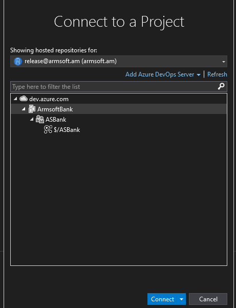
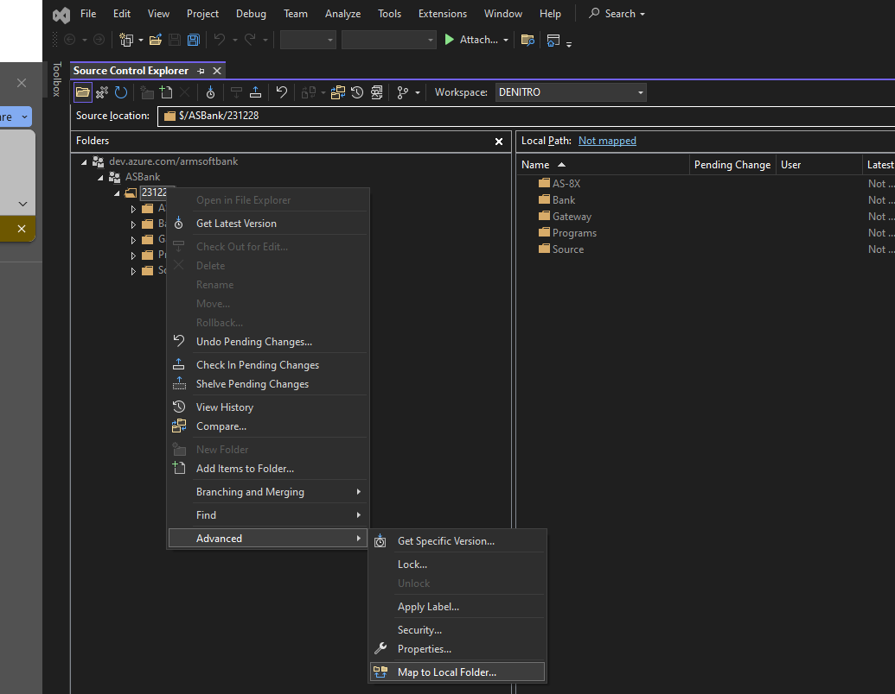
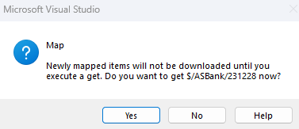
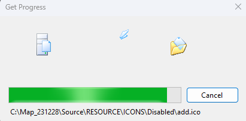
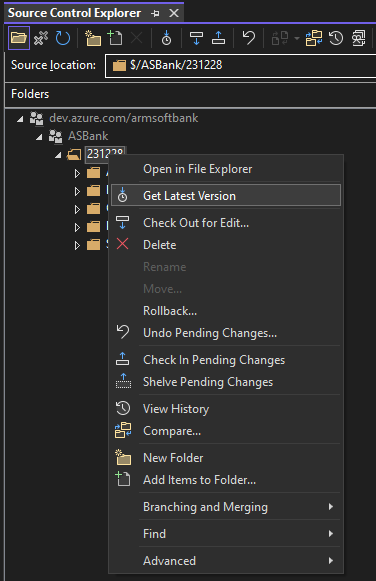
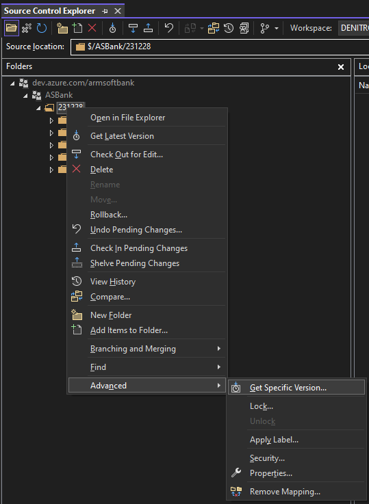

## Բովանդակություն
* [Տրամադրվող կոդեր](#տրամադրվող-կոդեր)
* [Տրամադրման միջոց](#տրամադրման-միջոց)
* [Օգտագործողի կարգավորումներ](#օգտագործողի-կարգավորումներ)
* [MS Visual Studio և Azure DevOps Services ինտեգրացիա, nuget-ների և կոդերի ստացում](#ms-visual-studio-և-azure-devops-services-ինտեգրացիա-nuget-ների-և-կոդերի-ստացում)

## Տրամադրվող կոդեր

Տրամադրվող կոդերը պատկանում են հետևյալ համակարգերին․

* AS-8X համակարգ՝ իր ենթահամակարգերով
* AS-Gateway և AS-Integration Services
* AS-4X համակարգ (asbank.exe)
* Կառուցված գրադարանները և ՀԾ-Բանկ համակարգի exe ֆայլերը

## Տրամադրման միջոց

Համակարգերի կոդերը տրամադրվելու են [Microsoft Azure DevOps Services](https://dev.azure.com/) ամպային համակարգի միջոցով։ 
Այն իրենից ներկայացնում է ծրագրային համակարգերի մշակման գործընթացի կառավարման գործիք։ 
Microsoft Visual Studio և Microsoft Visual Studio Code համակարգերը ունեն ներկառուցված ինտեգրման մեխանիցմներ Microsoft Azure DevOps Services համակարգի հետ աշխատելու համար։ Տրամադրվող համակարգերի կողմից օգտագործվող Nuget փաթեթները նույնպես մատակարարվելու են Microsoft Azure DevOps Services համակարգի միջոցով։ 
Microsoft Azure DevOps Services համակարգից օգտվելու համար օգտագործողը պետք է ունենա Microsoft Account, որի ստեղծումը այս պարագայում անվճար է։

## Օգտագործողի կարգավորումներ

Ստորև նկարագրված են կետեր, որոնք անհրաժեշտ են իրականացնել տրամադրվող կոդերին հասանելիություն ունենալու համար․

* Անհրաժեշտ է մեզ տրամադրել էլեկտրոնային փոստի հասցե, ինչի միջոցով մենք կուղարկենք հրավեր Microsoft Azure DevOps Services միջավայրում մեր կողմից տրամադրվող կոդերը օգտագործելու համար։

* Ձեր տրամադրած էլեկտրոնային փոստով արդեն կարող եք ունենալ ակտիվ Microsoft account, իսկ եթե չունեք, ապա հրավերի ընդունման ժամանակ համակարգը Ձեզ կառաջարկի այն ստեղծել։

* Հրավերն ընդունելուց և հաշիվ բացելուց հետո Ձեզ հասանելի կլինի ”ArmsoftBank Organization”-ը միայն կարդալու իրավասությամբ: Այն հանդիսանում է Հայկական Ծրագրեր կազմակերպության հաշիվ, որի միջոցով Ձեզ կմատակարարվեն համակարգերի կոդերը։ Ձեր իրավասությունները ”ArmsoftBank Organization”-ում լինելու են Read:

* ”ArmsoftBank Organization”-ը հասանելի է հետևյալ հղմամբ․  [https://dev.azure.com/ArmsoftBank](https://dev.azure.com/ArmsoftBank)

* ”ArmsoftBank Organization” browser-ով մուտք գործելուց հետո պատկերը կլինի հետևյալը․

* ASBank նախագիծը պարունակում է բոլոր տրամադրվող համակարգերի կոդերը (Repos բաժնում որպես TFVC տեսակի պահոց)․

## MS Visual Studio և Azure DevOps Services ինտեգրացիա, nuget-ների և կոդերի ստացում

Կոդերը և Nuget փաթեթները ստանալու համար նաև անհրաժեշտ է MS Visual Studio-ն կապել Microsoft Azure DevOps Services-ում գտնվող ArmsoftBank Organization-ի հետ։

Դա իրականացնելու համար հետևեք ստորև նկարագրված քայլերին.

* Բացեք Microsoft Visual Studio համակարգը և նրա միջոցով մուտք գործեք Ձեր կողմից ստեղծված Microsoft հաշիվ (վերևի աջ անկյունից)

* Օգտագործեք Ձեր կողմից ստեղծած Microsoft հաշվի տվյալները

* **Menu**-ի **View** բաժնից ընտրեք **Team Explorer**

* Աջ կողմում կբացվի **Team Explorer** պատուհանը, որտեղ անհրաժեշտ է սեղմել **Manage Connections**, ապա **Connect to a project…**

* Եթե առաջին քայլում Visual Studio բարեհաջող մուտք եք գործել, ապա կբացվի ձեզ հասանելի նախագծերի ցանկը։ Նշեք **ArmsoftBank**-ը և սեցմեք **Connect**

* **Menu**-ի **View** բաժնից ընտրեք **Other Windows**, ապա **Source Control Explorer**

* Կբացվի կոդի ղեկավարման պատուհանը, որի տեսքը կարող եք տեսնել նկարում։ Ծառատիպ հիերարխիայում կարող եք տեսնել ՀԾ-Բանկ համակարգի կոդերը, դասավորված ըստ թղթապանակների։ Նկարում երևում է **231228** տարբերակի թղթապանակը։ Հետագայում այս համակարգում նոր տարբերակի կոդ ավելացնելուց հետո այն Ձեզ հասանելի կլինի ASBank-ի տակ՝ համապատասխան տարբերակի թղթապանակում։ Կոդերի ստացման հետագա քայլերի նկարագիրը կլինի **231228** տարբերակի օրինակով։

* Ցանկացած տարբերակի թղթապանակ պարունակելու է հիմնական 000 տարբերակից սկսված մինչև վերջին ենթատարբերակ բոլոր թարմացումները։ Պահպանման տրամաբանությունը հետևյալն է՝

  * Թողարկվում է հիմնական տարբերակ ՀԾ-ի կողմից

  * Թողարկումից անմիջապես հետո **ArmsoftBank Organization**-ի **ASBank** նախագծում ավելանում է այդ տարբերակի համապատասխան կոդը, իր անվամբ թղթապանակով։ Ստեղծվում է Label (label-ները հետագայում կօգտագործենք, եթե ցանկություն ունենանք կոնկրետ տրարբերակի կոդերը ստանալ) թողարկված տարբերակի անվամբ հենց այդ թղթապանակի վրա։ Օրինակ՝ **231228** տարբերակի համար **231228.000** թողարկել և կոդերը տեղադրելուց հետո **231228** թղթապանակի վրա կստեղծվի **231228.000** անվամբ label-ը։

  * Այդ պահից սկսած ցանկացած ենթատարբերակի թողարկումից հետո **231228** թղթապանակի կոդերը կթարմացվեն և կստեղծվի նոր label։ Օրինակ՝ **231228.001** ենթատարբերակի թողարկումից հետո կոդերը կթարմացվեն, ապա **231228** թղթապանակի վրա կստեղծվի **231228.001** label-ը։ Թե քանի անգամ **231228** թղթապանակը կթարմացվի և քանի label կունենա կախված է նրանից թե քանի ենթատարբերակի անհրաժեշտություն կլինի այդ տարբերակի սպասարկման ընթացքում։

* Կոդերը լոկալ համակարգչում ստանալու համար անհրաժեշտ է ցանկալի տարբերակի թղթապանակը Map անել լոկալ թղթապանակի։ Դա անելու համար համակարգչի ձեր ցանկացած վայրում ստեղծում եք թղթապանակ՝ օրինակ «**C:\Map_231228**», ապա կանգնելով **231228** թղթապանակի վրա աջ կտտոցով աշխատացնում հետևյալ հրամանը՝ **Map to Local Follder…**

* Բացված պատուհանում լրացնում եք «**C:\Map_231228**», ապա սեղմում **Map**

* Համակարգը կառաջարկի լոկալ թղթապանակ բեռնել կոդերը վերջին վիճակով։ Սեղմեք **Yes**  կոճակը։ Կսկսվի ֆայլերի բեռնումը

* Կոդերը ստանալուց հետո, եթե Հայկական Ծրագրերի կողմից թարմացում տեղադրվի, ապա այն կարելի է ստանալ **Get latest version** հրամանով։ Օրինակ՝ եթե Ձեզ մոտ արդեն բեռնված է **231228.001** տարբերակի կոդերը և  Հայկական Ծրագրերը թարմացրել է այն **231228.002**-ի, ապա **231228** թղթապանակի վրա կատարում ենք մկնիկի աջ սեղմում և **Get latest version**։

* Տարբերակի կոդերի թղթապանակի վրայից մկնիկի աջ կտտոցով հասանելի է հարուստ ֆունկցիոնալություն, որին կարող եք ծանոթանալ Microsoft-ի պաշտոնական օգնությունից։ Այս պահին հատկանշական է կոդերը ըստ label-ի ստանալու ֆունկցիոնալությունը։ Օրինակ՝ եթե Ձեր մոտ արդեն բեռնված է համակարգի **231228.010** տարբերակի համապատասխան կոդերը և ցանկանում եք հետ գնալ և բեռնել համակարգի **231228.002** տարբերակի կոդերը, ապա իրականացնում եք **Get specific version** հրամանը։

* Բացված պատուհանում ընտրում ենք **Type: Label**

* Ապա սեղմում բազմակետերը label ընտրելու համար

* Հետո նշում պրոեկտը, որի վրա փնտրում ենք label, սեղմում **Find** և նշում ցանկալի label-ը, ապա **Ok** կոճակը

* Կարգավորում նշիչները ըստ ցանկության և սեղմում **Get** կոճակը

