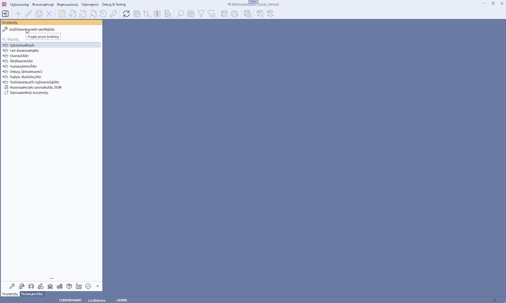
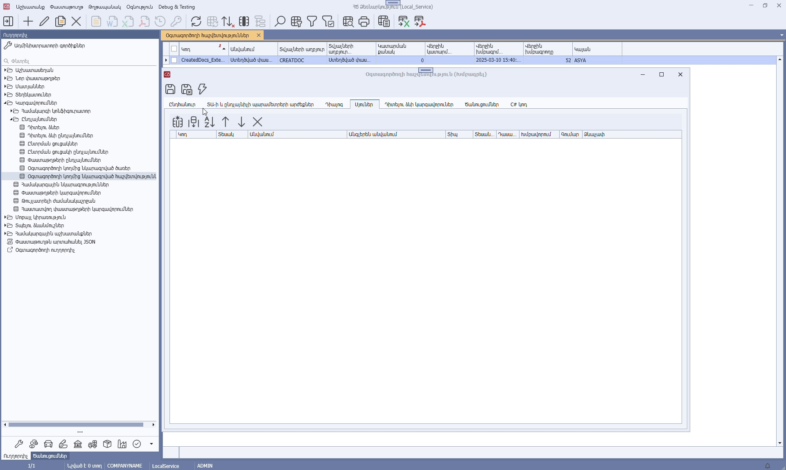
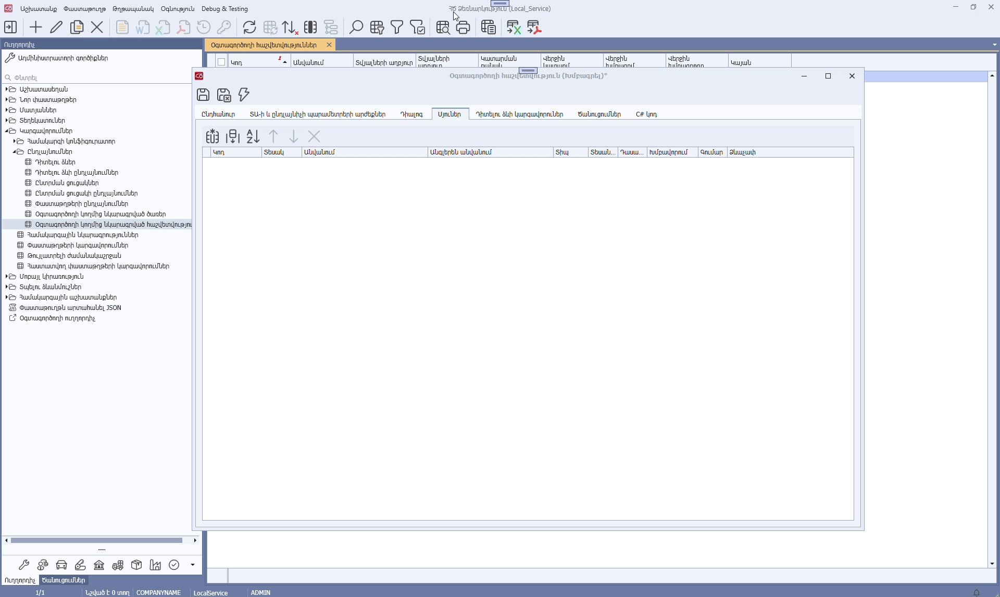

Օգտագործողի կողմից նկարագրված հաշվետվությունում սյունը կարող է հանդիսանալ՝
* տվյալների աղբյուրի սյուն,
* տվյալների աղբյուրի ընդլայնիչի սյուն,
* սյուն, որի արժեքները հաշվարկվում են C# կոդի միջոցով։

Օգտագործողի կողմից նկարագրված հաշվետվությունում սյուն ավելացնելու համար անհրաժեշտ է՝
* Բացել Ադմինիստրատորի Աշտ -> Կարգավորումներ -> Ընդլայնումներ -> **Օգտագործողի կողմից նկարագրված հաշվետվություններ** դիտելու ձևը,
* ընտրել անհրաժեշտ հաշվետվությունը,
* հաշվետվության կոնտեքստային մենյուից ընտրել **Դիտել/Խմբագրել** ֆունկցիան,
* բացված պատուհանի **Սյուներ** tab-ում ավելացնել սյուն։



Հաշվետվությունում տվյալների աղբյուրի կամ ընդլայնիչի սյուն ավելացնելու համար անհրաժեշտ է`
* **Սյուներ** tab-ում սեղմել **Ավելացնել սյուներ տվյալների աղբյուրից կամ ընդլայնիչից** կոճակը,
* բացված պատուհանում ընտրել անհրաժեշտ սյուները և սեղմել **Կատարել** կոճակը։



Հաշվետվությունում C# կոդ տիպի սյուն ավելացնելու համար անհրաժեշտ է` 
* **Սյուներ** tab-ում սեղմել **Ավելացնել սյուն** կոճակը, 
* բացված դիալոգում լրացնել սյան հատկությունները՝
  * կոդը,
  * հայերեն անվանումը, 
  * անգլերեն անվանումը,
  * [համակարգային տիպը](https://armsoft.github.io/as4x-docs/HTM/ProgrGuide/types.html): 
* սեղմել **Կատարել** կոճակը։



Սյան արժեքի հաշվարկման C# կոդը սահմանելու համար անհրաժեշտ է՝
* Բացել Օգտագործողի կողմից նկարագրված հաշվետվության խմբագրման պատուհանը և անցնել **C# կոդ** tab,
* սեղմել **Առաջարկվող տարբերակներ** կոճակը,
* բացված ցանկից ընտրել **ProcessRow - Տողերի մշակում** տարբերակը։


Արդյունքում կգեներացվի C# կոդ, որը հանդիսանում է ձևանմուշ սյան արժեքների լրացման համար:

```c#
using ArmSoft.AS8X.Client.DS;
using ArmSoft.AS8X.Core.UI.UserReport;
 
namespace ArmSoft.AS8X.Core.UI.UserReport
{
    public class UserReportExample : UserReport
    {
        public override bool EnableRowProcessing => true;

        public override bool ProcessRow(ExtendableRow row)
        {
            row["UD_ColumnName"] = "Value";
            return true;
        }

        public override string ExecutionPhaseName()
        {
            return "ExecutionPhaseName";
        }
    }
}
```

Կոդը պարունակում է դաս, որը ժառանգ է հանդիսանում **UserReport** դասից:

Դասը պարունակում է հետևյալ մեթոդները՝
* `ProcessRow` - Կանչվում է յուրաքանչյուր տողի համար և թույլ է տալիս փոփոխել սյան արժեքները **row** պարամետրի միջոցով՝ indexer-ին փոխանցելով սյան կոդը և արժեքը։ Վերադարձնում է bool տիպի արժեք, որը ցույց է տալիս թե ընթացիկ տողը պետք է ընդգրկվի վերջնական արդյունքում, թե ոչ։ Այս մեթոդը կանչվում է `EnableRowProcessing` հատկության **true** արժեքի դեպքում։
* `ExecutionPhaseName` - Վերադարձնում է այն փուլի անվանումը, որի ընթացքում `ProcessRow` մեթոդը կատարում է տողերի լրացուցիչ մշակում՝ ցուցադրելով այն կատարման պրոգրեսի պատուհանում։
